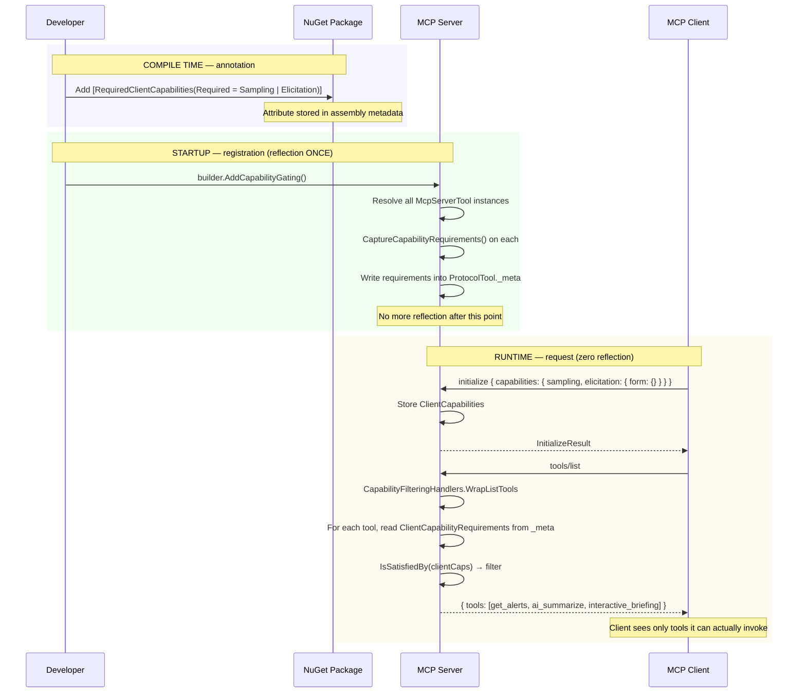

# MCP Capabilities Wrapper Libraries — Design & Implementation Guide

This document is an exhaustive blueprint for two NuGet packages that encapsulate
capability-gating logic for the `ModelContextProtocol` C# SDK. It covers every type,
extension method, registration hook, edge case, and integration point needed to start
coding both libraries immediately.

---

## Table of Contents

1. [Overview](#1-overview)
2. [Shared Infrastructure](#2-shared-infrastructure)
3. [Server-Side Library — `ModelContextProtocol.Capabilities.Server`](#3-server-side-library--modelcontextprotocolcapabilitiesserver)
   - [3.1 Capability Flags Enum](#31-capability-flags-enum)
   - [3.2 The `[RequiredClientCapabilities]` Attribute](#32-the-requiredclientcapabilities-attribute)
   - [3.3 Storage Strategy — `_meta` on Protocol Objects](#33-storage-strategy--_meta-on-protocol-objects)
   - [3.4 The `ClientCapabilityRequirements` Record](#34-the-clientcapabilityrequirements-record)
   - [3.5 Capture Extension Methods](#35-capture-extension-methods)
   - [3.6 The `ICapabilityAwareMcpServerPrimitive` Interface](#36-the-icapabilityawaremcpserverprimitive-interface)
   - [3.7 Automatic Capture via Custom `McpServerToolCreateOptions`](#37-automatic-capture-via-custom-mcpservertoolcreateoptions)
   - [3.8 Integration with `WithTools<T>` — Registration-Time Capture](#38-integration-with-withtoolst--registration-time-capture)
   - [3.9 The `CapabilityFilteringListToolsHandler`](#39-the-capabilityfilteringlisttoolshandler)
   - [3.10 Prompts and Resources — Same Pattern](#310-prompts-and-resources--same-pattern)
   - [3.11 The `AddCapabilityGating()` Builder Extension](#311-the-addcapabilitygating-builder-extension)
   - [3.12 Full Server Integration Example](#312-full-server-integration-example)
4. [Client-Side Library — `ModelContextProtocol.Capabilities.Client`](#4-client-side-library--modelcontextprotocolcapabilitiesclient)
   - [4.1 The `[RequiredServerCapabilities]` Attribute](#41-the-requiredservercapabilities-attribute)
   - [4.2 The `ServerCapabilityRequirements` Record](#42-the-servercapabilityrequirements-record)
   - [4.3 The `CapabilityAwareMcpClient` Wrapper](#43-the-capabilityawaremcpclient-wrapper)
   - [4.4 The `CapabilityAwareMcpClientTool` Wrapper](#44-the-capabilityawaremcpclienttool-wrapper)
   - [4.5 Usage in a Web App](#45-usage-in-a-web-app)
5. [Package Layout & .csproj Setup](#5-package-layout--csproj-setup)
6. [Integrated End-to-End Sequence](#6-integrated-end-to-end-sequence)

---

## 1. Overview

The MCP protocol is **bidirectional**: clients advertise `ClientCapabilities`,
servers advertise `ServerCapabilities`. Both sides can make decisions based on what
the other side supports. The two packages formalize this:

```
┌──────────────────────────────────────────────────┐
│  ModelContextProtocol.Capabilities.Server        │
│                                                  │
│  Helps MCP SERVERS gate tool/prompt/resource     │
│  visibility based on the connected client's      │
│  ClientCapabilities.                             │
│                                                  │
│  Key pattern:                                    │
│  1. Annotate methods at compile time             │
│  2. Capture into _meta at registration (1× cost) │
│  3. Read from _meta at request time (0× cost)    │
│  4. Filter lists, guard calls                    │
└──────────────────────────────────────────────────┘

┌──────────────────────────────────────────────────┐
│  ModelContextProtocol.Capabilities.Client        │
│                                                  │
│  Helps MCP CLIENTS gate tool calls and feature   │
│  usage based on the connected server's           │
│  ServerCapabilities.                             │
│                                                  │
│  Key pattern:                                    │
│  1. Declare what you need to call at startup     │
│  2. Check ServerCapabilities before every call   │
│  3. Throw clear, actionable errors if unmet      │
│  4. List-only tools the server supports          │
└──────────────────────────────────────────────────┘
```

Both libraries target `net8.0` and above, depend only on `ModelContextProtocol.Core`
(and `Microsoft.Extensions.DependencyInjection` for the server library), and are
< 500 lines of code each.

---

## 2. Shared Infrastructure

A third, shared package (or a shared source file linked into both) defines types
that both libraries need. For simplicity, this can be a **source-only NuGet**
(`ModelContextProtocol.Capabilities.Abstractions`) or the types can be duplicated in
each library. The shared types are:

```csharp
// ModelContextProtocol.Capabilities.Abstractions / CapabilityFlags.cs

namespace ModelContextProtocol.Capabilities;

/// <summary>
/// Bitmask enum of all protocol capabilities that a peer can advertise.
/// Used by both server (checking ClientCapabilities) and client (checking ServerCapabilities).
/// </summary>
[Flags]
public enum CapabilityFlag
{
    None = 0,

    // ── Client-side capabilities (checked by server) ──
    Sampling                 = 1 << 0,
    Roots                    = 1 << 1,
    Elicitation              = 1 << 2,
    ElicitationForm          = 1 << 3,
    ElicitationUrl           = 1 << 4,
    Tasks                    = 1 << 5,
    TaskList                 = 1 << 6,
    TaskCancel               = 1 << 7,
    TaskAugmentedSampling    = 1 << 8,
    TaskAugmentedElicitation = 1 << 9,

    // ── Server-side capabilities (checked by client) ──
    Tools              = 1 << 10,
    ToolsListChanged   = 1 << 11,
    Prompts            = 1 << 12,
    PromptsListChanged = 1 << 13,
    Resources          = 1 << 14,
    ResourcesSubscribe = 1 << 15,
    ResourcesListChanged = 1 << 16,
    Completions        = 1 << 17,
    Logging            = 1 << 18,
}
```

```csharp
// ModelContextProtocol.Capabilities.Abstractions / CapabilityRequirements.cs

namespace ModelContextProtocol.Capabilities;

/// <summary>
/// Portable structure describing what capabilities a primitive (tool, prompt,
/// resource) or operation requires from the remote peer.
/// Used by both libraries for the same purpose — different source of truth.
/// </summary>
public readonly record struct CapabilityRequirements
{
    public static readonly CapabilityRequirements None = new();

    /// <summary>Bitmask of required capabilities.</summary>
    public CapabilityFlag Required { get; init; }

    /// <summary>
    /// Returns true if every flag in <paramref name="required"/> is present
    /// in <paramref name="available"/>.
    /// </summary>
    public static bool IsSatisfied(CapabilityFlag required, CapabilityFlag available)
        => (available & required) == required;

    public bool IsSatisfiedBy(CapabilityFlag available) => IsSatisfied(Required, available);
}
```

---

## 3. Server-Side Library — `ModelContextProtocol.Capabilities.Server`

### 3.1 Capability Flags Enum

The server-side usage of `CapabilityFlag` focuses on client capabilities:

| Flag | Maps to `ClientCapabilities` | Use case |
|------|------------------------------|----------|
| `Sampling` | `ClientCapabilities.Sampling is not null` | Tool calls `server.SampleAsync()` |
| `Roots` | `ClientCapabilities.Roots is not null` | Tool calls `server.RequestRootsAsync()` |
| `Elicitation` | `ClientCapabilities.Elicitation is not null` | Tool calls `server.ElicitAsync()` |
| `ElicitationForm` | `ClientCapabilities.Elicitation.Form is not null` | Tool calls form-mode elicitation |
| `ElicitationUrl` | `ClientCapabilities.Elicitation.Url is not null` | Tool calls URL-mode elicitation |
| `Tasks` | `ClientCapabilities.Tasks is not null` | Tool is declared `async` and needs task support |
| `TaskAugmentedSampling` | `ClientCapabilities.Tasks.Requests.Sampling.CreateMessage is not null` | Tool calls `server.SampleAsTaskAsync()` |
| `TaskAugmentedElicitation` | `ClientCapabilities.Tasks.Requests.Elicitation.Create is not null` | Tool calls `server.ElicitAsTaskAsync()` |

### 3.2 The `[RequiredClientCapabilities]` Attribute

```csharp
// ModelContextProtocol.Capabilities.Server / RequiredClientCapabilitiesAttribute.cs

namespace ModelContextProtocol.Capabilities.Server;

/// <summary>
/// Placed on MCP primitives (tools, prompts, resources) to declare which client
/// capabilities the primitive requires. The library captures this metadata at
/// registration time and uses it at request time to filter lists and guard calls.
/// </summary>
[AttributeUsage(AttributeTargets.Method, AllowMultiple = false, Inherited = false)]
public sealed class RequiredClientCapabilitiesAttribute : Attribute
{
    /// <summary>
    /// Bitmask of client capabilities this primitive requires.
    /// Callers which do not advertise all these flags should not see or invoke this primitive.
    /// </summary>
    public CapabilityFlag Required { get; init; }

    /// <summary>
    /// Optional human-readable message shown when the requirement is not met.
    /// </summary>
    public string? Message { get; init; }
}
```

Usage on a tool:

```csharp
[McpServerTool, Description("Summarize alerts with AI")]
[RequiredClientCapabilities(
    Required = CapabilityFlag.Sampling | CapabilityFlag.Elicitation,
    Message = "This tool requires an LLM and user confirmation")]
public async Task<string> AiSummarize(string state, McpServer server, CancellationToken ct)
{
    var raw = await GetAlerts(state);
    var response = await server.SampleAsync(/*...*/);
    return response.Text;
}
```

### 3.3 Storage Strategy — `_meta` on Protocol Objects

Every MCP protocol object (`Tool`, `Prompt`, `Resource`, `ResourceTemplate`) has a
`JsonObject? Meta` property. This is the **ideal storage location** because:

- It survives serialization to JSON (clients receive it in list responses).
- It's a `JsonObject` — no schema restriction, arbitrary keys allowed.
- It's already part of the SDK's `McpServerTool.ProtocolTool.Meta`.
- Zero allocation for reads at request time.

The library uses a well-known key: `"__mcp_capabilities_required"`.

**Storage format (JSON):**

```json
{
  "name": "ai_summarize",
  "description": "Summarize alerts with AI",
  "_meta": {
    "__mcp_capabilities_required": {
      "flags": "Sampling, Elicitation",
      "message": "This tool requires an LLM and user confirmation"
    }
  }
}
```

### 3.4 The `ClientCapabilityRequirements` Record

```csharp
// ModelContextProtocol.Capabilities.Server / ClientCapabilityRequirements.cs

namespace ModelContextProtocol.Capabilities.Server;

/// <summary>
/// Stores client capability requirements on an MCP server primitive.
/// Captured from [RequiredClientCapabilities] at registration time,
/// read from _meta at request time.
/// </summary>
public readonly record struct ClientCapabilityRequirements
{
    public static readonly ClientCapabilityRequirements None = new();

    public CapabilityFlag Required { get; init; }
    public string? Message { get; init; }

    /// <summary>
    /// Checks the connected client's capabilities against these requirements.
    /// </summary>
    public bool IsSatisfiedBy(ClientCapabilities? clientCaps)
    {
        if (Required == CapabilityFlag.None) return true;
        if (clientCaps is null) return false;

        var available = CapabilityFlags.FromClientCapabilities(clientCaps);
        return (available & Required) == Required;
    }

    // ── Serialization (to/from _meta JsonObject) ──

    private const string MetaKey = "__mcp_capabilities_required";

    public void WriteToMeta(JsonObject meta)
    {
        meta[MetaKey] = new JsonObject
        {
            ["flags"] = Required.ToString(),
            ["message"] = Message,
        };
    }

    public static ClientCapabilityRequirements ReadFromMeta(JsonObject? meta)
    {
        if (meta is null || !meta.TryGetPropertyValue(MetaKey, out var node) || node is null)
            return None;

        var flags = CapabilityFlag.None;
        if (node["flags"]?.GetValue<string>() is { } flagsStr)
            Enum.TryParse<CapabilityFlag>(flagsStr, out flags);

        return new ClientCapabilityRequirements
        {
            Required = flags,
            Message = node["message"]?.GetValue<string>(),
        };
    }
}
```

### 3.5 The `CapabilityFlag` Converter

```csharp
// ModelContextProtocol.Capabilities.Server / CapabilityFlags.cs (partial)

namespace ModelContextProtocol.Capabilities;

public static partial class CapabilityFlags
{
    /// <summary>
    /// Converts a ClientCapabilities object into a CapabilityFlag bitmask.
    /// Call once per client connection. Cache the result.
    /// </summary>
    public static CapabilityFlag FromClientCapabilities(ClientCapabilities? caps)
    {
        if (caps is null) return CapabilityFlag.None;

        var f = CapabilityFlag.None;

        if (caps.Sampling is not null) f |= CapabilityFlag.Sampling;
        if (caps.Roots is not null) f |= CapabilityFlag.Roots;
        if (caps.Elicitation is not null)
        {
            f |= CapabilityFlag.Elicitation;
            if (caps.Elicitation.Form is not null) f |= CapabilityFlag.ElicitationForm;
            if (caps.Elicitation.Url is not null) f |= CapabilityFlag.ElicitationUrl;
        }
        if (caps.Tasks is not null)
        {
            f |= CapabilityFlag.Tasks;
            if (caps.Tasks.List is not null) f |= CapabilityFlag.TaskList;
            if (caps.Tasks.Cancel is not null) f |= CapabilityFlag.TaskCancel;
            if (caps.Tasks.Requests?.Sampling?.CreateMessage is not null)
                f |= CapabilityFlag.TaskAugmentedSampling;
            if (caps.Tasks.Requests?.Elicitation?.Create is not null)
                f |= CapabilityFlag.TaskAugmentedElicitation;
        }

        return f;
    }

    /// <summary>
    /// Converts a ServerCapabilities object into a CapabilityFlag bitmask.
    /// </summary>
    public static CapabilityFlag FromServerCapabilities(ServerCapabilities? caps)
    {
        if (caps is null) return CapabilityFlag.None;

        var f = CapabilityFlag.None;

        if (caps.Tools is not null)
        {
            f |= CapabilityFlag.Tools;
            if (caps.Tools.ListChanged == true) f |= CapabilityFlag.ToolsListChanged;
        }
        if (caps.Prompts is not null)
        {
            f |= CapabilityFlag.Prompts;
            if (caps.Prompts.ListChanged == true) f |= CapabilityFlag.PromptsListChanged;
        }
        if (caps.Resources is not null)
        {
            f |= CapabilityFlag.Resources;
            if (caps.Resources.Subscribe == true) f |= CapabilityFlag.ResourcesSubscribe;
            if (caps.Resources.ListChanged == true) f |= CapabilityFlag.ResourcesListChanged;
        }
        if (caps.Completions is not null) f |= CapabilityFlag.Completions;
        if (caps.Logging is not null) f |= CapabilityFlag.Logging;

        return f;
    }
}
```

### 3.6 Capture Extension Methods

These run once at registration time — the only place reflection is used.

```csharp
// ModelContextProtocol.Capabilities.Server / McpServerPrimitiveCapabilityExtensions.cs

namespace ModelContextProtocol.Capabilities.Server;

public static class McpServerPrimitiveCapabilityExtensions
{
    /// <summary>
    /// Reads [RequiredClientCapabilities] from the tool's underlying MethodInfo
    /// and writes the requirements into ProtocolTool._meta.
    /// Called once at startup. After this, all reads are zero-reflection.
    /// </summary>
    public static void CaptureCapabilityRequirements(this McpServerTool tool)
    {
        var methodInfo = tool.Metadata
            ?.OfType<MethodInfo>()
            .FirstOrDefault();
        if (methodInfo is null) return;

        var attr = methodInfo.GetCustomAttribute<RequiredClientCapabilitiesAttribute>();
        if (attr is null) return;

        var reqs = new ClientCapabilityRequirements
        {
            Required = attr.Required,
            Message = attr.Message,
        };

        tool.ProtocolTool.Meta ??= [];
        reqs.WriteToMeta(tool.ProtocolTool.Meta);
    }

    /// <summary>
    /// Reads requirements back from ProtocolTool._meta — zero reflection.
    /// Safe to call from any ListToolsHandler or request filter.
    /// </summary>
    public static ClientCapabilityRequirements GetCapabilityRequirements(
        this McpServerTool tool)
        => ClientCapabilityRequirements.ReadFromMeta(tool.ProtocolTool.Meta);

    // ── Same for prompts ──

    public static void CaptureCapabilityRequirements(this McpServerPrompt prompt)
    {
        var methodInfo = prompt.Metadata
            ?.OfType<MethodInfo>()
            .FirstOrDefault();
        if (methodInfo is null) return;

        var attr = methodInfo.GetCustomAttribute<RequiredClientCapabilitiesAttribute>();
        if (attr is null) return;

        var reqs = new ClientCapabilityRequirements
        {
            Required = attr.Required,
            Message = attr.Message,
        };

        prompt.ProtocolPrompt.Meta ??= [];
        reqs.WriteToMeta(prompt.ProtocolPrompt.Meta);
    }

    public static ClientCapabilityRequirements GetCapabilityRequirements(
        this McpServerPrompt prompt)
        => ClientCapabilityRequirements.ReadFromMeta(prompt.ProtocolPrompt.Meta);

    // ── Same for resources ──

    public static void CaptureCapabilityRequirements(this McpServerResource resource)
    {
        var methodInfo = resource.Metadata
            ?.OfType<MethodInfo>()
            .FirstOrDefault();
        if (methodInfo is null) return;

        var attr = methodInfo.GetCustomAttribute<RequiredClientCapabilitiesAttribute>();
        if (attr is null) return;

        var reqs = new ClientCapabilityRequirements
        {
            Required = attr.Required,
            Message = attr.Message,
        };

        resource.ProtocolResource.Meta ??= [];
        reqs.WriteToMeta(resource.ProtocolResource.Meta);
    }

    public static ClientCapabilityRequirements GetCapabilityRequirements(
        this McpServerResource resource)
        => ClientCapabilityRequirements.ReadFromMeta(resource.ProtocolResource.Meta);
}
```

### 3.7 Automatic Capture via Custom `McpServerToolCreateOptions`

The cleanest hook: whenever a `McpServerTool` is built from a `MethodInfo` (which is
what `WithTools<T>()` does internally), intercept the creation and capture attributes.

```csharp
// ModelContextProtocol.Capabilities.Server / CapabilityAwareMcpServerTool.cs

namespace ModelContextProtocol.Capabilities.Server;

/// <summary>
/// A delegating McpServerTool that wraps an existing tool and captures
/// capability requirements from [RequiredClientCapabilities] on creation.
/// </summary>
internal sealed class CapabilityAwareMcpServerTool : DelegatingMcpServerTool
{
    public ClientCapabilityRequirements Requirements { get; }

    public CapabilityAwareMcpServerTool(McpServerTool inner) : base(inner)
    {
        Requirements = ClientCapabilityRequirements.None;

        var methodInfo = inner.Metadata?.OfType<MethodInfo>().FirstOrDefault();
        if (methodInfo is null) return;

        var attr = methodInfo.GetCustomAttribute<RequiredClientCapabilitiesAttribute>();
        if (attr is null) return;

        Requirements = new ClientCapabilityRequirements
        {
            Required = attr.Required,
            Message = attr.Message,
        };

        // Also store on inner tool for the ListToolsHandler path
        inner.ProtocolTool.Meta ??= [];
        Requirements.WriteToMeta(inner.ProtocolTool.Meta);
    }
}
```

Then a factory method that the builder extensions use:

```csharp
public static class CapabilityAwareToolFactory
{
    public static McpServerTool Create(
        Delegate method,
        McpServerToolCreateOptions? options = null)
    {
        var tool = McpServerTool.Create(method, options);
        return new CapabilityAwareMcpServerTool(tool);
    }

    public static McpServerTool Create(
        MethodInfo method,
        object? target = null,
        McpServerToolCreateOptions? options = null)
    {
        var tool = McpServerTool.Create(method, target, options);
        return new CapabilityAwareMcpServerTool(tool);
    }
}
```

### 3.8 Integration with `WithTools<T>` — Registration-Time Capture

The server library provides its own builder extension that wraps the SDK's `WithTools<T>`
and adds automatic capture:

```csharp
// ModelContextProtocol.Capabilities.Server / CapabilityServerBuilderExtensions.cs

namespace ModelContextProtocol.Capabilities.Server;

public static class CapabilityServerBuilderExtensions
{
    /// <summary>
    /// Registers tools from <typeparamref name="TToolType"/> AND captures
    /// [RequiredClientCapabilities] attributes on each method. After this call,
    /// all tools are capability-aware with zero additional per-request cost.
    /// </summary>
    public static IMcpServerBuilder WithCapabilityAwareTools<TToolType>(
        this IMcpServerBuilder builder)
        where TToolType : class
    {
        return builder.WithCapabilityAwareTools<TToolType>(_ => { });
    }

    /// <summary>
    /// Registers tools with capability capture AND a post-registration callback
    /// (e.g., to set additional annotation properties programmatically).
    /// </summary>
    public static IMcpServerBuilder WithCapabilityAwareTools<TToolType>(
        this IMcpServerBuilder builder,
        Action<McpServerTool, ClientCapabilityRequirements>? configure)
        where TToolType : class
    {
        // 1. Register via the standard SDK pipeline
        builder.WithTools<TToolType>();

        // 2. After DI builds the service collection, post-process every tool
        builder.Services.AddTransient<IConfigureOptions<McpServerOptions>>(sp =>
        {
            // Resolve all tools registered for this TToolType
            var tools = sp.GetServices<McpServerTool>()
                .Where(t => t.ProtocolTool.Meta?["__mcp_capabilities_required"] is not null
                         || t.Metadata?.OfType<MethodInfo>()
                              .Any(m => m.GetCustomAttribute<RequiredClientCapabilitiesAttribute>() is not null) == true);

            foreach (var tool in tools)
            {
                tool.CaptureCapabilityRequirements();
                var reqs = tool.GetCapabilityRequirements();
                configure?.Invoke(tool, reqs);
            }

            return NullConfigureOptions<McpServerOptions>.Instance;
        });

        return builder;
    }
}
```

### 3.9 The `CapabilityFilteringListToolsHandler`

This is the core of the server library — a `ListToolsHandler` that filters the tool
list based on the calling client's `ClientCapabilities`. It wraps the existing handler
(so you can still use `.WithTools<T>()` and any custom handlers) and adds filtering.

```csharp
// ModelContextProtocol.Capabilities.Server / CapabilityFilteringHandlers.cs

namespace ModelContextProtocol.Capabilities.Server;

/// <summary>
/// Provides pre-built handler wrappers that filter MCP primitives based on
/// the connected client's advertised capabilities.
/// </summary>
public static class CapabilityFilteringHandlers
{
    /// <summary>
    /// Wraps a ListToolsHandler to filter out tools the client cannot invoke.
    /// Tools without [RequiredClientCapabilities] are always included.
    /// Tools with unsatisfied requirements are excluded and logged.
    /// </summary>
    public static McpRequestHandler<ListToolsRequestParams, ListToolsResult> WrapListTools(
        McpRequestHandler<ListToolsRequestParams, ListToolsResult>? inner)
    {
        return async (request, ct) =>
        {
            // Get the full list from the inner handler (or the collection)
            ListToolsResult fullResult;
            if (inner is not null)
            {
                fullResult = await inner(request, ct);
            }
            else
            {
                // If no inner handler, tools come only from ToolCollection
                fullResult = new ListToolsResult { Tools = [] };
            }

            var clientCaps = request.Services
                ?.GetService<McpServer>()
                ?.ClientCapabilities;

            var filtered = new List<Tool>(fullResult.Tools.Count);

            foreach (var tool in fullResult.Tools)
            {
                var reqs = ClientCapabilityRequirements.ReadFromMeta(tool.Meta);

                if (reqs.Required == CapabilityFlag.None)
                {
                    // No requirements — always visible
                    filtered.Add(tool);
                }
                else if (reqs.IsSatisfiedBy(clientCaps))
                {
                    filtered.Add(tool);
                }
                else
                {
                    // Tool requires capabilities the client doesn't have — skip it
                    Log.ToolFiltered(tool.Name, reqs.Required, reqs.Message);
                }
            }

            fullResult.Tools = filtered;
            return fullResult;
        };
    }

    // ── Same pattern for prompts ──
    public static McpRequestHandler<ListPromptsRequestParams, ListPromptsResult> WrapListPrompts(
        McpRequestHandler<ListPromptsRequestParams, ListPromptsResult>? inner)
    {
        return async (request, ct) =>
        {
            var fullResult = inner is not null
                ? await inner(request, ct)
                : new ListPromptsResult { Prompts = [] };

            var clientCaps = request.Services
                ?.GetService<McpServer>()
                ?.ClientCapabilities;

            var filtered = fullResult.Prompts
                .Where(p =>
                {
                    var reqs = ClientCapabilityRequirements.ReadFromMeta(p.Meta);
                    return reqs.Required == CapabilityFlag.None
                        || reqs.IsSatisfiedBy(clientCaps);
                })
                .ToList();

            fullResult.Prompts = filtered;
            return fullResult;
        };
    }

    // ── And resources ──
    public static McpRequestHandler<ListResourcesRequestParams, ListResourcesResult> WrapListResources(
        McpRequestHandler<ListResourcesRequestParams, ListResourcesResult>? inner)
    {
        return async (request, ct) =>
        {
            var fullResult = inner is not null
                ? await inner(request, ct)
                : new ListResourcesResult { Resources = [] };

            var clientCaps = request.Services
                ?.GetService<McpServer>()
                ?.ClientCapabilities;

            var filtered = fullResult.Resources
                .Where(r =>
                {
                    var reqs = ClientCapabilityRequirements.ReadFromMeta(r.Meta);
                    return reqs.Required == CapabilityFlag.None
                        || reqs.IsSatisfiedBy(clientCaps);
                })
                .ToList();

            fullResult.Resources = filtered;
            return fullResult;
        };
    }

    private static class Log
    {
        // Uses source-generated loggers for performance
        public static void ToolFiltered(string name, CapabilityFlag required, string? message)
        {
            Console.WriteLine(
                $"[CapabilityGate] Hiding tool '{name}': " +
                $"requires {required}. {(message is not null ? $"Reason: {message}" : "")}");
        }
    }
}
```

### 3.10 Prompts and Resources — Same Pattern

The pattern for prompts and resources is identical to tools — just different
handler types. The library provides `CapabilityFilteringHandlers.WrapListPrompts`
and `CapabilityFilteringHandlers.WrapListResources` (shown above).

### 3.11 The `AddCapabilityGating()` Builder Extension

This is the one-liner users add to their `Program.cs`:

```csharp
// ModelContextProtocol.Capabilities.Server / AddCapabilityGatingExtensions.cs

namespace Microsoft.Extensions.DependencyInjection;

public static class AddCapabilityGatingExtensions
{
    /// <summary>
    /// Enables capability-based filtering of MCP server primitives.
    /// After calling this, any tool/prompt/resource annotated with
    /// [RequiredClientCapabilities] will be hidden from clients that don't
    /// advertise the required capabilities.
    /// </summary>
    public static IMcpServerBuilder AddCapabilityGating(
        this IMcpServerBuilder builder)
    {
        // Register our filtering handlers that wrap the existing handlers
        builder.Services.Configure<McpServerOptions>(options =>
        {
            // Preserve any existing handlers, wrap them with our filters
            var existingListTools = options.Handlers.ListToolsHandler;
            var existingListPrompts = options.Handlers.ListPromptsHandler;
            var existingListResources = options.Handlers.ListResourcesHandler;

            options.Handlers.ListToolsHandler =
                CapabilityFilteringHandlers.WrapListTools(existingListTools);
            options.Handlers.ListPromptsHandler =
                CapabilityFilteringHandlers.WrapListPrompts(existingListPrompts);
            options.Handlers.ListResourcesHandler =
                CapabilityFilteringHandlers.WrapListResources(existingListResources);
        });

        return builder;
    }
}
```

### 3.12 Full Server Integration Example

```csharp
// Program.cs — complete example
using ModelContextProtocol.Capabilities.Server;
using ModelContextProtocol.Server;

var builder = WebApplication.CreateBuilder(args);

// 1. Register tools normally — the library post-processes them
builder.Services.AddMcpServer(options =>
{
    options.ServerInfo = new() { Name = "WeatherServer", Version = "2.0" };
})
    .WithTools<WeatherTools>()       // standard SDK registration
    .WithPrompts<ReviewPrompts>()    // standard SDK registration
    .WithResources<DocResources>()   // standard SDK registration
    .AddCapabilityGating()           // ← library's one-liner
    .WithHttpTransport();

var app = builder.Build();
app.MapMcp();
app.Run();
```

```csharp
// WeatherTools.cs — annotated tool class
[McpServerToolType]
public class WeatherTools
{
    // No annotation → always visible to all clients
    [McpServerTool, Description("Get weather alerts")]
    public async Task<string> GetAlerts(string state) { /* ... */ }

    // Requires LLM sampling → hidden from clients without sampling capability
    [McpServerTool, Description("AI-powered alert summarization")]
    [RequiredClientCapabilities(
        Required = CapabilityFlag.Sampling,
        Message = "This tool uses an LLM to summarize alerts")]
    public async Task<string> AiSummarize(string state, McpServer server, CancellationToken ct)
    {
        var raw = await GetAlerts(state);
        var response = await server.SampleAsync(/* ... */);
        return response.Text;
    }

    // Requires sampling + form elicitation → hidden from basic clients
    [McpServerTool, Description("Interactive weather briefing")]
    [RequiredClientCapabilities(
        Required = CapabilityFlag.Sampling | CapabilityFlag.ElicitationForm)]
    public async Task<string> InteractiveBriefing(string state, McpServer server, CancellationToken ct)
    {
        var raw = await GetAlerts(state);
        var summary = await server.SampleAsync(/* ... */);
        var confirm = await server.ElicitAsync<Confirmation>("Proceed?", ct);
        return confirm.IsAccepted ? summary.Text : "Cancelled";
    }
}
```

**Behavior at runtime:**

```
Client A connects with Capabilities = { }
  → tools/list returns: [get_alerts]  (only unannotated tools)

Client B connects with Capabilities = { sampling }
  → tools/list returns: [get_alerts, ai_summarize]

Client C connects with Capabilities = { sampling, elicitation: { form: {} } }
  → tools/list returns: [get_alerts, ai_summarize, interactive_briefing]
```

---

## 4. Client-Side Library — `ModelContextProtocol.Capabilities.Client`

The client library serves the **opposite direction**: it checks what `ServerCapabilities`
the connected server advertises and gates client behavior accordingly.

### 4.1 The `[RequiredServerCapabilities]` Attribute

```csharp
// ModelContextProtocol.Capabilities.Client / RequiredServerCapabilitiesAttribute.cs

namespace ModelContextProtocol.Capabilities.Client;

/// <summary>
/// Declares that an operation requires the connected MCP server to advertise
/// specific server capabilities. The library checks these before the operation
/// executes and throws <see cref="CapabilityNotAvailableException"/> if unsatisfied.
/// </summary>
[AttributeUsage(AttributeTargets.Method | AttributeTargets.Class, AllowMultiple = false)]
public sealed class RequiredServerCapabilitiesAttribute : Attribute
{
    public CapabilityFlag Required { get; init; }
    public string? Message { get; init; }
}
```

### 4.2 The `ServerCapabilityRequirements` Record

```csharp
// ModelContextProtocol.Capabilities.Client / ServerCapabilityRequirements.cs

namespace ModelContextProtocol.Capabilities.Client;

public readonly record struct ServerCapabilityRequirements
{
    public static readonly ServerCapabilityRequirements None = new();

    public CapabilityFlag Required { get; init; }
    public string? Message { get; init; }

    public bool IsSatisfiedBy(ServerCapabilities? serverCaps)
    {
        if (Required == CapabilityFlag.None) return true;
        if (serverCaps is null) return false;

        var available = CapabilityFlags.FromServerCapabilities(serverCaps);
        return (available & Required) == Required;
    }

    /// <summary>
    /// Throws <see cref="CapabilityNotAvailableException"/> if requirements are not met.
    /// </summary>
    public void ThrowIfNotSatisfied(ServerCapabilities? serverCaps)
    {
        if (IsSatisfiedBy(serverCaps)) return;

        var missing = Required & ~CapabilityFlags.FromServerCapabilities(serverCaps);
        throw new CapabilityNotAvailableException(
            missing,
            Message ?? $"The server does not support: {missing}");
    }
}
```

```csharp
// ModelContextProtocol.Capabilities.Client / CapabilityNotAvailableException.cs

namespace ModelContextProtocol.Capabilities.Client;

public sealed class CapabilityNotAvailableException : InvalidOperationException
{
    public CapabilityFlag Missing { get; }

    public CapabilityNotAvailableException(CapabilityFlag missing, string message)
        : base(message)
    {
        Missing = missing;
    }
}
```

### 4.3 The `CapabilityAwareMcpClient` Wrapper

The wrapper holds an `McpClient` and checks capabilities before every operation:

```csharp
// ModelContextProtocol.Capabilities.Client / CapabilityAwareMcpClient.cs

namespace ModelContextProtocol.Capabilities.Client;

/// <summary>
/// Wraps an <see cref="McpClient"/> and enforces server capability requirements
/// before every operation. Throws if the connected server doesn't support
/// the requested feature.
/// </summary>
public class CapabilityAwareMcpClient : IAsyncDisposable
{
    private readonly McpClient _inner;

    public CapabilityAwareMcpClient(McpClient inner)
    {
        _inner = inner ?? throw new ArgumentNullException(nameof(inner));
    }

    /// <summary>The underlying McpClient for escape-hatch scenarios.</summary>
    public McpClient Inner => _inner;

    /// <summary>The server's advertised capabilities, cached after connection.</summary>
    public ServerCapabilities ServerCapabilities => _inner.ServerCapabilities;

    /// <summary>The server's identity and version.</summary>
    public Implementation ServerInfo => _inner.ServerInfo;

    public string? ServerInstructions => _inner.ServerInstructions;

    // ── Guarded operations ──

    public async ValueTask<IList<McpClientTool>> ListToolsAsync(
        ServerCapabilityRequirements requirements = default,
        RequestOptions? options = null,
        CancellationToken ct = default)
    {
        requirements.ThrowIfNotSatisfied(ServerCapabilities);
        return await _inner.ListToolsAsync(options, ct);
    }

    public async ValueTask<CallToolResult> CallToolAsync(
        string toolName,
        ServerCapabilityRequirements requirements,
        IReadOnlyDictionary<string, object?>? arguments = null,
        IProgress<ProgressNotificationValue>? progress = null,
        RequestOptions? options = null,
        CancellationToken ct = default)
    {
        requirements.ThrowIfNotSatisfied(ServerCapabilities);
        return await _inner.CallToolAsync(toolName, arguments, progress, options, ct);
    }

    public async ValueTask<IList<McpClientPrompt>> ListPromptsAsync(
        ServerCapabilityRequirements requirements = default,
        RequestOptions? options = null,
        CancellationToken ct = default)
    {
        requirements.ThrowIfNotSatisfied(ServerCapabilities);
        return await _inner.ListPromptsAsync(options, ct);
    }

    public async ValueTask<GetPromptResult> GetPromptAsync(
        string name,
        ServerCapabilityRequirements requirements,
        IReadOnlyDictionary<string, object?>? arguments = null,
        RequestOptions? options = null,
        CancellationToken ct = default)
    {
        requirements.ThrowIfNotSatisfied(ServerCapabilities);
        return await _inner.GetPromptAsync(name, arguments, options, ct);
    }

    public async ValueTask<IList<McpClientResource>> ListResourcesAsync(
        ServerCapabilityRequirements requirements = default,
        RequestOptions? options = null,
        CancellationToken ct = default)
    {
        requirements.ThrowIfNotSatisfied(ServerCapabilities);
        return await _inner.ListResourcesAsync(options, ct);
    }

    public async ValueTask<IList<McpClientResourceTemplate>> ListResourceTemplatesAsync(
        ServerCapabilityRequirements requirements = default,
        RequestOptions? options = null,
        CancellationToken ct = default)
    {
        requirements.ThrowIfNotSatisfied(ServerCapabilities);
        return await _inner.ListResourceTemplatesAsync(options, ct);
    }

    public async ValueTask<ReadResourceResult> ReadResourceAsync(
        string uri,
        ServerCapabilityRequirements requirements,
        RequestOptions? options = null,
        CancellationToken ct = default)
    {
        requirements.ThrowIfNotSatisfied(ServerCapabilities);
        return await _inner.ReadResourceAsync(uri, options, ct);
    }

    /// <summary>
    /// Returns tools filtered to only those whose server capabilities are met.
    /// </summary>
    public async ValueTask<IList<McpClientTool>> ListFilteredToolsAsync(
        IReadOnlyDictionary<string, ServerCapabilityRequirements> requirementsByTool,
        RequestOptions? options = null,
        CancellationToken ct = default)
    {
        var allTools = await _inner.ListToolsAsync(options, ct);

        return allTools
            .Where(t =>
            {
                if (!requirementsByTool.TryGetValue(t.Name, out var reqs))
                    return true; // no requirements → always include
                return reqs.IsSatisfiedBy(ServerCapabilities);
            })
            .ToList();
    }

    // ── Passthrough: operations that don't need gating ──

    public ValueTask<PingResult> PingAsync(RequestOptions? options = null, CancellationToken ct = default)
        => _inner.PingAsync(options, ct);

    public Task<IAsyncDisposable> SubscribeToResourceAsync(
        Uri uri,
        Func<ResourceUpdatedNotificationParams, CancellationToken, ValueTask> handler,
        RequestOptions? options = null,
        CancellationToken ct = default)
        => _inner.SubscribeToResourceAsync(uri, handler, options, ct);

    public ValueTask<CompleteResult> CompleteAsync(
        Reference reference, string argumentName, string argumentValue,
        RequestOptions? options = null, CancellationToken ct = default)
        => _inner.CompleteAsync(reference, argumentName, argumentValue, options, ct);

    public async ValueTask DisposeAsync()
    {
        await _inner.DisposeAsync();
    }
}
```

### 4.4 The `CapabilityAwareMcpClientTool` Wrapper

For workflows where you resolve individual tools and want per-tool guards:

```csharp
// ModelContextProtocol.Capabilities.Client / CapabilityAwareMcpClientTool.cs

namespace ModelContextProtocol.Capabilities.Client;

/// <summary>
/// Wraps an <see cref="McpClientTool"/> with pre-declared server capability
/// requirements. Every invocation checks that the server supports the required
/// features before sending the request.
/// </summary>
public sealed class CapabilityAwareMcpClientTool
{
    private readonly McpClientTool _inner;
    private readonly Func<ServerCapabilities> _getServerCaps;

    public ServerCapabilityRequirements Requirements { get; }

    public CapabilityAwareMcpClientTool(
        McpClientTool inner,
        ServerCapabilityRequirements requirements,
        Func<ServerCapabilities> getServerCaps)
    {
        _inner = inner;
        Requirements = requirements;
        _getServerCaps = getServerCaps;
    }

    public string Name => _inner.Name;
    public string Description => _inner.Description;

    /// <summary>
    /// Calls the tool after verifying the server supports the required capabilities.
    /// </summary>
    public async ValueTask<CallToolResult> CallAsync(
        IReadOnlyDictionary<string, object?>? arguments = null,
        IProgress<ProgressNotificationValue>? progress = null,
        RequestOptions? options = null,
        CancellationToken ct = default)
    {
        Requirements.ThrowIfNotSatisfied(_getServerCaps());
        return await _inner.CallAsync(arguments, progress, options, ct);
    }
}
```

### 4.5 Usage in a Web App

```csharp
// In your service / endpoint
public class McpClientService
{
    private readonly CapabilityAwareMcpClient _client;
    private readonly Dictionary<string, ServerCapabilityRequirements> _toolRequirements;

    public McpClientService(CapabilityAwareMcpClient client)
    {
        _client = client;

        // Declare which tools need which server capabilities
        _toolRequirements = new()
        {
            ["get_alerts"] = ServerCapabilityRequirements.None,  // always works
            ["ai_summarize"] = new()
            {
                Required = CapabilityFlag.Tools,  // just needs Tools capability
                Message = "Server must support tools"
            },
            ["get_config_resource"] = new()
            {
                Required = CapabilityFlag.Resources,
                Message = "Server must support resources"
            },
        };
    }

    // List only tools the server supports
    public async ValueTask<IList<McpClientTool>> GetVisibleToolsAsync()
    {
        return await _client.ListFilteredToolsAsync(_toolRequirements);
    }

    // Call a tool with guard
    public async ValueTask<CallToolResult> CallToolAsync(
        string name, Dictionary<string, object?> args)
    {
        var reqs = _toolRequirements.GetValueOrDefault(name);
        return await _client.CallToolAsync(name, reqs, args);
    }
}
```

---

## 5. Package Layout & .csproj Setup

```
src/
├── ModelContextProtocol.Capabilities.Abstractions/
│   ├── ModelContextProtocol.Capabilities.Abstractions.csproj
│   ├── CapabilityFlag.cs
│   └── CapabilityRequirements.cs
│
├── ModelContextProtocol.Capabilities.Server/
│   ├── ModelContextProtocol.Capabilities.Server.csproj
│   ├── RequiredClientCapabilitiesAttribute.cs
│   ├── ClientCapabilityRequirements.cs
│   ├── CapabilityFlags.cs                    (partial — server-side converters)
│   ├── McpServerPrimitiveCapabilityExtensions.cs
│   ├── CapabilityFilteringHandlers.cs
│   ├── CapabilityAwareMcpServerTool.cs
│   └── CapabilityServerBuilderExtensions.cs
│
└── ModelContextProtocol.Capabilities.Client/
    ├── ModelContextProtocol.Capabilities.Client.csproj
    ├── RequiredServerCapabilitiesAttribute.cs
    ├── ServerCapabilityRequirements.cs
    ├── CapabilityFlags.cs                    (partial — client-side converters)
    ├── CapabilityNotAvailableException.cs
    ├── CapabilityAwareMcpClient.cs
    └── CapabilityAwareMcpClientTool.cs
```

**Server .csproj:**

```xml
<Project Sdk="Microsoft.NET.Sdk">
  <PropertyGroup>
    <TargetFramework>net8.0</TargetFramework>
    <ImplicitUsings>enable</ImplicitUsings>
    <Nullable>enable</Nullable>
    <PackageId>ModelContextProtocol.Capabilities.Server</PackageId>
  </PropertyGroup>
  <ItemGroup>
    <ProjectReference Include="../ModelContextProtocol.Capabilities.Abstractions/..." />
    <PackageReference Include="ModelContextProtocol.Core" Version="*" />
    <PackageReference Include="Microsoft.Extensions.Options.ConfigurationExtensions" Version="8.*" />
  </ItemGroup>
</Project>
```

**Client .csproj:**

```xml
<Project Sdk="Microsoft.NET.Sdk">
  <PropertyGroup>
    <TargetFramework>net8.0</TargetFramework>
    <ImplicitUsings>enable</ImplicitUsings>
    <Nullable>enable</Nullable>
    <PackageId>ModelContextProtocol.Capabilities.Client</PackageId>
  </PropertyGroup>
  <ItemGroup>
    <ProjectReference Include="../ModelContextProtocol.Capabilities.Abstractions/..." />
    <PackageReference Include="ModelContextProtocol.Core" Version="*" />
  </ItemGroup>
</Project>
```

---

## 6. Integrated End-to-End Sequence



---

## Summary — What Each Package Provides

| Package | What It Does | Key Types |
|---------|-------------|-----------|
| **Abstractions** | Shared `CapabilityFlag` enum, `CapabilityRequirements` struct | `CapabilityFlag`, `CapabilityRequirements` |
| **Server** | Attributes for tools/prompts/resources, automatic capture into `_meta`, handler wrappers that filter lists based on `ClientCapabilities` | `[RequiredClientCapabilities]`, `AddCapabilityGating()`, `CapabilityFilteringHandlers`, `WithCapabilityAwareTools<T>()` |
| **Client** | Wrapper around `McpClient` that gates every operation on `ServerCapabilities`, per-tool requirement declarations, clear exception type | `CapabilityAwareMcpClient`, `[RequiredServerCapabilities]`, `CapabilityNotAvailableException` |

Both libraries are < 500 lines, add zero per-request reflection cost, and integrate
with the existing SDK builder API as one-liner extensions.
