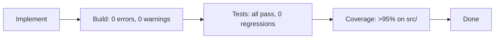
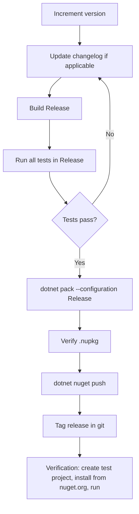

# DEVELOPMENT.md — McpCapabilities.Server

## Prerequisites

- [.NET SDK 10.0](https://dotnet.microsoft.com/download/dotnet/10.0) (see `global.json` for exact version)
- Git

Optional tools (restored via `dotnet tool restore`):
- `dotnet-coverage` — code coverage collection
- `dotnet-reportgenerator-globaltool` — coverage report generation

## Project Structure

```
McpCapabilities/
├── Directory.Build.props          # Solution-wide MSBuild properties (TreatWarningsAsErrors, ArtifactsPath)
├── Directory.Packages.props       # Central Package Management versions
├── global.json                    # SDK version and test runner config
├── dotnet-tools.json              # Local tool manifests
├── .editorconfig                  # Coding style conventions
├── AGENTS.md                      # AI coding agent guidelines (testing-first mandate, quality gates)
│
├── src/
│   └── McpCapabilities.Server/
│       ├── McpCapabilities.Server.csproj
│       ├── README.md              # Library documentation
│       ├── CapabilityFlag.cs              # [Flags] enum of MCP client capabilities
│       ├── CapabilityFlags.cs             # Bitmask utilities + ClientCapabilities → CapabilityFlag conversion
│       ├── RequiredClientCapabilitiesAttribute.cs  # [Attribute] for annotating methods
│       ├── ClientCapabilityRequirements.cs         # Record struct: serialize/deserialize requirements
│       ├── CapabilityNotMetError.cs                 # FluentResults Error subclass
│       ├── McpServerPrimitiveCapabilityExtensions.cs  # Extension methods on McpServerTool/Prompt/Resource
│       ├── CapabilityFilteringHandlers.cs             # Handler wrappers for filtering lists
│       ├── CapabilityFilteringFluentExtensions.cs     # FluentResults-based list filtering
│       ├── CapabilityServerBuilderExtensions.cs       # .WithCapabilityAwareTools<T>()
│       └── AddCapabilityGatingExtensions.cs           # .AddCapabilityGating()
│
└── tests/
    ├── McpCapabilities.Server.Unit.Tests/          # Fast, isolated unit tests (no I/O)
    │   ├── McpCapabilities.Unit.Tests.csproj
    │   ├── CapabilityFlagTests.cs
    │   ├── CapabilityFlagsFromClientCapabilitiesTests.cs
    │   ├── CapabilityNotMetErrorTests.cs
    │   ├── ClientCapabilityRequirementsTests.cs
    │   ├── RequiredClientCapabilitiesAttributeTests.cs
    │   ├── CapabilityFilteringHandlersTests.cs
    │   ├── CapabilityFilteringFluentExtensionsTests.cs
    │   ├── AddCapabilityGatingExtensionsTests.cs
    │   └── McpServerPrimitiveCapabilityExtensionsTests.cs
    │
    └── McpCapabilities.Server.Integration.Tests/   # Tests with real MCP transport and DI wiring
        ├── McpCapabilities.Server.Integration.Tests.csproj
        └── CapabilityGatingIntegrationTests.cs
│
├── tests/
│   ├── SampleMcpServer.Unit.Tests/               # Sample server unit tests (attribute verification)
│   │   ├── SampleMcpServer.Unit.Tests.csproj
│   │   ├── SampleServerAiToolsTests.cs
│   │   ├── SampleServerHelpfulPromptsTests.cs
│   │   └── SampleServerWorkspaceResourcesTests.cs
│   │
│   └── SampleMcpServer.Integration.Tests/        # Sample server integration tests (pipeline + filtering)
│       ├── SampleMcpServer.Integration.Tests.csproj
│       └── SampleMcpServerIntegrationTests.cs
│
└── samples/
    └── SampleMcpServer/             # Runnable sample MCP server
        ├── SampleMcpServer.csproj
        ├── README.md                  # Sample documentation
        ├── Program.cs                 # Hosting pipeline with DI setup
        ├── AiTools.cs                 # Capability-gated and ungated tools
        ├── HelpfulPrompts.cs          # Capability-gated and ungated prompts
        └── WorkspaceResources.cs      # Capability-gated and ungated resources
```

## Development Workflow

### 1. Restore dependencies

```bash
dotnet restore
dotnet tool restore
```

### 2. Build

```bash
dotnet build
```

Build output goes to `artifacts/bin/` (configured via `Directory.Build.props`). Warnings are treated as errors project-wide.

### 3. Run tests

```bash
# All tests
dotnet test

# Unit tests only
dotnet test tests/McpCapabilities.Server.Unit.Tests/

# Integration tests only
dotnet test tests/McpCapabilities.Server.Integration.Tests/
```

Tests use [TUnit](https://thomhurst.github.io/TUnit/) as the test framework (configured in `global.json` with `Microsoft.Testing.Platform`).

### 4. Run the sample server

```bash
dotnet run --project samples/SampleMcpServer/
```

### 5. Code coverage

```bash
# Collect coverage (outputs coverage XML)
dotnet test --coverage

# Generate HTML report from coverage data
reportgenerator \
  -reports:artifacts/bin/**/debug/**/*.cobertura.xml \
  -targetdir:artifacts/coverage-report \
  -reporttypes:Html
```

Coverage requirement: **>95%** on production code under `src/` (excluding auto-generated code, library code, and test projects).

### 5. Lint / format

The `.editorconfig` enforces code style conventions. To check formatting:

```bash
dotnet format --verify-no-changes
```

## Quality Gates

Every change must pass these gates before being considered complete:



### Test Discipline

- **Write the test first** — define expected behavior before writing implementation.
- **Red → Green → Refactor** — confirm the test fails before implementing, then refine.
- Tests must be **deterministic** (no `Thread.Sleep`, no wall-clock time, no flaky async races).
- Tests must be **fast** (unit tests: milliseconds; integration tests: seconds).
- Tests must be **independent** (no test depends on side effects or state from another test).
- Test names follow: `MethodName_Scenario_ExpectedBehavior`.

## Building the NuGet Package

### Local packaging

```bash
# Build in Release configuration and produce a .nupkg
dotnet pack src/McpCapabilities.Server/ --configuration Release

# Output: artifacts/package/release/McpCapabilities.Server.{version}.nupkg
```

The package version is derived from the project file. To set a specific version:

```bash
dotnet pack src/McpCapabilities.Server/ --configuration Release \
  -p:Version=1.0.0 \
  -p:PackageVersion=1.0.0
```

### Inspect the package

```bash
# List contents
dotnet nuget verify artifacts/package/release/*.nupkg --all

# Or unpack and browse
unzip -l artifacts/package/release/McpCapabilities.Server.*.nupkg
```

### Test the package locally

```bash
# Create a local NuGet source pointing to your package output
dotnet nuget add source $(pwd)/artifacts/package/release -n local-pkg

# In a test project, add a nuget.config referencing the local source:
# <add key="local-pkg" value="/path/to/artifacts/package/release" />

# Install and verify
dotnet add package McpCapabilities.Server --source local-pkg
dotnet build
```

## Publishing to NuGet.org

### Prerequisites

1. A [NuGet.org](https://www.nuget.org/) account.
2. An API key with push permissions. Generate one at: https://www.nuget.org/account/apikeys

### One-time setup

```bash
# Store your API key securely
dotnet nuget set-api-key YOUR_API_KEY --source https://api.nuget.org/v3/index.json
```

Or pass the key inline with `--api-key` on each push (more secure in CI pipelines).

### Release workflow



### Step-by-step commands

```bash
# 1. Ensure clean working tree and all tests pass
git status
dotnet test

# 2. Build in Release
dotnet build src/McpCapabilities.Server/ --configuration Release

# 3. Run tests in Release configuration
dotnet test --configuration Release

# 4. Create the package
dotnet pack src/McpCapabilities.Server/ --configuration Release \
  -p:Version=1.0.0

# 5. Inspect the package
dotnet nuget verify artifacts/package/release/McpCapabilities.Server.*.nupkg --all

# 6. Push to NuGet.org
dotnet nuget push artifacts/package/release/McpCapabilities.Server.*.nupkg \
  --source https://api.nuget.org/v3/index.json \
  --api-key YOUR_API_KEY

# 7. Tag the release
git tag v1.0.0
git push origin v1.0.0
```

### Package metadata

Package metadata is configured in `McpCapabilities.Server.csproj`:

```xml
<PackageId>McpCapabilities.Server</PackageId>
<Description>Capability-gating library for MCP servers. ...</Description>
```

Consider adding these optional properties for a complete package listing:

```xml
<Authors>Your Name</Authors>
<PackageLicenseExpression>MIT</PackageLicenseExpression>
<PackageProjectUrl>https://github.com/your-org/McpCapabilities</PackageProjectUrl>
<RepositoryUrl>https://github.com/your-org/McpCapabilities</RepositoryUrl>
<PackageTags>mcp;model-context-protocol;capabilities;gating</PackageTags>
<PackageReadmeFile>README.md</PackageReadmeFile>
```

And include the README in the package:

```xml
<ItemGroup>
  <None Include="README.md" Pack="true" PackagePath="\" />
</ItemGroup>
```

## Project Conventions

### Source control

- `artifacts/` is in `.gitignore` (generated build output).
- `bin/` and `obj/` are in `.gitignore`.

### Namespace structure

| Namespace | Purpose |
|-----------|---------|
| `McpCapabilities.Server` | Core library types (enums, attributes, records, extensions) |
| `Microsoft.Extensions.DependencyInjection` | DI registration extensions (`AddCapabilityGating`, `WithCapabilityAwareTools`) |

The DI extensions intentionally live in `Microsoft.Extensions.DependencyInjection` so they appear as natural extension methods when adding services.

### Dependency management

This project uses **Central Package Management** (`Directory.Packages.props`). All package versions are declared there. Individual `.csproj` files reference packages without version numbers:

```xml
<!-- Directory.Packages.props -->
<PackageVersion Include="FluentResults" Version="4.0.0" />

<!-- In .csproj files -->
<PackageReference Include="FluentResults" />
```

To add a new dependency, edit `Directory.Packages.props` to declare the version, then add the `PackageReference` (without version) to the relevant `.csproj`.

### Testing framework

Tests use [TUnit](https://thomhurst.github.io/TUnit/) with `Microsoft.Testing.Platform`:

```csharp
public class MyTests
{
    [Test]
    public async Task MethodName_Scenario_ExpectedBehavior()
    {
        var result = Something();
        await Assert.That(result).IsEqualTo(expected);
    }
}
```

### Build artifacts path

All build output goes to `artifacts/` at the repo root (not `bin/`/`obj/` inside each project):

```
artifacts/
├── bin/
│   └── McpCapabilities.Server/
│       └── debug/
│           └── net10.0/
├── obj/
└── package/
    └── release/
        └── McpCapabilities.Server.1.0.0.nupkg
```
