# MCP Client Application — Exhaustive Tutorial

This tutorial explains how to build an **MCP Client** using the `ModelContextProtocol` C# SDK. It focuses on web applications, covering every layer from transport negotiation to invoking server-side tools, prompts, and resources, with Mermaid.js diagrams illuminating architecture, modularization, and data flows.

---

## Table of Contents

1. [What Is an MCP Client?](#1-what-is-an-mcp-client)
2. [High-Level Client Architecture](#2-high-level-client-architecture)
3. [Component Catalog](#3-component-catalog)
4. [Transport Layer Deep Dive](#4-transport-layer-deep-dive)
5. [Creating and Connecting a Client](#5-creating-and-connecting-a-client)
6. [The Initialization Handshake](#6-the-initialization-handshake)
7. [Discovering Server Capabilities](#7-discovering-server-capabilities)
8. [Working with Tools](#8-working-with-tools)
9. [Working with Prompts](#9-working-with-prompts)
10. [Working with Resources](#10-working-with-resources)
11. [Client-Side Capabilities (Sampling, Roots, Elicitation)](#11-client-side-capabilities)
12. [Authentication (OAuth)](#12-authentication-oauth)
13. [Session Lifecycle & Resumption](#13-session-lifecycle--resumption)
14. [Error Handling & Completion](#14-error-handling--completion)
15. [Full Web-Application Example](#15-full-web-application-example)
16. [Data Flow Reference](#16-data-flow-reference)

---

## 1. What Is an MCP Client?

An **MCP Client** is an application that connects to one or more **MCP Servers** over a transport to discover and invoke capabilities — tools, prompts, resources, completions, and more. The client initiates the connection, performs the [Model Context Protocol](https://modelcontextprotocol.io/) handshake, and then orchestrates server interactions on behalf of an end user or an AI model.

From a **web app perspective**, the MCP client is the code running inside your backend (ASP.NET Core, Blazor Server, a minimal API, etc.) that talks to MCP servers. Your frontend JavaScript calls your backend API, which in turn uses the MCP client SDK.

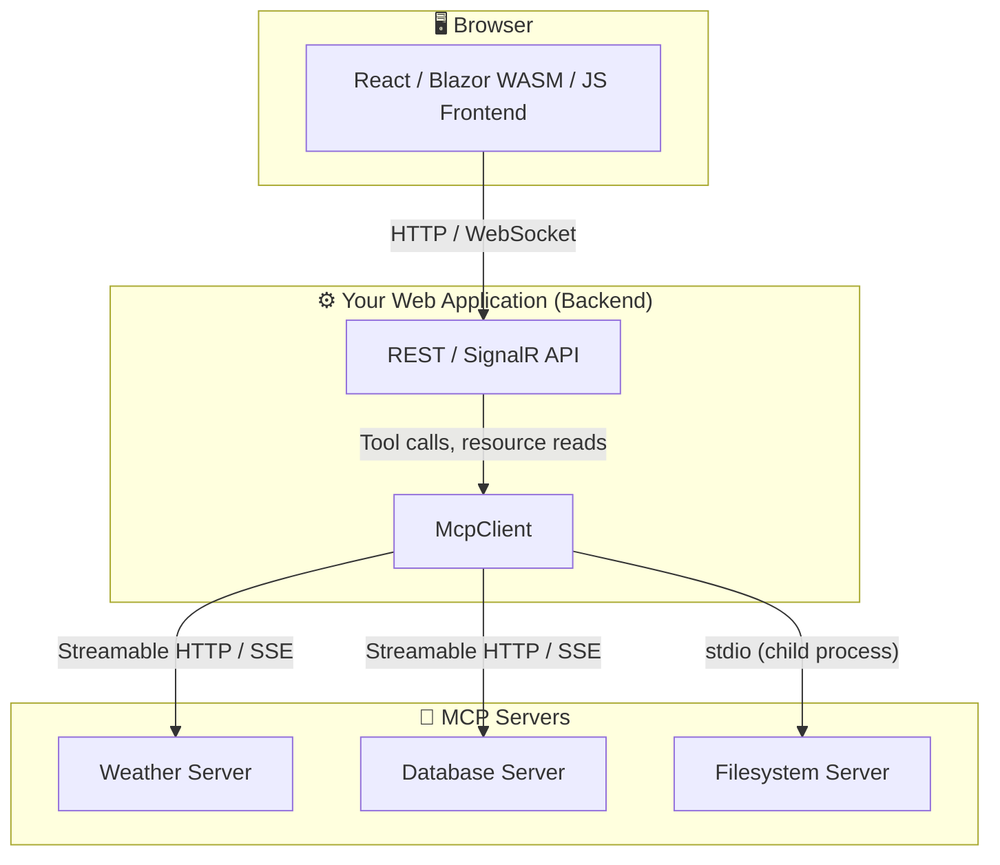

> **Key responsibility of the client:** abstract transport differences, negotiate protocol versions, deserialize JSON-RPC responses into typed C# objects, manage authentication tokens, and expose a simple async API.

---

## 2. High-Level Client Architecture

The SDK is layered. From top to bottom:

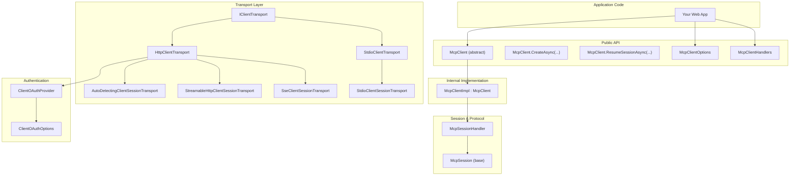

**Layer responsibilities:**

| Layer                       | Role                                                                                                                                                                                  |
| --------------------------- | ------------------------------------------------------------------------------------------------------------------------------------------------------------------------------------- |
| **Application Code**        | Your web app. Calls `McpClient.CreateAsync()`, invokes tools, handles results.                                                                                                        |
| **Public API**              | `McpClient` factory methods, `McpClientOptions`, `McpClientHandlers`, and typed wrappers (`McpClientTool`, `McpClientPrompt`, `McpClientResource`).                                   |
| **Internal Implementation** | `McpClientImpl` manages the transport, handler registration, tool cache, initialization, and disposal.                                                                                |
| **Session & Protocol**      | `McpSessionHandler` handles JSON-RPC message serialization, request/response correlation, and the bidirectional message channel.                                                      |
| **Transport Layer**         | `IClientTransport` implementations that abstract the wire protocol (HTTP, SSE, stdio).                                                                                                |
| **Authentication**          | `ClientOAuthProvider` intercepts HTTP requests, detects 401/403 challenges, discovers authorization server metadata, orchestrates the OAuth 2.0 PKCE flow, and manages bearer tokens. |

---

## 3. Component Catalog

### 3.1 Central Types

| Type                | File                          | Purpose                                                                                                                        |
| ------------------- | ----------------------------- | ------------------------------------------------------------------------------------------------------------------------------ |
| `McpClient`         | `Client/McpClient.cs`         | Abstract client base; exposes `CreateAsync`, `ResumeSessionAsync`, and all interaction methods.                                |
| `McpClientImpl`     | `Client/McpClientImpl.cs`     | Internal implementation; manages transport, handshake, tool cache, disposal.                                                   |
| `McpClientOptions`  | `Client/McpClientOptions.cs`  | Client identity (`ClientInfo`), capabilities (`Capabilities`), protocol version, initialization timeout, handlers, task store. |
| `McpClientHandlers` | `Client/McpClientHandlers.cs` | Delegate container: `RootsHandler`, `SamplingHandler`, `ElicitationHandler`, `NotificationHandlers`, `TaskStatusHandler`.      |

### 3.2 Transport Types

| Type                          | File                                    | Purpose                                                                   |
| ----------------------------- | --------------------------------------- | ------------------------------------------------------------------------- |
| `IClientTransport`            | `Client/IClientTransport.cs`            | Contract: `Name` + `ConnectAsync() → ITransport`.                         |
| `HttpClientTransport`         | `Client/HttpClientTransport.cs`         | HTTP-based transport (SSE or Streamable HTTP).                            |
| `HttpClientTransportOptions`  | `Client/HttpClientTransportOptions.cs`  | Endpoint, transport mode, auth, headers, timeouts, reconnection settings. |
| `HttpTransportMode`           | `Client/HttpTransportMode.cs`           | Enum: `AutoDetect`, `StreamableHttp`, `Sse`.                              |
| `StdioClientTransport`        | `Client/StdioClientTransport.cs`        | Launches a child process and communicates via stdin/stdout.               |
| `StdioClientTransportOptions` | `Client/StdioClientTransportOptions.cs` | Command, arguments, environment variables, shutdown timeout.              |

### 3.3 Wrapper Types

| Type                        | File                                  | Purpose                                                                                                                       |
| --------------------------- | ------------------------------------- | ----------------------------------------------------------------------------------------------------------------------------- |
| `McpClientTool`             | `Client/McpClientTool.cs`             | An `AIFunction` wrapper around a server tool. Supports `.WithName()`, `.WithDescription()`, `.WithProgress()`, `.WithMeta()`. |
| `McpClientPrompt`           | `Client/McpClientPrompt.cs`           | Wrapper around a server prompt. Has a `.GetAsync()` convenience method.                                                       |
| `McpClientResource`         | `Client/McpClientResource.cs`         | Wrapper around a server resource. Has a `.ReadAsync()` convenience method.                                                    |
| `McpClientResourceTemplate` | `Client/McpClientResourceTemplate.cs` | Wrapper around a parameterized URI template.                                                                                  |

### 3.4 Authentication Types

| Type                            | File                                              | Purpose                                                                                                         |
| ------------------------------- | ------------------------------------------------- | --------------------------------------------------------------------------------------------------------------- |
| `ClientOAuthOptions`            | `Authentication/ClientOAuthOptions.cs`            | OAuth configuration: redirect URI, client ID/secret, scopes, DCR settings, token cache, authorization delegate. |
| `ClientOAuthProvider`           | `Authentication/ClientOAuthProvider.cs`           | Internal `McpHttpClient` subclass that handles OAuth 2.0 with PKCE, DCR, token refresh, and CIMD.               |
| `ITokenCache`                   | `Authentication/ITokenCache.cs`                   | Interface for persistent token storage. Default: `InMemoryTokenCache`.                                          |
| `AuthorizationRedirectDelegate` | `Authentication/AuthorizationRedirectDelegate.cs` | Delegate: `(authUrl, redirectUri, ct) → authorizationCode?`.                                                    |

### 3.5 Completion / Error Types

| Type                             | File                                       | Purpose                                                           |
| -------------------------------- | ------------------------------------------ | ----------------------------------------------------------------- |
| `ClientCompletionDetails`        | `Client/ClientCompletionDetails.cs`        | Base class: why a session ended (`Exception`).                    |
| `StdioClientCompletionDetails`   | `Client/StdioClientCompletionDetails.cs`   | Extends with `ExitCode`, `StandardErrorTail`, `ProcessId`.        |
| `HttpClientCompletionDetails`    | `Client/HttpClientCompletionDetails.cs`    | Extends with `HttpStatusCode`.                                    |
| `ClientTransportClosedException` | `Client/ClientTransportClosedException.cs` | Wraps `ClientCompletionDetails` for structured error propagation. |

---

## 4. Transport Layer Deep Dive

The transport layer is the most modular part of the client. Every transport implements `IClientTransport`:

```csharp
public interface IClientTransport
{
    string Name { get; }
    Task<ITransport> ConnectAsync(CancellationToken cancellationToken = default);
}
```

`ConnectAsync` returns an `ITransport`, which provides a `ChannelReader<JsonRpcMessage>` and a `SendMessageAsync` method.

### 4.1 Transport Selection Decision Tree

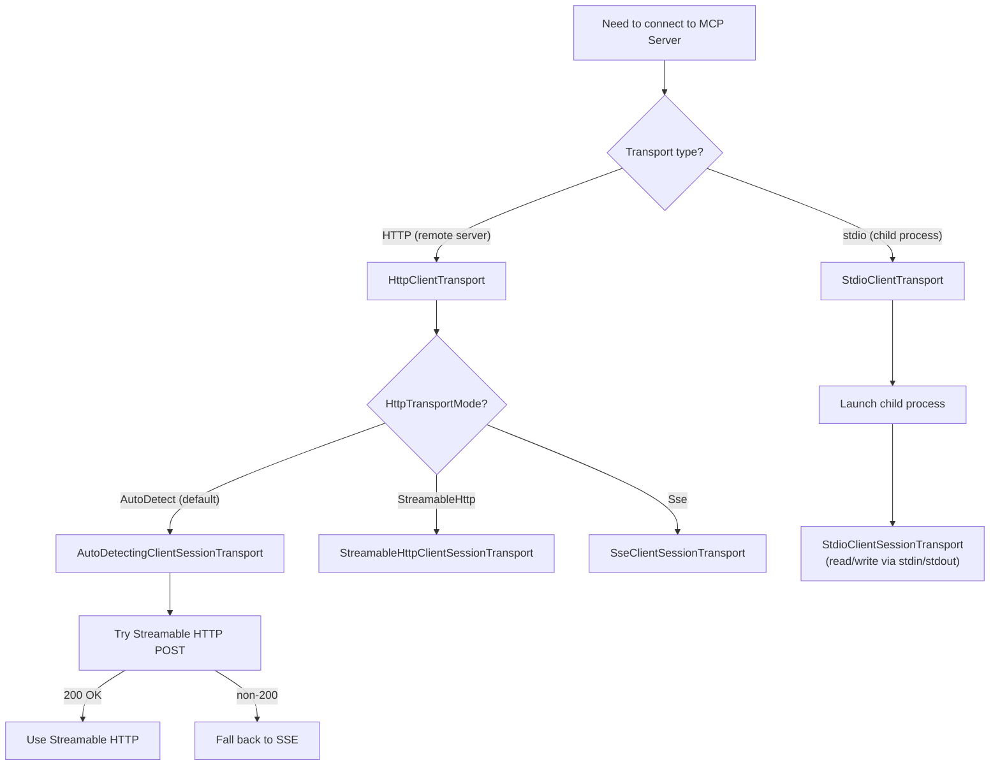

### 4.2 Streamable HTTP (Recommended for Web Apps)

Streamable HTTP is the modern MCP transport. It uses:

- **POST** requests to send JSON-RPC messages to the server.
- **GET** requests with `Accept: text/event-stream` to receive server-initiated notifications.
- **`Mcp-Session-Id`** header to multiplex sessions.
- **`Last-Event-Id`** header for resumability.

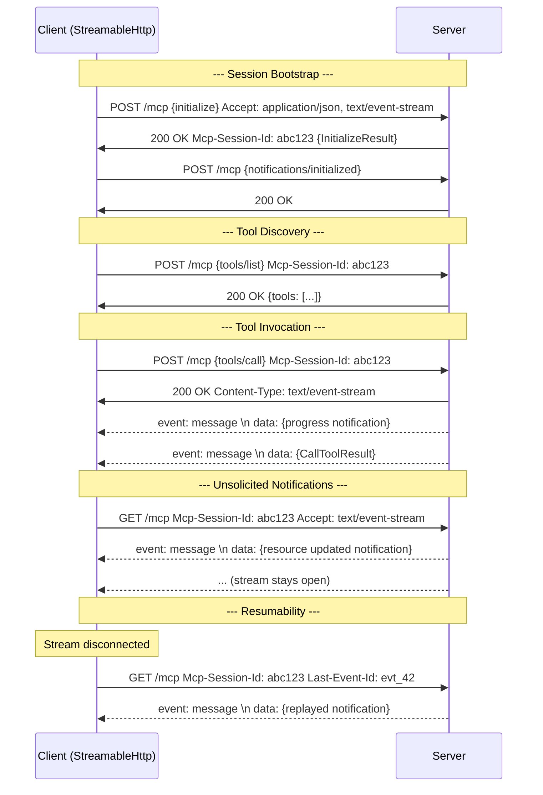

Key implementation details in `StreamableHttpClientSessionTransport`:

- **`SendMessageAsync`** — POSTs the JSON-RPC message; the response may be `application/json` (immediate) or `text/event-stream` (streaming).
- **`ReceiveUnsolicitedMessagesAsync`** — long-running GET loop that reads SSE events.
- **`SendGetSseRequestWithRetriesAsync`** — reconnection with exponential-ish backoff, honoring `Last-Event-Id`.
- **`AddMcpRequestHeaders`** — automatically adds `Mcp-Method`, `Mcp-Name`, and `Mcp-Param-*` headers based on the tool schema's `x-mcp-header` annotations.

### 4.3 SSE (Server-Sent Events) Transport

The SSE transport uses:

- A persistent **GET** to an SSE endpoint to receive messages.
- Separate **POST** requests to a message endpoint to send messages.

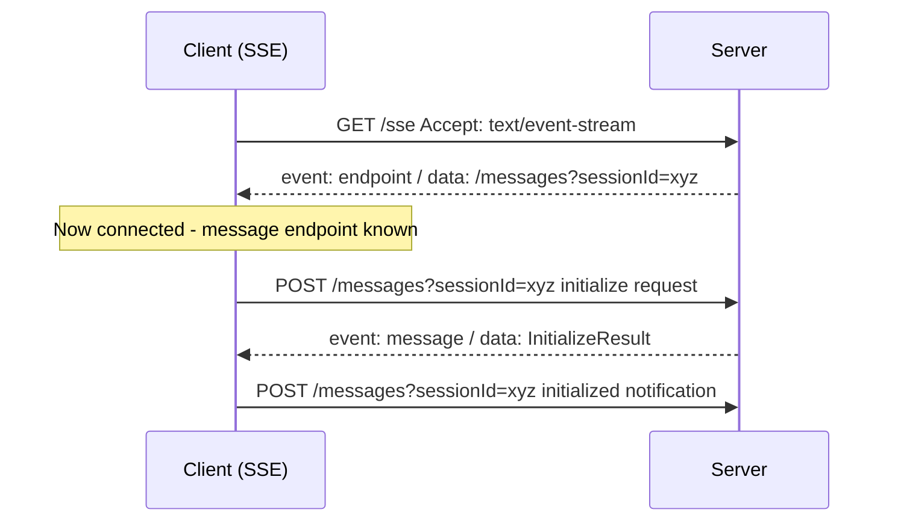

### 4.4 stdio Transport

Launches a child process and communicates via stdin/stdout (newline-delimited JSON). Useful for local MCP servers. Not relevant for web apps unless the web app runs on the same machine and spawns processes.

### 4.5 Auto-Detection

`HttpTransportMode.AutoDetect` (the default for `HttpClientTransport`) tries Streamable HTTP first. If the server returns a non-200 status code, it falls back to SSE transparently. This is implemented in `AutoDetectingClientSessionTransport`.

---

## 5. Creating and Connecting a Client

### 5.1 Minimal Web-App Connection

```csharp
using ModelContextProtocol.Client;
using Microsoft.Extensions.Logging;

// 1. Configure transport
var transport = new HttpClientTransport(new HttpClientTransportOptions
{
    Endpoint = new Uri("https://my-mcp-server.example.com/mcp"),
    TransportMode = HttpTransportMode.StreamableHttp,  // or AutoDetect / Sse
});

// 2. Configure client options
var clientOptions = new McpClientOptions
{
    ClientInfo = new() { Name = "MyWebApp", Version = "1.0.0" },
    ProtocolVersion = "2025-11-25",  // optional; null = negotiate latest
    InitializationTimeout = TimeSpan.FromSeconds(30),
};

// 3. Create and connect (handshake happens here)
var loggerFactory = LoggerFactory.Create(b => b.AddConsole());
McpClient client = await McpClient.CreateAsync(
    transport,
    clientOptions,
    loggerFactory);
```

### 5.2 Configuring a Shared HttpClient

In a web app, you typically want to reuse an `HttpClient` via `IHttpClientFactory`. Pass it to the transport:

```csharp
// In Program.cs / Startup:
builder.Services.AddHttpClient("McpClient", client =>
{
    client.Timeout = TimeSpan.FromSeconds(60);
});

// Later, in your service:
var httpClient = httpClientFactory.CreateClient("McpClient");
var transport = new HttpClientTransport(
    new HttpClientTransportOptions { Endpoint = new Uri("...") },
    httpClient,                    // shared HttpClient
    loggerFactory,
    ownsHttpClient: false);        // don't dispose it; DI manages it
```

> **Note for web apps:** Always use `ownsHttpClient: false` when the `HttpClient` is managed by `IHttpClientFactory`.

### 5.3 Custom HTTP Headers

```csharp
var transport = new HttpClientTransport(new HttpClientTransportOptions
{
    Endpoint = new Uri("https://server/mcp"),
    AdditionalHeaders = new Dictionary<string, string>
    {
        ["X-API-Key"] = "my-api-key",
        ["X-Tenant-Id"] = "tenant-42",
    },
});
```

These headers are included in every POST and GET request.

---

## 6. The Initialization Handshake

The handshake is a three-step JSON-RPC exchange:

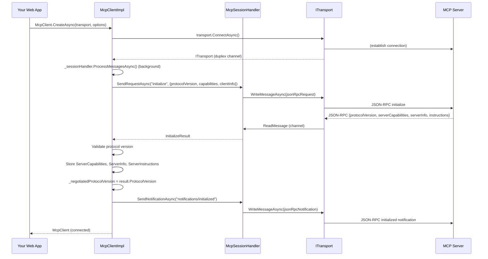

**What happens during `ConnectAsync` inside `McpClientImpl`:**

1. Start `_sessionHandler.ProcessMessagesAsync()` — a background loop reading from the transport's `ChannelReader<JsonRpcMessage>`.
2. Create a `CancellationTokenSource` with the `InitializationTimeout`.
3. Send `initialize` request with `ClientCapabilities`, `ClientInfo`, and `ProtocolVersion`.
4. Receive `InitializeResult` from the server.
5. Validate protocol version:
   - If `McpClientOptions.ProtocolVersion` is set, the server must match it exactly.
   - If not set, the server's version must be in `McpSessionHandler.SupportedProtocolVersions`.
6. Store `ServerCapabilities`, `ServerInfo`, `ServerInstructions`.
7. Send `notifications/initialized`.
8. Return the connected `McpClient`.

**Error scenarios during handshake:**

- **Timeout:** If the server doesn't respond within `InitializationTimeout` (default 60s), a `TimeoutException` is thrown.
- **Protocol mismatch:** An `McpException` is thrown.
- **Transport failure:** The transport may throw `HttpRequestException` (HTTP), `IOException` (stdio), or `ClientTransportClosedException`.

---

## 7. Discovering Server Capabilities

After connection, inspect what the server offers:

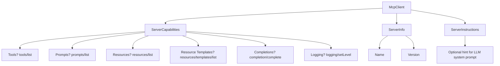

```csharp
Console.WriteLine($"Connected to: {client.ServerInfo.Name} v{client.ServerInfo.Version}");
Console.WriteLine($"Protocol: {client.NegotiatedProtocolVersion}");
Console.WriteLine($"Instructions: {client.ServerInstructions}");

// Check capabilities
var caps = client.ServerCapabilities;
bool hasTools = caps.Tools is not null;
bool hasPrompts = caps.Prompts is not null;
bool hasResources = caps.Resources is not null;
bool hasCompletions = caps.Completions is not null;
bool toolsListChanged = caps.Tools?.ListChanged == true;
```

> **Important:** Always check capabilities before calling list/get methods. Calling `ListToolsAsync()` on a server that doesn't support tools results in a protocol error.

---

## 8. Working with Tools

Tools are the primary interaction mechanism. The flow is: **discover → invoke → process result**.

### 8.1 Listing Tools

```csharp
IList<McpClientTool> tools = await client.ListToolsAsync();

foreach (var tool in tools)
{
    Console.WriteLine($"Tool: {tool.Name}");
    Console.WriteLine($"  Description: {tool.Description}");
    Console.WriteLine($"  Title: {tool.Title}");
    // tool.ProtocolTool.InputSchema contains the JSON Schema
}
```

`ListToolsAsync` handles pagination automatically. Internally it clears the tool cache, sends `tools/list` in a loop with a cursor, validates `x-mcp-header` annotations, and wraps each `Tool` in an `McpClientTool`.

### 8.2 Calling a Tool

```csharp
var result = await client.CallToolAsync(
    toolName: "get_forecast",
    arguments: new Dictionary<string, object?>
    {
        ["latitude"] = 47.6062,
        ["longitude"] = -122.3321,
    });

if (result.IsError == true)
{
    Console.WriteLine($"Error: {result}");
}
else
{
    foreach (var contentBlock in result.Content)
    {
        if (contentBlock is TextContentBlock text)
            Console.WriteLine(text.Text);
        else if (contentBlock is ImageContentBlock img)
            Console.WriteLine($"Image: {img.MimeType}, {img.Data}");
        else if (contentBlock is ResourceContentBlock res)
            Console.WriteLine($"Resource: {res.Resource.Uri}");
    }
}
```

### 8.3 Progress Reporting

```csharp
var progress = new Progress<ProgressNotificationValue>(p =>
{
    Console.WriteLine($"Progress: {p.Progress} / {p.Total}");
});

var result = await client.CallToolAsync(
    "long_running_task",
    arguments: null,
    progress: progress);
```

Or via `McpClientTool`:

```csharp
var tool = tools.First(t => t.Name == "long_running_task");
var configuredTool = tool.WithProgress(new Progress<ProgressNotificationValue>(p =>
    Console.WriteLine($"{p.Message}")));

var result = await configuredTool.CallAsync(arguments);
```

### 8.4 Tool Customization (Model-Facing)

`McpClientTool` extends `AIFunction` from `Microsoft.Extensions.AI`, so it integrates directly with `IChatClient`:

```csharp
// Rename for the model without changing the wire protocol
var renamed = tool.WithName("weather_forecast");

// Override the description
var redescribed = tool.WithDescription("Gets the 7-day forecast for a US location.");

// Add metadata injected into the _meta field
var metaTool = tool.WithMeta(new JsonObject { ["category"] = "weather" });

// Chain modifications
var final = tool
    .WithName("get_forecast")
    .WithDescription("Returns current weather forecast")
    .WithProgress(new Progress<ProgressNotificationValue>(...));
```

### 8.5 Known Tools (Pre-Registration for HTTP Headers)

When using Streamable HTTP, the client sends `Mcp-Param-*` headers based on `x-mcp-header` schema annotations. You can pre-register tool schemas:

```csharp
// Register tools you already know about (e.g., from config or prior session)
client.AddKnownTools(new[]
{
    new Tool
    {
        Name = "get_forecast",
        InputSchema = /* JSON Schema with x-mcp-header annotations */
    }
});

// Later calls will include Mcp-Param-* headers even without ListToolsAsync
await client.CallToolAsync("get_forecast", args);

// Remove when no longer needed
client.RemoveKnownTools(new[] { "get_forecast" });
client.ClearKnownTools(); // remove all
```

### 8.6 Internal Tool Cache Behavior

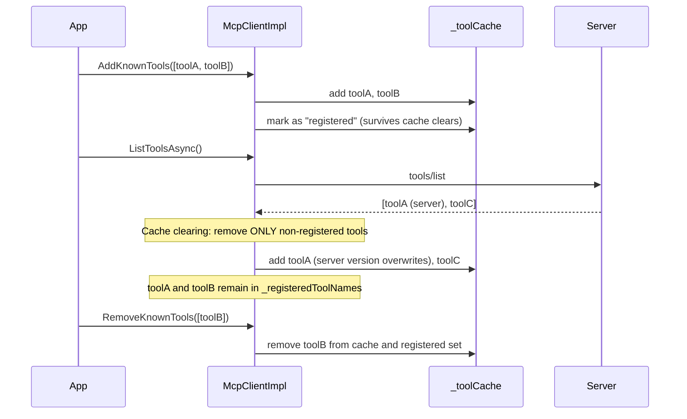

---

## 9. Working with Prompts

Prompts are server-defined prompt templates that can be retrieved and presented to an LLM.

```csharp
// Discover
IList<McpClientPrompt> prompts = await client.ListPromptsAsync();

foreach (var prompt in prompts)
{
    Console.WriteLine($"Prompt: {prompt.Name} — {prompt.Description}");
}

// Retrieve a specific prompt with arguments
var result = await client.GetPromptAsync(
    name: "code_review",
    arguments: new Dictionary<string, object?>
    {
        ["language"] = "csharp",
        ["code"] = "public class Foo {}",
    });

// Or via the wrapper
var prompt = prompts.First(p => p.Name == "code_review");
var result2 = await prompt.GetAsync(new Dictionary<string, object?>
{
    ["language"] = "csharp",
    ["code"] = "public class Foo {}",
});

// result.Messages contains the prompt content
foreach (var message in result.Messages)
{
    Console.WriteLine($"[{message.Role}]: {message.Content.Text}");
}
```

---

## 10. Working with Resources

Resources are URI-addressable content served by the MCP server.

### 10.1 Listing Resources

```csharp
IList<McpClientResource> resources = await client.ListResourcesAsync();

foreach (var res in resources)
{
    Console.WriteLine($"{res.Name}: {res.Uri} ({res.MimeType})");
}
```

### 10.2 Reading Resources

```csharp
// By URI string
var result = await client.ReadResourceAsync("docs://readme");

// By Uri object
var result2 = await client.ReadResourceAsync(new Uri("docs://readme"));

// By URI template with arguments
var result3 = await client.ReadResourceAsync(
    "docs://users/{userId}",
    new Dictionary<string, object?> { ["userId"] = "42" });

// Via the wrapper
var resource = resources.First(r => r.Name == "readme");
var result4 = await resource.ReadAsync();

// result.Contents contains the resource content
foreach (var content in result.Contents)
{
    Console.WriteLine($"[{content.Uri}]: {content.Text}");
}
```

### 10.3 Listing Resource Templates

Resource templates are parameterized URIs:

```csharp
IList<McpClientResourceTemplate> templates = await client.ListResourceTemplatesAsync();

foreach (var tmpl in templates)
{
    Console.WriteLine($"Template: {tmpl.UriTemplate} — {tmpl.Description}");
}

// Read via template
var tmpl = templates.First(t => t.Name == "user_profile");
var result = await tmpl.ReadAsync(new Dictionary<string, object?> { ["userId"] = "42" });
```

### 10.4 Subscribing to Resource Updates

```csharp
// Subscribe with a typed handler (recommended)
IAsyncDisposable subscription = await client.SubscribeToResourceAsync(
    "docs://notifications",
    handler: (update, ct) =>
    {
        Console.WriteLine($"Resource updated: {update.Uri}");
        return ValueTask.CompletedTask;
    });

// ... later, dispose to unsubscribe and remove handler
await subscription.DisposeAsync();
```

---

## 11. Client-Side Capabilities

Client capabilities describe what the **server can request from the client**. Configure them via `McpClientHandlers`.

### 11.1 Sampling (LLM generation)

The server can ask your client to generate text via an LLM. The handler receives a
`request` (with the conversation messages, model preferences, max tokens), a `progress`
reporter, and a cancellation token.

```csharp
var options = new McpClientOptions
{
    Handlers = new McpClientHandlers
    {
        SamplingHandler = async (request, progress, ct) =>
        {
            // 1. Report initial progress so the server knows work has started
            progress?.Report(new ProgressNotificationValue
            {
                Progress = 0,
                Total = 100,
                Message = "Starting LLM generation..."
            });

            // 2. Build chat options from the server's request
            var chatOptions = new ChatOptions
            {
                MaxOutputTokens = request?.MaxTokens ?? 1024,
                Temperature = request?.ModelPreferences?.Temperature,
                StopSequences = request?.ModelPreferences?.StopSequences,
            };

            // 3. Optionally report model selection progress
            var modelId = request?.ModelPreferences?.Model
                ?? "default-model";
            progress?.Report(new ProgressNotificationValue
            {
                Progress = 10,
                Total = 100,
                Message = $"Selected model: {modelId}"
            });

            // 4. Call the LLM (streaming if supported)
            var response = await myChatClient.GetResponseAsync(
                request!.Messages, chatOptions, ct);

            // 5. Report final progress
            progress?.Report(new ProgressNotificationValue
            {
                Progress = 100,
                Total = 100,
                Message = "Generation complete"
            });

            // 6. Build and return the result
            return new CreateMessageResult
            {
                Role = Role.Assistant,
                Content = [new ContentBlock
                {
                    Type = "text",
                    Text = response.Text
                }],
                Model = modelId,
                StopReason = response.FinishReason switch
                {
                    ChatFinishReason.Stop       => CreateMessageResult.StopReasonEndTurn,
                    ChatFinishReason.Length     => CreateMessageResult.StopReasonMaxTokens,
                    ChatFinishReason.ToolCalls  => CreateMessageResult.StopReasonToolUse,
                    _                           => response.FinishReason?.ToString()
                },
            };
        },
    },
};
```

For streaming LLM calls, you can report incremental progress as tokens are generated:

```csharp
SamplingHandler = async (request, progress, ct) =>
{
    var fullResponse = new StringBuilder();
    var tokenCount = 0;
    var estimatedTokens = request?.MaxTokens ?? 1024;

    progress?.Report(new ProgressNotificationValue
    {
        Progress = 0,
        Total = estimatedTokens,
        Message = "Streaming response..."
    });

    await foreach (var update in myChatClient.GetStreamingResponseAsync(
        request!.Messages, new ChatOptions { MaxOutputTokens = request.MaxTokens }, ct))
    {
        fullResponse.Append(update.Text);
        tokenCount++;

        // Report every 10 tokens to avoid flooding the progress channel
        if (tokenCount % 10 == 0 || update.FinishReason is not null)
        {
            progress?.Report(new ProgressNotificationValue
            {
                Progress = Math.Min(tokenCount, estimatedTokens),
                Total = estimatedTokens,
                Message = $"Generated {tokenCount} tokens"
            });
        }
    }

    return new CreateMessageResult
    {
        Role = Role.Assistant,
        Content = [new ContentBlock { Type = "text", Text = fullResponse.ToString() }],
        Model = request?.ModelPreferences?.Model ?? "default-model",
        StopReason = CreateMessageResult.StopReasonEndTurn,
    };
},
```

> **Note:** The `SamplingHandler` can also be created from `IChatClient` using the
> `CreateSamplingHandler()` extension method. The `ProgressNotificationValue` has three
> properties: `Progress` (float, monotonically increasing), `Total` (float?, the
> expected total), and `Message` (string?, human-readable status). The progress
> notifications are sent back to the MCP server via `notifications/progress`.

### 11.2 Roots (filesystem roots)

```csharp
options.Handlers.RootsHandler = (request, ct) =>
{
    return ValueTask.FromResult(new ListRootsResult
    {
        Roots = new List<Root>
        {
            new() { Uri = "file:///home/user/projects", Name = "Projects" },
        },
    });
};
```

### 11.3 Elicitation (user input)

When the server needs more information from the user:

```csharp
options.Handlers.ElicitationHandler = (request, ct) =>
{
    // In a web app, you'd send this to the frontend and await the user's response
    Console.WriteLine($"Server asks: {request.Message}");

    return ValueTask.FromResult(new ElicitResult
    {
        Action = "accept",
        Content = new Dictionary<string, JsonElement>
        {
            ["answer"] = JsonSerializer.SerializeToElement("my response"),
        },
    });
};
```

### 11.4 Notification Handlers

Register handlers for server-sent notifications:

```csharp
options.Handlers.NotificationHandlers = new Dictionary<string, Func<JsonRpcNotification, CancellationToken, ValueTask>>
{
    [NotificationMethods.ResourceUpdatedNotification] = async (notification, ct) =>
    {
        var update = JsonSerializer.Deserialize<ResourceUpdatedNotificationParams>(notification.Params);
        Console.WriteLine($"Resource changed: {update.Uri}");
    },
};

// Or register dynamically after connection:
IAsyncDisposable handler = client.RegisterNotificationHandler(
    "notifications/custom",
    (notification, ct) =>
    {
        Console.WriteLine($"Custom notification: {notification.Params}");
        return ValueTask.CompletedTask;
    });

// Unregister by disposing
await handler.DisposeAsync();
```

### 11.5 Task-Augmented Requests

When a `TaskStore` is configured, the client can accept requests the server wants handled asynchronously:

```csharp
options.TaskStore = new InMemoryMcpTaskStore();
options.SendTaskStatusNotifications = true;

options.Handlers.TaskStatusHandler = (task, ct) =>
{
    Console.WriteLine($"Task {task.TaskId}: {task.Status} — {task.StatusMessage}");
    return ValueTask.CompletedTask;
};
```

The client advertises `tasks` capability, and the server can send `sampling/createMessage` or `elicitation/create` with a `task` metadata block. The client creates the task, returns immediately with a `CreateTaskResult`, and processes the task in the background.

---

## 12. Authentication (OAuth)

MCP clients authenticate to protected servers using OAuth 2.0 with PKCE.

### 12.1 OAuth Architecture

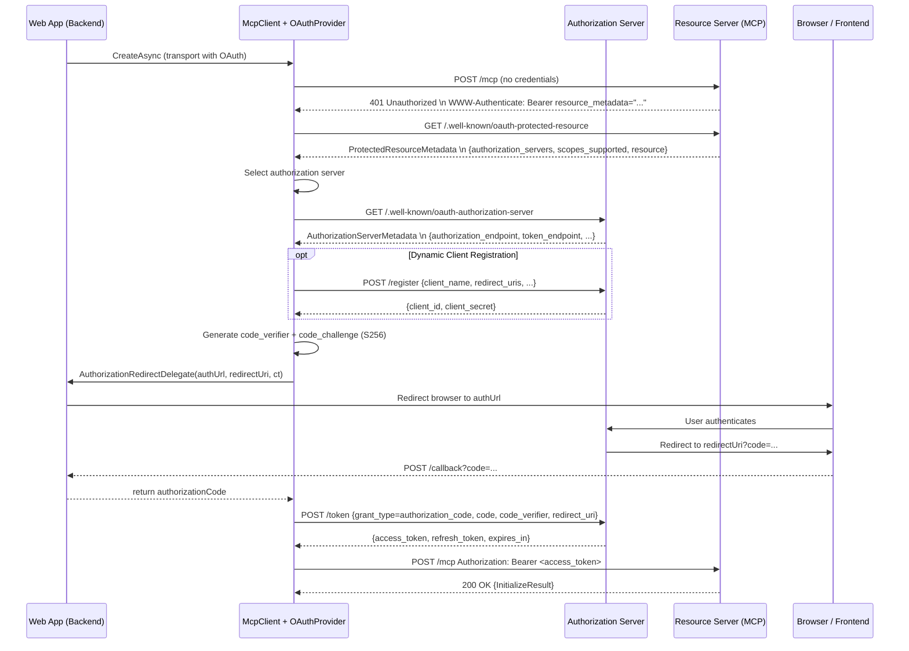

### 12.2 Minimal OAuth Configuration

```csharp
var transport = new HttpClientTransport(new HttpClientTransportOptions
{
    Endpoint = new Uri("https://protected-mcp-server.example.com/mcp"),
    OAuth = new ClientOAuthOptions
    {
        RedirectUri = new Uri("https://my-webapp.example.com/oauth/callback"),
        AuthorizationRedirectDelegate = HandleAuthorizationAsync,
        // Scopes (fallback when server doesn't provide them)
        Scopes = new[] { "mcp:tools", "mcp:resources" },
    },
});

// In your web app, implement the delegate:
static async Task<string?> HandleAuthorizationAsync(
    Uri authorizationUrl, Uri redirectUri, CancellationToken ct)
{
    // 1. Store the redirectUri → pendingRequest mapping in your session state
    // 2. Redirect the user's browser to authorizationUrl
    // 3. Wait for the callback at redirectUri?code=...
    // 4. Return the authorization code
}
```

### 12.3 Pre-Registered Client Credentials

Skip dynamic client registration by providing known credentials:

```csharp
OAuth = new ClientOAuthOptions
{
    RedirectUri = new Uri("https://myapp/callback"),
    ClientId = "my-client-id",
    ClientSecret = "my-client-secret",  // optional for public clients
    AuthorizationRedirectDelegate = HandleAuthorizationAsync,
}
```

### 12.4 Dynamic Client Registration (DCR)

When no `ClientId` is provided, the client will automatically register with the authorization server:

```csharp
OAuth = new ClientOAuthOptions
{
    RedirectUri = new Uri("https://myapp/callback"),
    DynamicClientRegistration = new DynamicClientRegistrationOptions
    {
        ClientName = "My MCP Web App",
        ClientUri = new Uri("https://myapp.example.com"),
        InitialAccessToken = "optional-initial-token",
        ResponseDelegate = async (response, ct) =>
        {
            // Store the issued client_id and client_secret for future use
            await SaveClientCredentialsAsync(response.ClientId, response.ClientSecret);
        },
    },
    AuthorizationRedirectDelegate = HandleAuthorizationAsync,
}
```

### 12.5 Client Metadata Document (CIMD)

Instead of DCR, you can provide an HTTPS URL pointing to your client's metadata:

```csharp
OAuth = new ClientOAuthOptions
{
    RedirectUri = new Uri("https://myapp/callback"),
    ClientMetadataDocumentUri = new Uri("https://myapp.example.com/.well-known/client-metadata"),
    AuthorizationRedirectDelegate = HandleAuthorizationAsync,
}
```

This requires the server to support `client_id_metadata_document_supported`.

### 12.6 Persistent Token Cache

Store tokens across app restarts:

```csharp
public class DatabaseTokenCache : ITokenCache
{
    public async Task<TokenContainer?> GetTokensAsync(CancellationToken ct)
    {
        // Load from DB
    }

    public async Task StoreTokensAsync(TokenContainer tokens, CancellationToken ct)
    {
        // Save to DB
    }
}

// Use it:
OAuth = new ClientOAuthOptions
{
    ...
    TokenCache = new DatabaseTokenCache(),
}
```

### 12.7 Scope Selection Strategy

The SDK follows the MCP scope selection strategy (in order of priority):

1. **WWW-Authenticate `scope` parameter** (from the 401 challenge)
2. **Protected Resource Metadata `scopes_supported`** (from `/.well-known/oauth-protected-resource`)
3. **`ClientOAuthOptions.Scopes`** (client-configured fallback)
4. **Omit scope parameter** (if none of the above)

Customize with `ScopeSelector`:

```csharp
OAuth.ScopeSelector = (candidateScopes) =>
{
    // Return only the scopes your app needs
    return candidateScopes?.Where(s => s.StartsWith("mcp:")).ToArray();
};
```

The SDK automatically appends `offline_access` when the authorization server advertises it (for refresh tokens).

### 12.8 Auth Server Selection

When multiple authorization servers are available (from PRM):

```csharp
OAuth.AuthServerSelector = (availableServers) =>
{
    // Prefer our trusted auth server
    return availableServers.FirstOrDefault(s =>
        s.Host == "auth.trusted-provider.com");
};
```

---

## 13. Session Lifecycle & Resumption

### 13.1 Normal Lifecycle

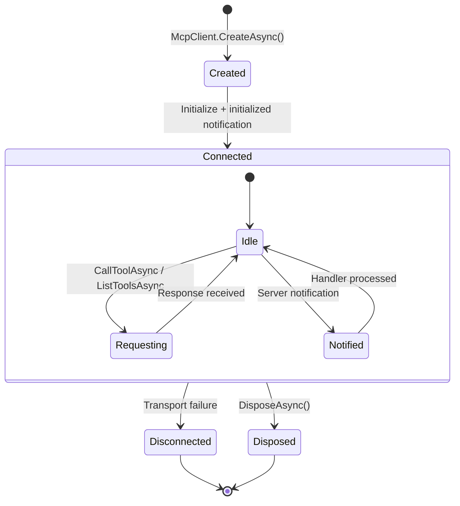

Always dispose the client:

```csharp
await using var client = await McpClient.CreateAsync(transport, options);
// ... use client ...
// Disposed automatically at end of block
```

### 13.2 Session Resumption

Resume a previous session without re-initializing (Streamable HTTP only):

```csharp
// --- First process ---
var client1 = await McpClient.CreateAsync(transport);
string sessionId = client1.SessionId;
var serverCaps = client1.ServerCapabilities;
var serverInfo = client1.ServerInfo;

// Save these for later...
await client1.DisposeAsync();  // Send DELETE (if OwnsSession=true)

// --- Second process (e.g., after app restart) ---
var transport2 = new HttpClientTransport(new HttpClientTransportOptions
{
    Endpoint = new Uri("https://server/mcp"),
    TransportMode = HttpTransportMode.StreamableHttp,
    KnownSessionId = sessionId,  // <-- key setting
});

var client2 = await McpClient.ResumeSessionAsync(
    transport2,
    new ResumeClientSessionOptions
    {
        ServerCapabilities = serverCaps,
        ServerInfo = serverInfo,
        ServerInstructions = client1.ServerInstructions,
        NegotiatedProtocolVersion = client1.NegotiatedProtocolVersion,
    });
```

> **Important:** When `OwnsSession` is `false`, the transport does **not** send a DELETE request on disposal. This is critical when you want to hand off a session to another transport.

### 13.3 Session Expiry Handling

If the server returns HTTP 404 with an `Mcp-Session-Id`, the transport signals session expiry. The `McpClient.Completion` task resolves, and any in-flight operations are cancelled. Catch this to reconnect:

```csharp
var completionTask = client.Completion;

// ... use client ...

if (completionTask.IsCompleted)
{
    var details = await completionTask;
    if (details.Exception is not null)
    {
        // Handle disconnection: reconnect, notify user, etc.
    }
}
```

---

## 14. Error Handling & Completion

### 14.1 Error Types

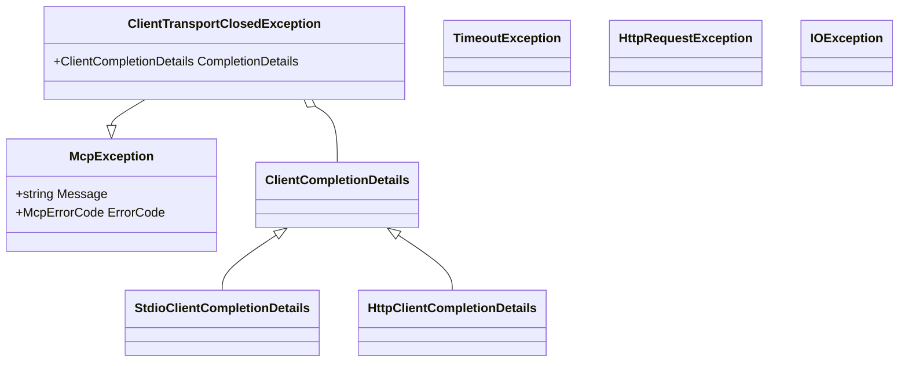

### 14.2 Completion Details

The `McpClient.Completion` property is a `Task<ClientCompletionDetails>` that completes when the session ends:

```csharp
var details = await client.Completion;

if (details is StdioClientCompletionDetails stdio)
{
    Console.WriteLine($"Process {stdio.ProcessId} exited with code {stdio.ExitCode}");
    if (stdio.StandardErrorTail is { Length: > 0 })
    {
        Console.WriteLine($"Stderr: {string.Join("\n", stdio.StandardErrorTail)}");
    }
}
else if (details is HttpClientCompletionDetails http)
{
    Console.WriteLine($"HTTP status: {http.HttpStatusCode}");
    Console.WriteLine($"Error: {http.Exception?.Message}");
}
```

### 14.3 Robust Error Handling Pattern

```csharp
try
{
    await using var client = await McpClient.CreateAsync(transport, options, loggerFactory);

    var tools = await client.ListToolsAsync();
    // ...
}
catch (TimeoutException ex)
{
    // Initialization timed out
    _logger.LogError(ex, "MCP server did not respond in time");
}
catch (ClientTransportClosedException ex)
{
    // Transport closed prematurely (check ex.CompletionDetails)
    _logger.LogError(ex, "MCP transport closed: {Reason}",
        ex.CompletionDetails.Exception?.Message);
}
catch (HttpRequestException ex) when (ex.StatusCode == HttpStatusCode.Unauthorized)
{
    // Authentication required
    _logger.LogWarning("MCP server requires authentication");
}
catch (McpException ex)
{
    // Protocol-level error
    _logger.LogError(ex, "MCP protocol error: {Code}", ex.ErrorCode);
}
```

---

## 15. Full Web-Application Example

Below is a complete ASP.NET Core minimal API that acts as an MCP client web application.

### 15.1 Project Structure

```
MyMcpWebApp/
├── Program.cs                    # Host builder & DI setup
├── Services/
│   ├── McpClientService.cs       # Wraps McpClient lifecycle
│   └── OAuthCallbackHandler.cs   # Handles OAuth redirect
├── Endpoints/
│   └── McpEndpoints.cs           # API endpoints exposed to frontend
└── MyMcpWebApp.csproj
```

### 15.2 Program.cs — DI Registration

```csharp
using ModelContextProtocol.Client;
using MyMcpWebApp.Services;

var builder = WebApplication.CreateBuilder(args);

// Register IHttpClientFactory for the MCP transport
builder.Services.AddHttpClient("McpTransport", client =>
{
    client.Timeout = TimeSpan.FromMinutes(5);
});

// Register our MCP client service as a singleton (or scoped, depending on needs)
builder.Services.AddSingleton<McpClientService>();

// Register OAuth callback handler
builder.Services.AddSingleton<OAuthCallbackHandler>();

builder.Services.AddCors(options =>
{
    options.AddDefaultPolicy(policy =>
        policy.WithOrigins("http://localhost:5173")
              .AllowAnyMethod()
              .AllowAnyHeader());
});

var app = builder.Build();
app.UseCors();

// Map API endpoints
McpEndpoints.Map(app);

app.Run();
```

### 15.3 McpClientService.cs — Client Lifecycle

```csharp
using ModelContextProtocol.Client;
using ModelContextProtocol.Authentication;

namespace MyMcpWebApp.Services;

public class McpClientService : IAsyncDisposable
{
    private readonly IHttpClientFactory _httpClientFactory;
    private readonly ILogger<McpClientService> _logger;
    private readonly OAuthCallbackHandler _oauthHandler;

    private McpClient? _client;
    private readonly SemaphoreSlim _lock = new(1, 1);

    public McpClientService(
        IHttpClientFactory httpClientFactory,
        ILogger<McpClientService> logger,
        OAuthCallbackHandler oauthHandler)
    {
        _httpClientFactory = httpClientFactory;
        _logger = logger;
        _oauthHandler = oauthHandler;
    }

    public McpClient Client => _client
        ?? throw new InvalidOperationException("Client not connected. Call ConnectAsync first.");

    public bool IsConnected => _client is not null;

    public async Task ConnectAsync(CancellationToken ct = default)
    {
        await _lock.WaitAsync(ct);
        try
        {
            if (_client is not null) return; // already connected

            var httpClient = _httpClientFactory.CreateClient("McpTransport");

            var transport = new HttpClientTransport(
                new HttpClientTransportOptions
                {
                    Endpoint = new Uri("https://weather-mcp-server.example.com/mcp"),
                    TransportMode = HttpTransportMode.StreamableHttp,
                    Name = "Weather MCP Client",
                    OAuth = new ClientOAuthOptions
                    {
                        RedirectUri = new Uri("https://myapp.example.com/oauth/callback"),
                        AuthorizationRedirectDelegate = _oauthHandler.HandleAsync,
                        Scopes = new[] { "mcp:tools" },
                        DynamicClientRegistration = new()
                        {
                            ClientName = "MyMcpWebApp",
                        },
                        TokenCache = new DatabaseTokenCache(), // your persistent cache
                    },
                },
                httpClient,
                loggerFactory: null,
                ownsHttpClient: false);

            var options = new McpClientOptions
            {
                ClientInfo = new() { Name = "MyMcpWebApp", Version = "1.0.0" },
                Handlers = new McpClientHandlers
                {
                    ElicitationHandler = async (request, ct2) =>
                    {
                        _logger.LogInformation("Server elicitation: {Message}", request?.Message);
                        return new ElicitResult { Action = "accept", Content = new() };
                    },
                },
            };

            _client = await McpClient.CreateAsync(transport, options, loggerFactory: null, ct);

            _logger.LogInformation(
                "Connected to {Server} v{Version} (protocol {Protocol})",
                _client.ServerInfo.Name,
                _client.ServerInfo.Version,
                _client.NegotiatedProtocolVersion);

            // Monitor for unexpected disconnection
            _ = MonitorCompletionAsync();
        }
        finally
        {
            _lock.Release();
        }
    }

    private async Task MonitorCompletionAsync()
    {
        var details = await Client.Completion;
        _logger.LogWarning(
            "MCP session ended: {Reason}",
            details.Exception?.Message ?? "graceful shutdown");
        // Optionally trigger reconnect
    }

    public async ValueTask DisposeAsync()
    {
        if (_client is { } client)
        {
            await client.DisposeAsync();
        }
        _lock.Dispose();
    }
}
```

### 15.4 OAuthCallbackHandler.cs — Browser Redirect Flow

```csharp
using ModelContextProtocol.Authentication;
using System.Collections.Concurrent;

namespace MyMcpWebApp.Services;

public class OAuthCallbackHandler
{
    // Maps state parameters to pending auth TaskCompletionSources
    private readonly ConcurrentDictionary<string, TaskCompletionSource<string?>> _pendingAuths = new();

    /// <summary>
    /// Called by the MCP SDK when it needs the user to authorize.
    /// Returns the authorization code after the browser redirect.
    /// </summary>
    public async Task<string?> HandleAsync(
        Uri authorizationUrl, Uri redirectUri, CancellationToken ct)
    {
        // Generate a unique state for CSRF protection
        var state = Guid.NewGuid().ToString("N");

        // Append state to the authorization URL
        var builder = new UriBuilder(authorizationUrl);
        var query = System.Web.HttpUtility.ParseQueryString(builder.Query);
        query["state"] = state;
        builder.Query = query.ToString();

        var tcs = new TaskCompletionSource<string?>(TaskCreationOptions.RunContinuationsAsynchronously);
        _pendingAuths[state] = tcs;

        // Store pending auth info in your session/cache so the callback endpoint
        // can map state → redirectUri
        PendingAuthStore.Store(state, redirectUri.AbsoluteUri);

        // Return the URL for the frontend to redirect to
        OAuthUrlCache.PendingUrl = builder.Uri.ToString();

        using var cts = CancellationTokenSource.CreateLinkedTokenSource(ct);
        cts.CancelAfter(TimeSpan.FromMinutes(5)); // 5-minute timeout

        try
        {
            return await tcs.Task.WaitAsync(cts.Token);
        }
        catch (OperationCanceledException)
        {
            _pendingAuths.TryRemove(state, out _);
            return null;
        }
    }

    /// <summary>
    /// Called by the API endpoint when the browser redirects back.
    /// </summary>
    public void CompleteAuth(string state, string? code, string? error)
    {
        if (_pendingAuths.TryRemove(state, out var tcs))
        {
            if (!string.IsNullOrEmpty(error))
            {
                tcs.SetException(new InvalidOperationException($"OAuth error: {error}"));
            }
            else
            {
                tcs.SetResult(code);
            }
        }
    }
}

// Simple in-memory stores (use Redis or DB in production)
public static class PendingAuthStore
{
    private static readonly ConcurrentDictionary<string, string> _store = new();
    public static void Store(string state, string redirectUri) => _store[state] = redirectUri;
    public static string? Get(string state) => _store.TryGetValue(state, out var uri) ? uri : null;
}

public static class OAuthUrlCache
{
    public static string? PendingUrl { get; set; }
}
```

### 15.5 McpEndpoints.cs — API Endpoints

```csharp
using Microsoft.AspNetCore.Mvc;
using ModelContextProtocol.Client;
using MyMcpWebApp.Services;

namespace MyMcpWebApp.Endpoints;

public static class McpEndpoints
{
    public static void Map(WebApplication app)
    {
        var api = app.MapGroup("/api/mcp");

        // Check connection status
        api.MapGet("/status", (McpClientService service) =>
        {
            if (!service.IsConnected)
                return Results.Ok(new { connected = false });

            var c = service.Client;
            return Results.Ok(new
            {
                connected = true,
                server = c.ServerInfo.Name,
                version = c.ServerInfo.Version,
                protocolVersion = c.NegotiatedProtocolVersion,
                instructions = c.ServerInstructions,
            });
        });

        // Get OAuth URL (called by frontend to redirect user)
        api.MapGet("/auth-url", () =>
        {
            var url = OAuthUrlCache.PendingUrl;
            return url is not null
                ? Results.Ok(new { url })
                : Results.NotFound(new { message = "No pending authorization" });
        });

        // OAuth callback endpoint (browser redirects here)
        api.MapGet("/oauth/callback", (
            [FromQuery] string code,
            [FromQuery] string? state,
            [FromQuery] string? error,
            OAuthCallbackHandler handler) =>
        {
            state ??= "default";
            handler.CompleteAuth(state, code, error);
            return Results.Content("<html><body><h1>Authorized!</h1><p>You can close this window.</p><script>window.close()</script></body></html>", "text/html");
        });

        // List tools
        api.MapGet("/tools", async (McpClientService service) =>
        {
            var tools = await service.Client.ListToolsAsync();
            return tools.Select(t => new
            {
                name = t.Name,
                description = t.Description,
                title = t.Title,
                schema = t.ProtocolTool.InputSchema,
            });
        });

        // Call a tool
        api.MapPost("/tools/{toolName}/call", async (
            string toolName,
            [FromBody] Dictionary<string, object?> arguments,
            McpClientService service) =>
        {
            try
            {
                var result = await service.Client.CallToolAsync(toolName, arguments);
                return Results.Ok(new
                {
                    isError = result.IsError,
                    content = result.Content.Select(c => c switch
                    {
                        TextContentBlock t => new { type = "text", text = t.Text },
                        ImageContentBlock i => new { type = "image", mimeType = i.MimeType, data = i.Data },
                        ResourceContentBlock r => new { type = "resource", uri = r.Resource.Uri },
                        _ => new { type = "unknown" }
                    }),
                });
            }
            catch (McpException ex)
            {
                return Results.BadRequest(new { error = ex.Message, code = ex.ErrorCode });
            }
        });

        // List resources
        api.MapGet("/resources", async (McpClientService service) =>
        {
            var resources = await service.Client.ListResourcesAsync();
            return resources.Select(r => new
            {
                name = r.Name,
                uri = r.Uri,
                description = r.Description,
                mimeType = r.MimeType,
            });
        });

        // Read a resource
        api.MapGet("/resources/read", async (
            [FromQuery] string uri,
            McpClientService service) =>
        {
            var result = await service.Client.ReadResourceAsync(uri);
            return result.Contents;
        });

        // List prompts
        api.MapGet("/prompts", async (McpClientService service) =>
        {
            var prompts = await service.Client.ListPromptsAsync();
            return prompts.Select(p => new { name = p.Name, description = p.Description });
        });

        // Get a prompt
        api.MapPost("/prompts/{name}", async (
            string name,
            [FromBody] Dictionary<string, object?>? arguments,
            McpClientService service) =>
        {
            var result = await service.Client.GetPromptAsync(name, arguments);
            return result.Messages;
        });
    }
}
```

### 15.6 Frontend Integration (TypeScript Example)

```typescript
// api-client.ts
const BASE = "/api/mcp";

export async function getStatus() {
  const res = await fetch(`${BASE}/status`);
  return res.json();
}

export async function getOAuthUrl() {
  const res = await fetch(`${BASE}/auth-url`);
  const data = await res.json();
  if (data.url) {
    // Open in a popup or redirect
    window.open(data.url, "oauth-popup", "width=600,height=700");
  }
}

export async function getTools() {
  const res = await fetch(`${BASE}/tools`);
  return res.json();
}

export async function callTool(name: string, args: Record<string, unknown>) {
  const res = await fetch(`${BASE}/tools/${name}/call`, {
    method: "POST",
    headers: { "Content-Type": "application/json" },
    body: JSON.stringify(args),
  });
  return res.json();
}
```

---

## 16. Data Flow Reference

### 16.1 Complete Request Flow (Tool Call)

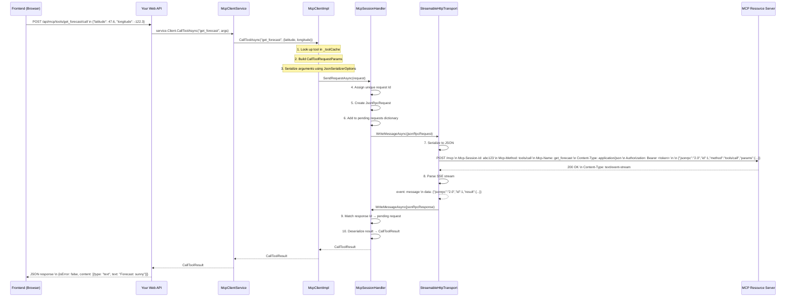

### 16.2 Authentication Flow (401 → Token Acquisition)

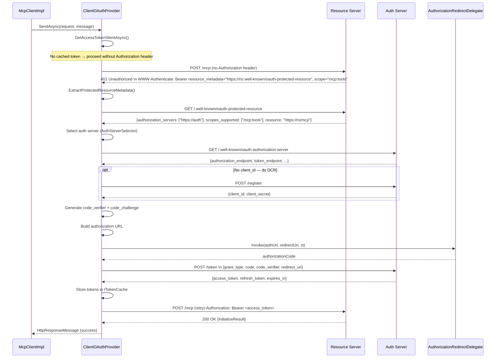

### 16.3 Component Dependency Diagram

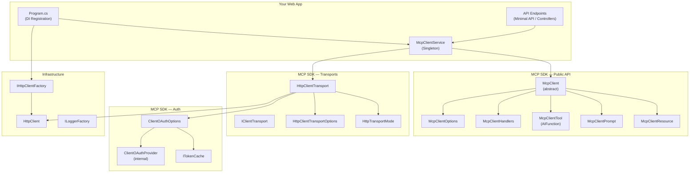

### 16.4 Modularization Guidelines

```
YourWebApp/
├── McpIntegration/
│   ├── McpClientFactory.cs       # Creates & wires McpClient
│   ├── McpSessionManager.cs      # Lifecycle, reconnection, health checks
│   ├── OAuth/
│   │   ├── OAuthCallbackService.cs    # Handles browser redirect flow
│   │   ├── TokenStorage.cs            # ITokenCache implementation
│   │   └── OAuthStateManager.cs       # CSRF state tracking
│   ├── Tools/
│   │   ├── ToolRegistry.cs            # Caches McpClientTool wrappers
│   │   └── ToolCallLogger.cs          # Audit/logging for tool calls
│   ├── Resources/
│   │   └── ResourceCache.cs           # Caches resource content
│   └── Configuration/
│       ├── McpServerOptions.cs        # IOptions<T> bindings
│       └── TransportOptionsConfig.cs   # Environment-specific transport config
└── Api/
    ├── McpController.cs               # REST endpoints
    └── McpHub.cs                      # SignalR hub for real-time updates
```

---

## Summary

Building an MCP client web application with the C# SDK involves:

1. **Choose a transport** — `HttpClientTransport` with `StreamableHttp` mode for production web apps.
2. **Configure options** — `McpClientOptions` with `ClientInfo`, handlers, and capabilities.
3. **Handle authentication** — `ClientOAuthOptions` with PKCE flow, DCR, and persistent token caching.
4. **Create and connect** — `McpClient.CreateAsync()` performs the handshake.
5. **Discover and invoke** — `ListToolsAsync()`, `CallToolAsync()`, `GetPromptAsync()`, `ReadResourceAsync()`.
6. **Manage lifecycle** — Dispose properly, monitor `Completion`, resume sessions when appropriate.
7. **Expose to frontend** — Wrap the client in a service, expose via REST/SignalR endpoints, and build your UI.

For further reference, see the SDK source code at `src/ModelContextProtocol.Core/Client/` and the sample projects at `samples/ProtectedMcpClient/` and `tests/ModelContextProtocol.ConformanceClient/`.
