# MCP Server Application — Exhaustive Tutorial

This tutorial explains how to build an **MCP Server** using the `ModelContextProtocol` C# SDK. It focuses on ASP.NET Core web applications, covering tools, prompts, resources, transports, authentication with OAuth 2.0 / OpenID Connect, and running with a local Keycloak Docker container. Mermaid.js diagrams illuminate architecture, data flows, and auth workflows.

---

## Table of Contents

1. [What Is an MCP Server?](#1-what-is-an-mcp-server)
2. [High-Level Server Architecture](#2-high-level-server-architecture)
3. [Component Catalog](#3-component-catalog)
4. [Creating a Minimal Server](#4-creating-a-minimal-server)
5. [The Server Builder API](#5-the-server-builder-api)
6. [Building Tools](#6-building-tools)
7. [Building Prompts](#7-building-prompts)
8. [Building Resources](#8-building-resources)
9. [Transports — HTTP, SSE, Streamable HTTP](#9-transports--http-sse-streamable-http)
10. [The Initialization Handshake — Server View](#10-the-initialization-handshake--server-view)
11. [Server Capabilities](#11-server-capabilities)
12. [Server-to-Client Requests — Sampling, Elicitation, Roots](#12-server-to-client-requests--sampling-elicitation-roots)
13. [Filters and Middleware](#13-filters-and-middleware)
14. [Authentication — OAuth 2.0 & OpenID Connect](#14-authentication--oauth-20--openid-connect)
15. [Running with Keycloak — Full Docker Setup](#15-running-with-keycloak--full-docker-setup)
16. [Complete Weather Server Example](#16-complete-weather-server-example)
17. [Data Flow Reference](#17-data-flow-reference)

---

## 1. What Is an MCP Server?

An **MCP Server** exposes capabilities — **tools** (functions), **prompts** (templates), and
**resources** (data) — to MCP clients over a transport. The server waits for client connections,
performs the initialization handshake, and then responds to client requests.

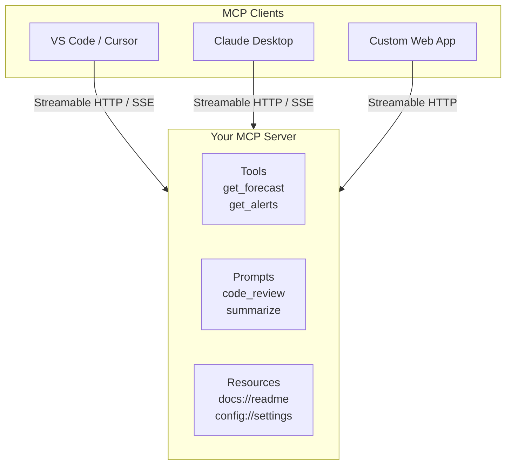

From an **ASP.NET Core perspective**, the MCP server is middleware mapped to a route — typically
`/mcp` — that handles MCP protocol messages over HTTP.

---

## 2. High-Level Server Architecture

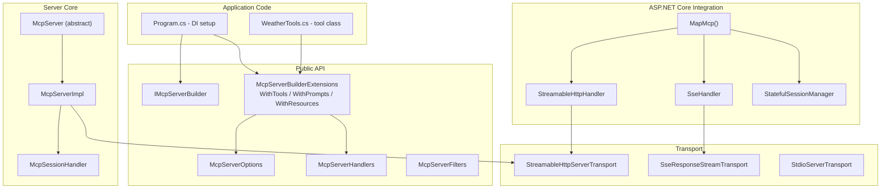

**Layer responsibilities:**

| Layer | Role |
|-------|------|
| **Application Code** | Your C# classes with `[McpServerTool]` attributes. DI registration in `Program.cs`. |
| **Builder API** | Fluent extensions (`WithTools<T>`, `WithHttpTransport`, etc.) that register services and configure `McpServerOptions`. |
| **Server Core** | `McpServerImpl` manages the session, handles `initialize`, dispatches requests to handlers, manages capabilities. |
| **ASP.NET Integration** | `MapMcp()` middleware, session management, CORS, auth challenge handling. |
| **Transport** | Streamable HTTP (POST + GET SSE), SSE (GET SSE + POST), or stdio (child process). |

---

## 3. Component Catalog

### 3.1 Core Types

| Type | File | Purpose |
|------|------|---------|
| `McpServer` | `Server/McpServer.cs` | Abstract base; exposes `ClientCapabilities`, `ClientInfo`, `LoggingLevel`, and interaction methods. |
| `McpServer.Methods.cs` | `Server/McpServer.Methods.cs` | Static `Create()` factory, `SampleAsync()`, `ElicitAsync()`, `RequestRootsAsync()`, task management, `AsSamplingChatClient()`, `AsClientLoggerProvider()`. |
| `McpServerImpl` | `Server/McpServerImpl.cs` | Internal implementation; session handling, handler wiring, capability advertisement, disposables. |
| `McpServerOptions` | `Server/McpServerOptions.cs` | Server info, capabilities, protocol version, timeout, instructions, handlers, filters, collections, task store. |
| `McpServerHandlers` | `Server/McpServerHandlers.cs` | Delegate container: `ListToolsHandler`, `CallToolHandler`, `ListPromptsHandler`, `GetPromptHandler`, `ListResourcesHandler`, `ReadResourceHandler`, `CompleteHandler`, `SetLoggingLevelHandler`, `SubscribeToResourcesHandler`, `UnsubscribeFromResourcesHandler`. |
| `McpServerFilters` | `Server/McpServerFilters.cs` | Message-level and request-specific filters. |

### 3.2 Primitives

| Type | File | Purpose |
|------|------|---------|
| `McpServerTool` | `Server/McpServerTool.cs` | A server-side tool definition; wraps a method with `[McpServerTool]`. |
| `McpServerPrompt` | `Server/McpServerPrompt.cs` | A server-side prompt definition; wraps a method with `[McpServerPrompt]`. |
| `McpServerResource` | `Server/McpServerResource.cs` | A server-side resource definition; wraps a method with `[McpServerResource]`. |

### 3.3 Attributes

| Attribute | Purpose |
|-----------|---------|
| `[McpServerToolType]` | Marks a class as containing tool methods. |
| `[McpServerTool]` | Marks a method as an MCP tool. |
| `[McpServerPromptType]` | Marks a class as containing prompt methods. |
| `[McpServerPrompt]` | Marks a method as an MCP prompt. |
| `[McpServerResourceType]` | Marks a class as containing resource methods. |
| `[McpServerResource]` | Marks a method as an MCP resource. |

### 3.4 Transports & Hosting

| Type | File | Purpose |
|------|------|---------|
| `MapMcp()` | `M:McpEndpointRouteBuilderExtensions.MapMcp` | Maps the MCP endpoint in ASP.NET Core. |
| `HttpServerTransportOptions` | `AspNetCore/HttpServerTransportOptions.cs` | Stateless mode, session management, CORS configuration. |
| `StreamableHttpServerTransport` | `Server/StreamableHttpServerTransport.cs` | Server-side Streamable HTTP transport. |
| `SseResponseStreamTransport` | `Server/SseResponseStreamTransport.cs` | Server-side SSE transport. |
| `StdioServerTransport` | `Server/StdioServerTransport.cs` | Server-side stdio transport. |

---

## 4. Creating a Minimal Server

### 4.1 Bare-Minimum ASP.NET Core Server

```csharp
using ModelContextProtocol.Server;

var builder = WebApplication.CreateBuilder(args);

// Register MCP server services
builder.Services.AddMcpServer()
    .WithHttpTransport();  // enables Streamable HTTP endpoint

var app = builder.Build();

// Map the MCP endpoint at /mcp (default)
app.MapMcp();

app.Run("http://localhost:5000");
```

This creates an MCP server that:
- Listens on `http://localhost:5000/mcp`
- Uses Streamable HTTP transport
- Advertises **zero** tools/prompts/resources (you add them via `.WithTools<T>()` etc.)
- Has no authentication (open to all clients)

### 4.2 Server Lifecycle

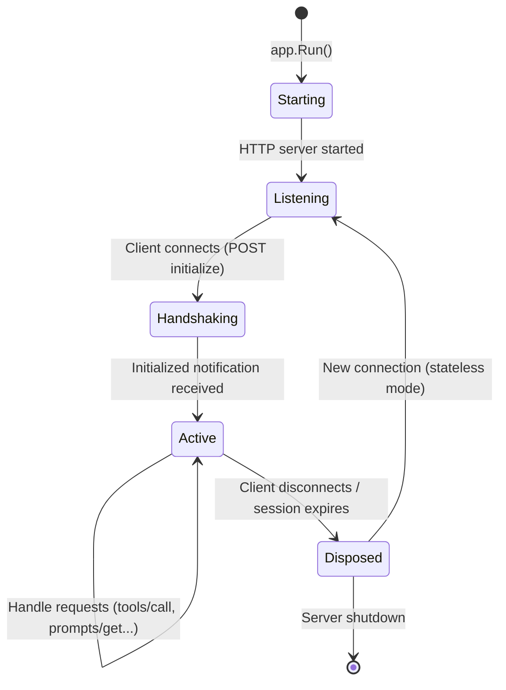

---

## 5. The Server Builder API

The `IMcpServerBuilder` returned by `AddMcpServer()` provides a fluent API:

```mermaid
graph TD
    A["services.AddMcpServer()"] --> B["IMcpServerBuilder"]
    B --> C["WithTools<T>()"]
    B --> D["WithPrompts<T>()"]
    B --> E["WithResources<T>()"]
    B --> F["WithHttpTransport()"]
    B --> G["WithListToolsHandler()"]
    B --> H["WithCallToolHandler()"]
    B --> I["WithListPromptsHandler()"]
    B --> J["WithGetPromptHandler()"]
    B --> K["WithListResourcesHandler()"]
    B --> L["WithReadResourceHandler()"]
    B --> M["WithCompleteHandler()"]
    B --> N["WithSubscribeToResourcesHandler()"]
    B --> O["WithSetLoggingLevelHandler()"]
    B --> P["WithMessageFilters()"]
    B --> Q["WithRequestFilters()"]
    B --> R["AddAuthorizationFilters()"]
    B --> S["WithDistributedCacheEventStreamStore()"]
```

### 5.1 Configuring McpServerOptions

```csharp
builder.Services.AddMcpServer(options =>
{
    options.ServerInfo = new Implementation
    {
        Name = "WeatherServer",
        Version = "1.0.0"
    };
    options.ProtocolVersion = "2025-11-25";
    options.ServerInstructions = "This server provides weather data via tools and resources.";
    options.InitializationTimeout = TimeSpan.FromSeconds(30);
    options.MaxSamplingOutputTokens = 2048;
    options.ScopeRequests = true; // create a DI scope per request
})
.WithHttpTransport();
```

### 5.2 Server Instructions

The `ServerInstructions` string is sent to clients during initialization. Clients typically use it as a system prompt for LLMs. Write clear, actionable guidance:

```csharp
options.ServerInstructions = """
    You have access to weather tools:
    - get_alerts: Returns active weather alerts for a US state.
    - get_forecast: Returns weather forecast for a lat/lon location.
    
    Use get_alerts when the user asks about weather warnings or alerts.
    Use get_forecast when the user asks about upcoming weather conditions.
    """;
```

---

## 6. Building Tools

Tools are the most common MCP primitive. They expose callable functions with typed parameters.

### 6.1 Tool Class with Attributes

```csharp
using ModelContextProtocol;
using ModelContextProtocol.Server;
using System.ComponentModel;

[McpServerToolType]
public sealed class WeatherTools
{
    private readonly IHttpClientFactory _httpClientFactory;

    public WeatherTools(IHttpClientFactory httpClientFactory)
    {
        _httpClientFactory = httpClientFactory;
    }

    [McpServerTool, Description("Get weather alerts for a US state")]
    public async Task<string> GetAlerts(
        [Description("Two-letter state abbreviation, e.g. 'WA' or 'NY'")]
        string state)
    {
        var client = _httpClientFactory.CreateClient("WeatherApi");
        var json = await client.GetFromJsonAsync<JsonDocument>(
            $"/alerts/active/area/{state}");

        var alerts = json?.RootElement.GetProperty("features").EnumerateArray();
        if (!alerts?.Any() ?? true)
            return "No active alerts for this state.";

        return string.Join("\n---\n", alerts!.Select(alert =>
        {
            var p = alert.GetProperty("properties");
            return $"Event: {p.GetProperty("event").GetString()}\n" +
                   $"Area: {p.GetProperty("areaDesc").GetString()}\n" +
                   $"Severity: {p.GetProperty("severity").GetString()}";
        }));
    }

    [McpServerTool, Description("Get weather forecast for a location")]
    public async Task<string> GetForecast(
        [Description("Latitude of the location, e.g. 47.6062")]
        double latitude,
        [Description("Longitude of the location, e.g. -122.3321")]
        double longitude)
    {
        var client = _httpClientFactory.CreateClient("WeatherApi");
        var pointJson = await client.GetFromJsonAsync<JsonDocument>(
            $"/points/{latitude:F4},{longitude:F4}");

        var forecastUrl = pointJson?.RootElement
            .GetProperty("properties")
            .GetProperty("forecast")
            .GetString()
            ?? throw new InvalidOperationException("No forecast URL");

        var forecastJson = await client.GetFromJsonAsync<JsonDocument>(forecastUrl);
        var periods = forecastJson?.RootElement
            .GetProperty("properties")
            .GetProperty("periods")
            .EnumerateArray();

        return string.Join("\n---\n", periods!.Select(p =>
            $"{p.GetProperty("name").GetString()}: " +
            $"{p.GetProperty("temperature").GetInt32()}F - " +
            $"{p.GetProperty("shortForecast").GetString()}"));
    }
}
```

### 6.2 Registration

```csharp
builder.Services.AddHttpClient("WeatherApi", client =>
{
    client.BaseAddress = new Uri("https://api.weather.gov");
    client.DefaultRequestHeaders.UserAgent.Add(
        new ProductInfoHeaderValue("WeatherMCP", "1.0"));
});

builder.Services.AddMcpServer(options => { ... })
    .WithTools<WeatherTools>()
    .WithHttpTransport();
```

### 6.3 Tool Discovery Flow

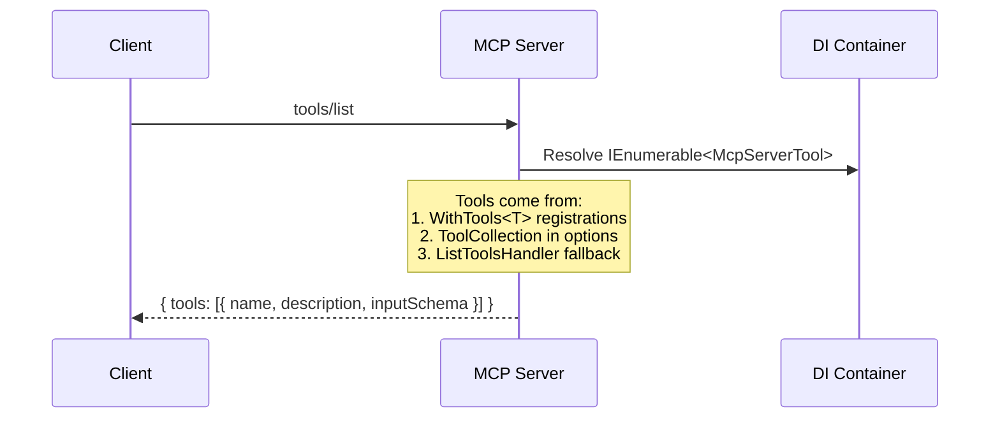

### 6.4 Tool Invocation Flow

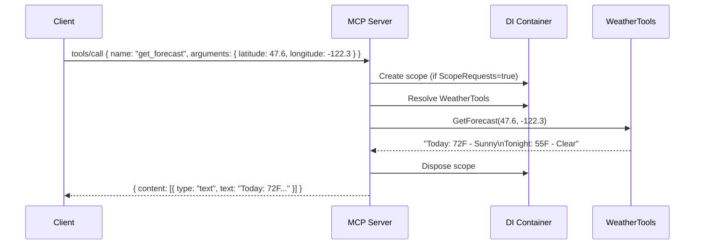

### 6.5 Async Tools (Task Support)

When a tool returns `Task` or `ValueTask` and a `TaskStore` is configured, the server can
delegate execution to the client as a task:

```csharp
[McpServerTool, Description("Long-running data processing task")]
public async Task<string> ProcessLargeDataset(
    [Description("Dataset ID")] string datasetId,
    CancellationToken cancellationToken)
{
    // The server detects async and, if the client requests task-augmented
    // execution, creates a task on the client side automatically.
    await Task.Delay(TimeSpan.FromMinutes(5), cancellationToken);
    return $"Dataset {datasetId} processed";
}
```

### 6.6 Custom Tool Schema with x-mcp-header

Control HTTP header behavior via `[McpHeader]`:

```csharp
[McpServerTool, Description("Get data by region")]
public string GetDataByRegion(
    [McpHeader("region")] string region)
{
    // The 'region' parameter will be sent as an Mcp-Param-Region HTTP header
    return DataForRegion(region);
}
```

---

## 7. Building Prompts

Prompts are parameterized message templates that clients can retrieve and present to LLMs.

### 7.1 Prompt Class

```csharp
[McpServerPromptType]
public sealed class ReviewPrompts
{
    [McpServerPrompt, Description("Generate a code review prompt for a given language and code")]
    public GetPromptResult CodeReview(
        [Description("Programming language")] string language,
        [Description("Code to review")] string code)
    {
        return new GetPromptResult
        {
            Messages = [
                new PromptMessage
                {
                    Role = Role.User,
                    Content = new ContentBlock
                    {
                        Type = "text",
                        Text = $"Please review this {language} code:\n\n```{language}\n{code}\n```"
                    }
                }
            ]
        };
    }

    [McpServerPrompt, Description("Generate a summarization prompt")]
    public GetPromptResult Summarize(
        [Description("Text to summarize")] string text)
    {
        return new GetPromptResult
        {
            Messages = [
                new PromptMessage
                {
                    Role = Role.User,
                    Content = new ContentBlock
                    {
                        Type = "text",
                        Text = $"Please summarize the following text:\n\n{text}"
                    }
                }
            ]
        };
    }
}
```

### 7.2 Registration

```csharp
builder.Services.AddMcpServer()
    .WithPrompts<ReviewPrompts>()
    .WithHttpTransport();
```

---

## 8. Building Resources

Resources are URI-addressable data served by the MCP server.

### 8.1 Resource Class

```csharp
[McpServerResourceType]
public sealed class DocumentationResources
{
    [McpServerResource(Name = "readme", UriTemplate = "docs://readme",
        Description = "Project README", MimeType = "text/markdown")]
    public string GetReadme()
    {
        return "# My MCP Server\n\nThis server provides weather data.";
    }

    [McpServerResource(Name = "config", UriTemplate = "config://app",
        Description = "Application configuration")]
    public string GetConfig()
    {
        return System.Text.Json.JsonSerializer.Serialize(new
        {
            version = "1.0.0",
            features = new[] { "weather", "alerts" }
        });
    }
}
```

### 8.2 Parameterized Resources (Templates)

```csharp
[McpServerResource(Name = "user-docs",
    UriTemplate = "docs://users/{userId}",
    Description = "User-specific documentation")]
public string GetUserDocs(string userId)
{
    return $"Documentation for user {userId}";
}
```

### 8.3 Registration

```csharp
builder.Services.AddMcpServer()
    .WithResources<DocumentationResources>()
    .WithHttpTransport();
```

---

## 9. Transports — HTTP, SSE, Streamable HTTP

### 9.1 Streamable HTTP (Default for Web Apps)

The modern MCP transport. The server handles both POST requests (client-to-server) and
GET requests (server-to-client notifications) at the same endpoint.

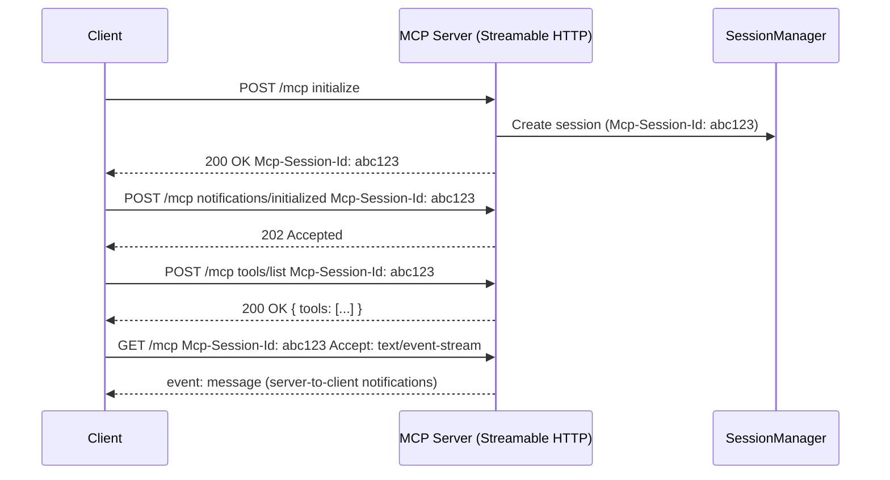

Configuration:

```csharp
builder.Services.AddMcpServer()
    .WithHttpTransport(options =>
    {
        // Stateless mode: no session persistence, no server-to-client requests
        options.Stateless = true;

        // Configure per-session server options
        options.ConfigureSession = (sessionId, serverOptions) =>
        {
            serverOptions.KnownClientInfo = new Implementation
            {
                Name = "ResumedClient",
                Version = "1.0"
            };
        };
    });
```

### 9.2 Stateless Mode vs Stateful Mode

| Feature | Stateless | Stateful |
|---------|-----------|----------|
| Session persistence | No | Yes (`Mcp-Session-Id`) |
| Server-to-client requests | No (sampling, elicitation) | Yes |
| Horizontal scaling | Easy (no session affinity) | Requires sticky sessions |
| SSE resumability | N/A | Supported |

```csharp
// Stateless (recommended for simple servers)
.WithHttpTransport(options => options.Stateless = true)

// Stateful (needed for sampling, elicitation, roots)
.WithHttpTransport()  // default: stateful
```

### 9.3 CORS Configuration

When your server is called from browser-based clients on different origins:

```csharp
var allowedOrigins = new[] { "http://localhost:5173", "https://myapp.example.com" };

builder.Services.AddCors(options =>
{
    options.AddPolicy("McpBrowserClient", policy =>
    {
        policy.WithOrigins(allowedOrigins)
            .WithMethods("POST", "GET", "DELETE")
            .WithHeaders("Content-Type", "Authorization", "MCP-Protocol-Version",
                         "MCP-Session-Id", "MCP-Last-Event-Id")
            .WithExposedHeaders("WWW-Authenticate", "MCP-Session-Id");
    });
});

app.UseCors();
app.MapMcp().RequireCors("McpBrowserClient");
```

### 9.4 stdio Transport

For local/desktop MCP servers (e.g., launched by Claude Desktop):

```csharp
// No web host needed — just the server and transport
var server = McpServer.Create(
    new StdioServerTransport("MyServer"),
    new McpServerOptions
    {
        ServerInfo = new() { Name = "MyServer", Version = "1.0" }
    });

await server.RunAsync();
```

---

## 10. The Initialization Handshake — Server View

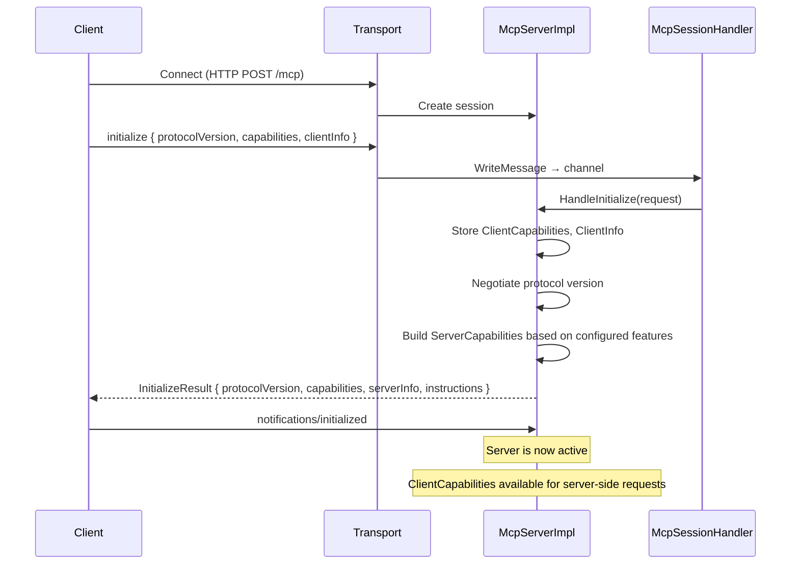

**What the server validates during `initialize`:**

1. Protocol version — must be supported (`McpSessionHandler.SupportedProtocolVersions`)
2. Client capabilities — stored as `ClientCapabilities`, checked before server-to-client requests
3. `ClientInfo` — stored for logging/debugging

**Capabilities are auto-advertised** based on what's configured:
- `WithTools<T>` → `ServerCapabilities.Tools` is set
- `WithPrompts<T>` → `ServerCapabilities.Prompts` is set
- `WithResources<T>` → `ServerCapabilities.Resources` is set
- `WithCompleteHandler()` → `ServerCapabilities.Completions` is set
- `WithSetLoggingLevelHandler()` → `ServerCapabilities.Logging` is set

---

## 11. Server Capabilities

Server capabilities are the features the server advertises to clients. They are set
automatically based on what you configure, but you can also set them explicitly.

### 11.1 Capability Classes

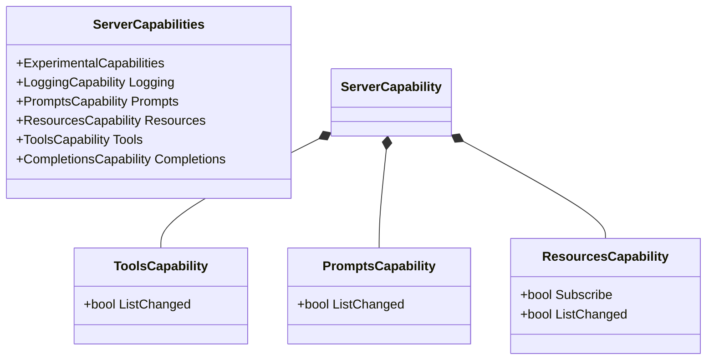

### 11.2 Explicit Capability Configuration

```csharp
builder.Services.AddMcpServer(options =>
{
    options.Capabilities = new ServerCapabilities
    {
        Tools = new ToolsCapability { ListChanged = true },
        Prompts = new PromptsCapability { ListChanged = true },
        Resources = new ResourcesCapability
        {
            Subscribe = true,
            ListChanged = true
        },
        Logging = new LoggingCapability(),
        Completions = new CompletionsCapability(),
    };
});
```

`ListChanged = true` tells clients they can subscribe to `notifications/tools/list_changed`
to be notified when the tool list changes.

---

## 12. Server-to-Client Requests — Sampling, Elicitation, Roots

When running in **stateful** mode, the server can request the client to perform actions.

### 12.0 How ClientCapabilities Gate Server Behavior

Before the server can use any of these features, it must check what the client actually supports.
During the `initialize` handshake, the client sends its `ClientCapabilities` object. The server
stores this in `McpServer.ClientCapabilities` and uses it to decide what's allowed.

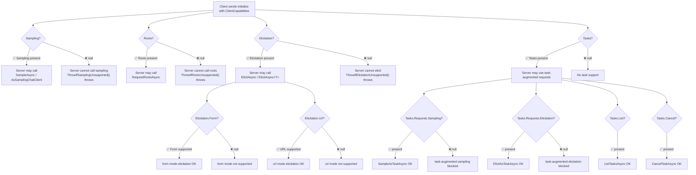

The SDK enforces these checks via private `ThrowIf*` methods inside `McpServer.Methods.cs`.
Every server-to-client method gates on `ClientCapabilities`:

```csharp
// From McpServer.Methods.cs — these guards run before every server-to-client request:

private void ThrowIfSamplingUnsupported()
{
    if (ClientCapabilities?.Sampling is null)
    {
        if (ClientCapabilities is null)
            throw new InvalidOperationException(
                "Sampling is not supported in stateless mode.");
        throw new InvalidOperationException(
            "Client does not support sampling.");
    }
}

private void ThrowIfElicitationUnsupported(ElicitRequestParams request)
{
    if (ClientCapabilities is null)
        throw new InvalidOperationException(
            "Elicitation is not supported in stateless mode.");

    var cap = ClientCapabilities.Elicitation;
    if (cap is null)
        throw new InvalidOperationException(
            "Client does not support elicitation requests.");

    // Further check: does the client support the specific mode?
    if (request.Mode == "form" && cap.Form is null)
        throw new InvalidOperationException(
            "Client does not support form mode elicitation.");
    if (request.Mode == "url" && cap.Url is null)
        throw new InvalidOperationException(
            "Client does not support URL mode elicitation.");
}
```

#### Using ClientCapabilities for Graceful Degradation

Instead of letting exceptions propagate, inspect capabilities and offer fallbacks:

```csharp
[McpServerTool, Description("Summarize alerts, with AI if available")]
public async Task<string> SmartSummarize(
    [Description("State code")] string state,
    McpServer server,
    CancellationToken ct)
{
    var rawAlerts = await GetAlerts(state);

    // Check if the connected client supports AI sampling
    if (server.ClientCapabilities?.Sampling is not null)
    {
        // Client supports LLM — use AI summarization
        var response = await server.SampleAsync(
            new List<ChatMessage>
            {
                new(ChatRole.System, "Summarize weather alerts concisely."),
                new(ChatRole.User, rawAlerts)
            },
            new ChatOptions { MaxOutputTokens = 150 },
            cancellationToken: ct);
        return response.Text;
    }

    // Fallback: manual summarization (first 500 chars, remove boilerplate)
    var lines = rawAlerts.Split('\n')
        .Where(l => !l.StartsWith("Instruction:"))
        .Take(15);
    return string.Join("\n", lines);
}
```

#### Using ClientCapabilities for Feature Toggling

You can use capabilities to toggle whole features at the tool-list level — don't advertise
tools the client can't use:

```csharp
// In a custom ListToolsHandler:
builder.Services.AddMcpServer()
    .WithListToolsHandler(async (request, ct) =>
    {
        var tools = new List<Tool>();

        // Always available
        tools.Add(new Tool { Name = "get_alerts", Description = "..." });

        // Only advertise AI-dependent tools if the client supports sampling
        if (request.Context?.ClientCapabilities?.Sampling is not null)
        {
            tools.Add(new Tool
            {
                Name = "ai_summarize_alerts",
                Description = "Summarize alerts using AI"
            });
        }

        // Only advertise user-input tools if elicitation is supported
        if (request.Context?.ClientCapabilities?.Elicitation is not null)
        {
            tools.Add(new Tool
            {
                Name = "confirm_action",
                Description = "Perform an action with user confirmation"
            });
        }

        return new ListToolsResult { Tools = tools };
    })
    .WithHttpTransport();
```

#### Checking ClientCapabilities Inside Tool Methods

The `McpServer` is injectable into tool methods (when `ScopeRequests=true`) or via
constructor injection. Access `server.ClientCapabilities` at any point:

```csharp
[McpServerTool, Description("Get weather with optional AI context")]
public async Task<string> GetWeatherWithContext(
    [Description("Location")] string location,
    McpServer server,
    CancellationToken ct)
{
    var forecast = await GetForecastForLocation(location);

    // Check what the client can do
    bool canSample = server.ClientCapabilities?.Sampling is not null;
    bool canElicit = server.ClientCapabilities?.Elicitation is not null;
    bool canElicitForm = server.ClientCapabilities?.Elicitation?.Form is not null;
    bool canElicitUrl = server.ClientCapabilities?.Elicitation?.Url is not null;
    bool canListTasks = server.ClientCapabilities?.Tasks?.List is not null;
    bool canCancelTasks = server.ClientCapabilities?.Tasks?.Cancel is not null;

    if (canSample)
    {
        // Enrich the forecast with AI context
        var context = await server.SampleAsync(
            new List<ChatMessage>
            {
                new(ChatRole.User,
                    $"Weather for {location}: {forecast}. " +
                    "Add one sentence about what activities are suitable.")
            },
            cancellationToken: ct);
        return $"{forecast}\n\nAI Context: {context.Text}";
    }

    return forecast;
}
```

#### Capability Matrix for Server Decision-Making

| `ClientCapabilities` Property | What It Unlocks | Server API | Stateless? |
|---|---|---|---|
| `Sampling` is not null | LLM text generation | `SampleAsync()`, `AsSamplingChatClient()` | ❌ No |
| `Roots` is not null | Filesystem root listing | `RequestRootsAsync()` | ❌ No |
| `Elicitation` is not null | User input requests | `ElicitAsync()`, `ElicitAsync<T>()` | ❌ No |
| `Elicitation.Form` is not null | Form-based elicitation | `ElicitAsync<ConfirmationForm>()` | ❌ No |
| `Elicitation.Url` is not null | URL-based elicitation (external form) | `ElicitAsync()` with mode="url" | ❌ No |
| `Tasks` is not null | Task-augmented requests (any) | — | ❌ No |
| `Tasks.Requests.Sampling.CreateMessage` | Task-augmented sampling | `SampleAsTaskAsync()` | ❌ No |
| `Tasks.Requests.Elicitation.Create` | Task-augmented elicitation | `ElicitAsTaskAsync()` | ❌ No |
| `Tasks.List` is not null | Task listing | `ListTasksAsync()` | ❌ No |
| `Tasks.Cancel` is not null | Task cancellation | `CancelTaskAsync()` | ❌ No |
| `Experimental["key"]` | Custom extensions | Dynamic lookup | ❌ No |
| `Extensions["..."]` | Protocol extensions | Dynamic lookup | ❌ No |

> **Stateless mode note:** When `HttpServerTransportOptions.Stateless = true`, the server
> never receives an `initialize` request (session state is pre-negotiated). In this mode,
> `ClientCapabilities` is `null` and all server-to-client requests throw
> `InvalidOperationException`. Use `KnownClientCapabilities` in `McpServerOptions` to
> provide pre-negotiated capabilities for stateless servers.

### 12.1 Sampling (LLM Generation)

Ask the client's LLM to generate text:

```csharp
[McpServerTool, Description("Summarize recent alerts using AI")]
public async Task<string> SummarizeAlertsWithAI(
    [Description("State code")] string state,
    McpServer server,
    CancellationToken ct)
{
    // First, get the raw alerts
    var alerts = await GetAlerts(state);

    // Then ask the client's LLM to summarize
    var response = await server.SampleAsync(
        new List<ChatMessage>
        {
            new(ChatRole.System,
                "You summarize weather alerts concisely."),
            new(ChatRole.User,
                $"Summarize these alerts for {state}:\n\n{alerts}")
        },
        new ChatOptions { MaxOutputTokens = 200 },
        cancellationToken: ct);

    return response.Text;
}
```

The `McpServer` is injectable into tool constructors or method parameters:

```csharp
// Via constructor injection
public class WeatherTools(McpServer server)
{
    private readonly McpServer _server = server;
}

// Via method injection (if ScopeRequests=true, services are resolved per-request)
[McpServerTool]
public async Task<string> MyTool(McpServer server) { ... }
```

### 12.2 Sampling as a ChatClient

```csharp
var chatClient = server.AsSamplingChatClient();

var response = await chatClient.GetResponseAsync(
    "Summarize the following: ...");
```

### 12.3 Elicitation (User Input)

Ask the client's user for structured input:

```csharp
[McpServerTool, Description("Process with user confirmation")]
public async Task<string> ProcessWithConfirmation(
    [Description("Data to process")] string data,
    McpServer server,
    CancellationToken ct)
{
    // Ask the user for confirmation via the client
    var result = await server.ElicitAsync<ConfirmationRequest>(
        $"Process this data: {data}",
        cancellationToken: ct);

    if (!result.IsAccepted)
        return "User declined";

    return ProcessData(data, result.Content!);
}

public class ConfirmationRequest
{
    public bool Proceed { get; set; }
    public string? Note { get; set; }
}
```

### 12.4 Roots

Ask the client for filesystem roots:

```csharp
var roots = await server.RequestRootsAsync(
    new ListRootsRequestParams());

foreach (var root in roots.Roots)
{
    Console.WriteLine($"Root: {root.Uri} ({root.Name})");
}
```

### 12.5 Server Logging to Client

Send log messages to the connected client:

```csharp
var loggerProvider = server.AsClientLoggerProvider();
var logger = loggerProvider.CreateLogger("WeatherTools");
logger.LogInformation("Fetching alerts for state {State}", state);
```

---

## 13. Filters and Middleware

Filters intercept and modify request/response processing:

### 13.1 Message Filters

```csharp
builder.Services.AddMcpServer()
    .WithMessageFilters(filters =>
    {
        // Log all incoming JSON-RPC messages
        filters.Add(async (context, next) =>
        {
            var msg = context.JsonRpcMessage;
            Console.WriteLine($"[IN] {msg}");
            await next(context);
        });

        // Add custom header to all responses
        filters.Add(async (context, next) =>
        {
            await next(context);
            Console.WriteLine($"[OUT] Response sent");
        });
    })
    .WithHttpTransport();
```

### 13.2 Request Filters

```csharp
builder.Services.AddMcpServer()
    .WithRequestFilters(filters =>
    {
        // Time all tool calls
        filters.Add("tools/call", async (context, next) =>
        {
            var sw = Stopwatch.StartNew();
            await next(context);
            sw.Stop();
            Console.WriteLine($"Tool call took {sw.ElapsedMilliseconds}ms");
        });
    })
    .WithHttpTransport();
```

---

## 14. Authentication — OAuth 2.0 & OpenID Connect

### 14.1 How Server Auth Works

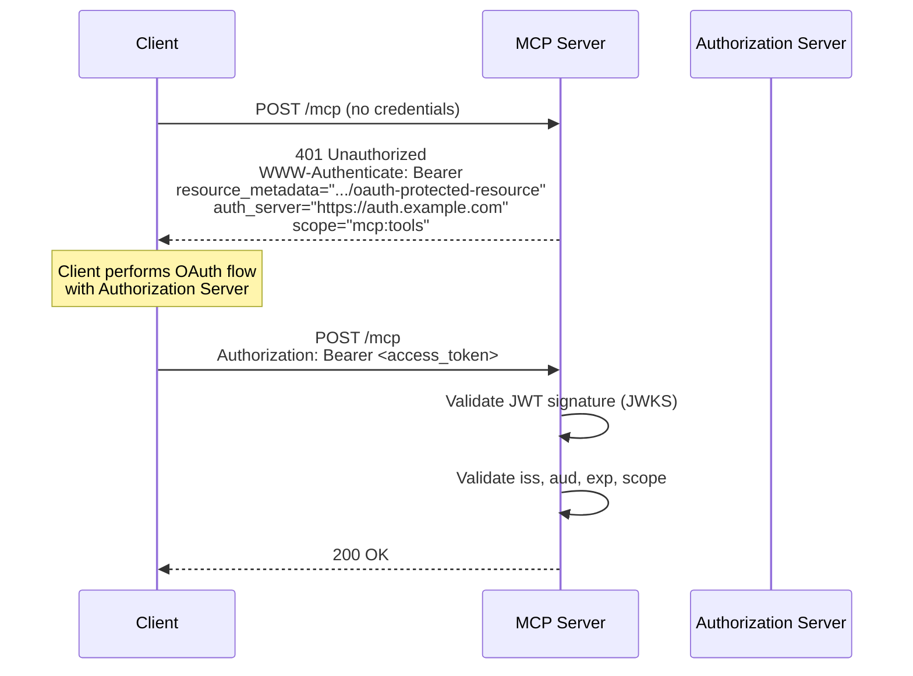

### 14.2 Server-Side Auth Configuration

The MCP server validates tokens — it doesn't issue them. Use `AddJwtBearer` with
`AddMcp` for challenge metadata:

```csharp
using Microsoft.AspNetCore.Authentication.JwtBearer;
using ModelContextProtocol.AspNetCore.Authentication;
using Microsoft.IdentityModel.Tokens;

var serverUrl = "https://my-mcp-server.example.com";
var authServerUrl = "https://auth.example.com";

builder.Services.AddAuthentication(options =>
{
    // When unauthenticated, use MCP-specific challenge
    options.DefaultChallengeScheme = McpAuthenticationDefaults.AuthenticationScheme;
    options.DefaultAuthenticateScheme = JwtBearerDefaults.AuthenticationScheme;
})
.AddJwtBearer(options =>
{
    // 🔍 OIDC Discovery: GET /.well-known/openid-configuration
    options.Authority = authServerUrl;

    options.TokenValidationParameters = new TokenValidationParameters
    {
        ValidateIssuer = true,
        ValidIssuer = authServerUrl,        // Token must be FROM this auth server
        ValidateAudience = true,
        ValidAudience = serverUrl,           // Token must be FOR this server
        ValidateLifetime = true,             // exp must be in the future
        ValidateIssuerSigningKey = true,     // Signature must verify against JWKS
        NameClaimType = "name",              // → User.Identity.Name
        RoleClaimType = "roles",             // → User.IsInRole()
    };

    options.Events = new JwtBearerEvents
    {
        OnTokenValidated = context =>
        {
            var name = context.Principal?.Identity?.Name ?? "unknown";
            Console.WriteLine($"Token validated for: {name}");
            return Task.CompletedTask;
        },
        OnAuthenticationFailed = context =>
        {
            Console.WriteLine($"Auth failed: {context.Exception?.Message}");
            return Task.CompletedTask;
        }
    };
})
// 🔧 MCP-specific: advertises resource metadata for client discovery
.AddMcp(options =>
{
    options.ResourceMetadata = new()
    {
        ResourceDocumentation = "https://docs.example.com/mcp-server",
        AuthorizationServers = { authServerUrl },
        ScopesSupported = ["mcp:tools", "mcp:resources"],
    };
});

builder.Services.AddAuthorization();

var app = builder.Build();

app.UseAuthentication();
app.UseAuthorization();

// 🔒 Require valid JWT for all MCP operations
app.MapMcp().RequireAuthorization();
```

### 14.3 Protected Resource Metadata (RFC 9728)

The `.AddMcp()` middleware exposes:

```http
GET /.well-known/oauth-protected-resource
```

```json
{
  "resource": "https://my-mcp-server.example.com",
  "authorization_servers": ["https://auth.example.com"],
  "scopes_supported": ["mcp:tools", "mcp:resources"],
  "bearer_methods_supported": ["header"],
  "resource_documentation": "https://docs.example.com/mcp-server"
}
```

This tells clients: *"To access me, get a token from `https://auth.example.com` with one of these scopes."*

### 14.4 Per-Tool Authorization

Use ASP.NET Core's `[Authorize]` attribute on tool classes or methods:

```csharp
using Microsoft.AspNetCore.Authorization;

[McpServerToolType]
[Authorize]  // all tools in this class require authentication
public class AdminTools
{
    [McpServerTool, Description("Delete a resource")]
    [Authorize(Roles = "admin")]
    public string DeleteResource(string id) { ... }

    [McpServerTool, Description("List resources")]
    [AllowAnonymous]  // override class-level auth
    public string ListResources() { ... }
}
```

For authorization filters to work, call:

```csharp
builder.Services.AddMcpServer()
    .AddAuthorizationFilters()
    .WithHttpTransport();
```

### 14.5 Token Validation Flow

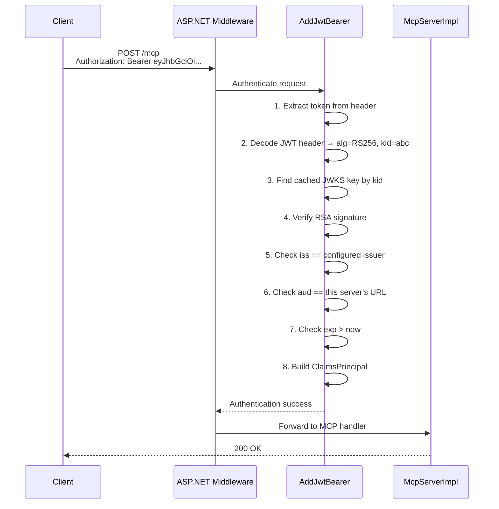

---

## 15. Running with Keycloak — Full Docker Setup

Keycloak is an open-source Identity and Access Management server. It provides OAuth 2.0 /
OpenID Connect out of the box and is the easiest way to run a real auth server locally.

### 15.1 Architecture with Keycloak

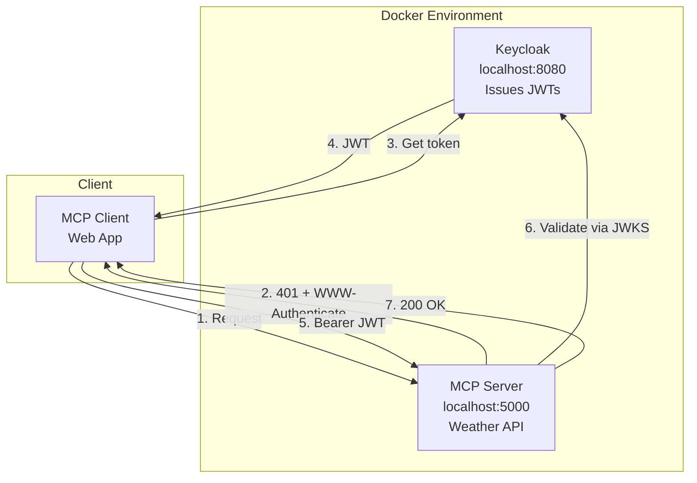

### 15.2 docker-compose.yml

```yaml
# docker-compose.yml
version: '3.8'

services:
  keycloak:
    image: quay.io/keycloak/keycloak:26.0
    container_name: keycloak
    environment:
      KC_BOOTSTRAP_ADMIN_USERNAME: admin
      KC_BOOTSTRAP_ADMIN_PASSWORD: admin
    ports:
      - "8080:8080"
    command:
      - start-dev
      - --http-port=8080
      - --health-enabled=true
    volumes:
      - ./keycloak-data:/opt/keycloak/data
    healthcheck:
      test: ["CMD", "curl", "-f", "http://localhost:8080/health/ready"]
      interval: 10s
      timeout: 5s
      retries: 10

  mcp-server:
    build:
      context: .
      dockerfile: Dockerfile
    container_name: mcp-server
    ports:
      - "5000:8080"
    environment:
      - ASPNETCORE_ENVIRONMENT=Development
      - ASPNETCORE_URLS=http://+:8080
      - Auth__Authority=http://keycloak:8080/realms/mcp-realm
      - Auth__Audience=mcp-server
    depends_on:
      keycloak:
        condition: service_healthy
```

### 15.3 Keycloak Realm Setup Script

Create a script to automate realm configuration:

```bash
#!/bin/bash
# setup-keycloak.sh — configure Keycloak realm, client, and user

KC_URL="http://localhost:8080"
ADMIN="admin"
ADMIN_PW="admin"
REALM="mcp-realm"
CLIENT_ID="mcp-server"
CLIENT_SECRET="mcp-server-secret"
MCP_CLIENT_ID="mcp-client-app"

# 1. Get admin token
ADMIN_TOKEN=$(curl -s -X POST "$KC_URL/realms/master/protocol/openid-connect/token" \
  -d "grant_type=password" \
  -d "client_id=admin-cli" \
  -d "username=$ADMIN" \
  -d "password=$ADMIN_PW" \
  | jq -r '.access_token')

if [ -z "$ADMIN_TOKEN" ] || [ "$ADMIN_TOKEN" = "null" ]; then
  echo "Failed to get admin token. Is Keycloak running?"
  exit 1
fi

# 2. Create realm
curl -s -X POST "$KC_URL/admin/realms" \
  -H "Authorization: Bearer $ADMIN_TOKEN" \
  -H "Content-Type: application/json" \
  -d '{
    "realm": "'$REALM'",
    "enabled": true,
    "accessTokenLifespan": 3600,
    "ssoSessionIdleTimeout": 86400
  }'

echo "Realm '$REALM' created."

# 3. Create confidential client for the MCP server (resource server)
curl -s -X POST "$KC_URL/admin/realms/$REALM/clients" \
  -H "Authorization: Bearer $ADMIN_TOKEN" \
  -H "Content-Type: application/json" \
  -d '{
    "clientId": "'$CLIENT_ID'",
    "secret": "'$CLIENT_SECRET'",
    "enabled": true,
    "publicClient": false,
    "bearerOnly": true,
    "protocol": "openid-connect",
    "standardFlowEnabled": false,
    "directAccessGrantsEnabled": false,
    "serviceAccountsEnabled": false
  }'

echo "Resource server client '$CLIENT_ID' created."

# 4. Create public client for the MCP client app
curl -s -X POST "$KC_URL/admin/realms/$REALM/clients" \
  -H "Authorization: Bearer $ADMIN_TOKEN" \
  -H "Content-Type: application/json" \
  -d '{
    "clientId": "'$MCP_CLIENT_ID'",
    "enabled": true,
    "publicClient": true,
    "protocol": "openid-connect",
    "standardFlowEnabled": true,
    "directAccessGrantsEnabled": false,
    "redirectUris": [
      "http://localhost:5173/callback",
      "http://localhost:1179/callback"
    ],
    "webOrigins": ["http://localhost:5173"]
  }'

echo "Public client '$MCP_CLIENT_ID' created."

# 5. Create a test user
curl -s -X POST "$KC_URL/admin/realms/$REALM/users" \
  -H "Authorization: Bearer $ADMIN_TOKEN" \
  -H "Content-Type: application/json" \
  -d '{
    "username": "testuser",
    "email": "test@example.com",
    "firstName": "Test",
    "lastName": "User",
    "enabled": true,
    "credentials": [{
      "type": "password",
      "value": "testpassword",
      "temporary": false
    }]
  }'

echo "Test user created: testuser / testpassword"
echo ""
echo "=== Keycloak Setup Complete ==="
echo "Realm:           $REALM"
echo "Auth Server URL: $KC_URL/realms/$REALM"
echo "MCP Server Client ID: $CLIENT_ID"
echo "MCP Client App ID:    $MCP_CLIENT_ID"
echo "Discovery:        $KC_URL/realms/$REALM/.well-known/openid-configuration"
```

### 15.4 Running Everything

```bash
# 1. Start Keycloak + MCP server
docker compose up -d

# 2. Wait for Keycloak to be healthy
until curl -sf http://localhost:8080/health/ready > /dev/null; do
  echo "Waiting for Keycloak..."
  sleep 3
done

# 3. Configure the realm
chmod +x setup-keycloak.sh
./setup-keycloak.sh

# 4. Verify OIDC discovery
curl -s http://localhost:8080/realms/mcp-realm/.well-known/openid-configuration | jq
```

### 15.5 Server Configuration with Keycloak

```csharp
// Program.cs
var authServerUrl = builder.Configuration["Auth:Authority"]
    ?? "http://localhost:8080/realms/mcp-realm";
var serverUrl = "http://localhost:5000";

builder.Services.AddAuthentication(options =>
{
    options.DefaultChallengeScheme = McpAuthenticationDefaults.AuthenticationScheme;
    options.DefaultAuthenticateScheme = JwtBearerDefaults.AuthenticationScheme;
})
.AddJwtBearer(options =>
{
    options.Authority = authServerUrl;
    // Keycloak JWKS: http://localhost:8080/realms/mcp-realm/protocol/openid-connect/certs

    options.TokenValidationParameters = new TokenValidationParameters
    {
        ValidateIssuer = true,
        ValidIssuer = authServerUrl,
        ValidateAudience = true,
        ValidAudience = serverUrl,  // aud claim must match our server URL
        ValidateLifetime = true,
        ValidateIssuerSigningKey = true,
        NameClaimType = "preferred_username",
    };
})
.AddMcp(options =>
{
    options.ResourceMetadata = new()
    {
        AuthorizationServers = { authServerUrl },
        ScopesSupported = ["mcp:tools"],
    };
});

builder.Services.AddAuthorization();
builder.Services.AddMcpServer()
    .WithTools<WeatherTools>()
    .WithHttpTransport();

var app = builder.Build();
app.UseAuthentication();
app.UseAuthorization();
app.MapMcp().RequireAuthorization();
app.Run(serverUrl);
```

### 15.6 Keycloak-Specific Notes

| Concern | Detail |
|---------|--------|
| **JWKS URL** | `http://localhost:8080/realms/mcp-realm/protocol/openid-connect/certs` |
| **OIDC Discovery** | `http://localhost:8080/realms/mcp-realm/.well-known/openid-configuration` |
| **Token endpoint** | `http://localhost:8080/realms/mcp-realm/protocol/openid-connect/token` |
| **Auth endpoint** | `http://localhost:8080/realms/mcp-realm/protocol/openid-connect/auth` |
| **`aud` claim** | Keycloak sets `aud` to the client ID by default. If your server validates `aud` against its own URL, configure a **mapper** in Keycloak or use `ValidAudiences` with multiple values. |
| **`iss` claim** | Keycloak uses the full realm URL: `http://localhost:8080/realms/mcp-realm` |
| **Token lifetime** | Default 5 min for access tokens, 30 min for refresh tokens. Adjust in realm settings. |
| **CORS** | If using Keycloak JS adapter, enable `webOrigins` on the client. |

### 15.7 Testing the Token Flow

```bash
# 1. Get token from Keycloak (client credentials for server-to-server)
TOKEN=$(curl -s -X POST \
  "http://localhost:8080/realms/mcp-realm/protocol/openid-connect/token" \
  -d "grant_type=client_credentials" \
  -d "client_id=mcp-client-app" \
  | jq -r '.access_token')

echo "Token: ${TOKEN:0:50}..."

# 2. Call the MCP server with the token
curl -s -X POST http://localhost:5000/mcp \
  -H "Authorization: Bearer $TOKEN" \
  -H "Content-Type: application/json" \
  -d '{"jsonrpc":"2.0","id":1,"method":"initialize","params":{"protocolVersion":"2025-11-25","capabilities":{},"clientInfo":{"name":"test","version":"1.0"}}}' \
  | jq

# 3. Call without token → 401
curl -s -o /dev/null -w "%{http_code}" \
  -X POST http://localhost:5000/mcp \
  -H "Content-Type: application/json" \
  -d '{"jsonrpc":"2.0","id":1,"method":"initialize","params":{}}'
# → 401
```

---

## 16. Complete Weather Server Example

Below is a complete, production-ready MCP weather server with authentication.

### 16.1 Project Structure

```
WeatherMcpServer/
├── Program.cs
├── Tools/
│   └── WeatherTools.cs
├── Resources/
│   └── DocumentationResources.cs
├── Prompts/
│   └── ReviewPrompts.cs
├── appsettings.json
├── docker-compose.yml
├── setup-keycloak.sh
├── Dockerfile
└── WeatherMcpServer.csproj
```

### 16.2 Program.cs

```csharp
using Microsoft.AspNetCore.Authentication.JwtBearer;
using ModelContextProtocol.AspNetCore.Authentication;
using WeatherMcpServer.Tools;
using WeatherMcpServer.Resources;
using WeatherMcpServer.Prompts;
using Microsoft.IdentityModel.Tokens;

var builder = WebApplication.CreateBuilder(args);

var serverUrl = builder.Configuration["Server:Url"] ?? "http://localhost:5000";
var authServerUrl = builder.Configuration["Auth:Authority"]
    ?? "http://localhost:8080/realms/mcp-realm";
var allowedOrigins = builder.Configuration
    .GetSection("Cors:AllowedOrigins")
    .Get<string[]>() ?? ["http://localhost:5173"];

// ── HTTP client for weather.gov ──
builder.Services.AddHttpClient("WeatherApi", client =>
{
    client.BaseAddress = new Uri("https://api.weather.gov");
    client.DefaultRequestHeaders.UserAgent.Add(
        new ProductInfoHeaderValue("WeatherMcpServer", "1.0"));
});

// ── Authentication ──
builder.Services.AddAuthentication(options =>
{
    options.DefaultChallengeScheme = McpAuthenticationDefaults.AuthenticationScheme;
    options.DefaultAuthenticateScheme = JwtBearerDefaults.AuthenticationScheme;
})
.AddJwtBearer(options =>
{
    options.Authority = authServerUrl;
    options.TokenValidationParameters = new TokenValidationParameters
    {
        ValidateIssuer = true,
        ValidIssuer = authServerUrl,
        ValidateAudience = true,
        ValidAudience = serverUrl,
        ValidateLifetime = true,
        ValidateIssuerSigningKey = true,
        NameClaimType = "preferred_username",
    };
})
.AddMcp(options =>
{
    options.ResourceMetadata = new()
    {
        AuthorizationServers = { authServerUrl },
        ScopesSupported = ["mcp:tools", "mcp:resources"],
        ResourceDocumentation = "https://docs.example.com/weather-mcp",
    };
});

builder.Services.AddAuthorization();

// ── CORS ──
builder.Services.AddCors(options =>
{
    options.AddPolicy("McpBrowserClient", policy =>
    {
        policy.WithOrigins(allowedOrigins)
            .WithMethods("POST", "GET", "DELETE")
            .WithHeaders("Content-Type", "Authorization", "MCP-Protocol-Version",
                         "MCP-Session-Id", "MCP-Last-Event-Id")
            .WithExposedHeaders("WWW-Authenticate", "MCP-Session-Id");
    });
});

// ── MCP Server ──
builder.Services.AddMcpServer(options =>
{
    options.ServerInfo = new()
    {
        Name = "WeatherMcpServer",
        Version = "1.0.0"
    };
    options.ServerInstructions = """
        You have access to weather tools, resources, and prompts:
        Tools: get_alerts, get_forecast
        Resources: docs://readme
        Prompts: code_review
        """;
})
    .WithTools<WeatherTools>()
    .WithPrompts<ReviewPrompts>()
    .WithResources<DocumentationResources>()
    .WithHttpTransport(options =>
    {
        options.ConfigureSession = (sessionId, serverOpts) =>
        {
            Console.WriteLine($"[Session {sessionId[..8]}...] New connection");
        };
    });

var app = builder.Build();

app.UseCors();
app.UseAuthentication();
app.UseAuthorization();

app.MapMcp().RequireAuthorization().RequireCors("McpBrowserClient");

Console.WriteLine($"Weather MCP Server starting at {serverUrl}");
Console.WriteLine($"Auth server: {authServerUrl}");
app.Run(serverUrl);
```

### 16.3 appsettings.json

```json
{
  "Logging": {
    "LogLevel": {
      "Default": "Information",
      "Microsoft.AspNetCore": "Warning"
    }
  },
  "Server": {
    "Url": "http://localhost:5000"
  },
  "Auth": {
    "Authority": "http://localhost:8080/realms/mcp-realm"
  },
  "Cors": {
    "AllowedOrigins": [
      "http://localhost:5173",
      "http://localhost:3000"
    ]
  }
}
```

### 16.4 Dockerfile

```dockerfile
FROM mcr.microsoft.com/dotnet/sdk:9.0 AS build
WORKDIR /src
COPY . .
RUN dotnet restore
RUN dotnet publish -c Release -o /app

FROM mcr.microsoft.com/dotnet/aspnet:9.0
WORKDIR /app
COPY --from=build /app .
EXPOSE 8080
ENTRYPOINT ["dotnet", "WeatherMcpServer.dll"]
```

---

## 17. Data Flow Reference

### 17.1 Tool Call Flow

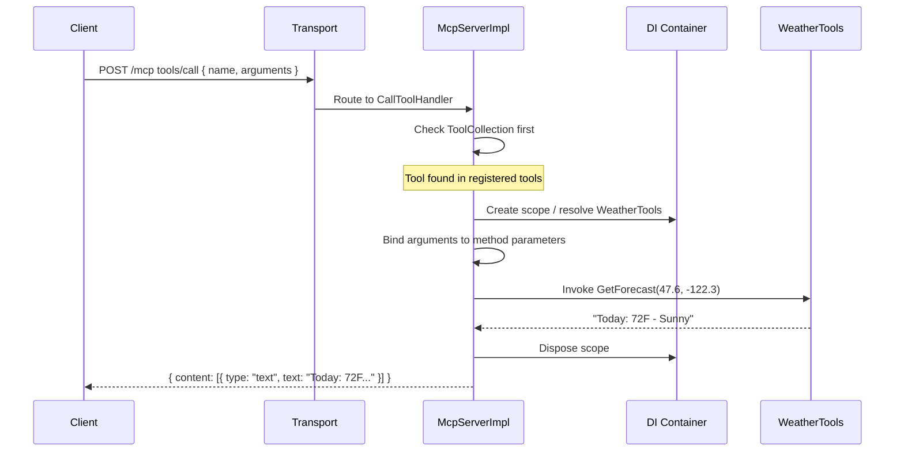

### 17.2 Auth Challenge Flow

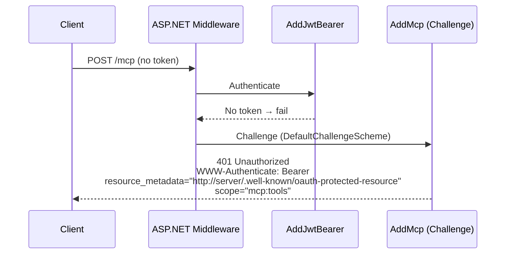

### 17.3 Dependency Graph

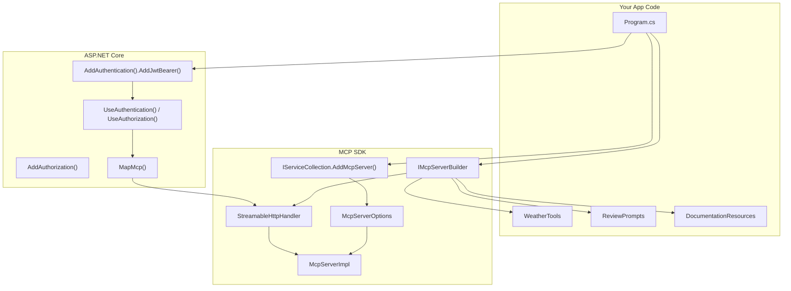

---

## Summary

Building an MCP server with the C# SDK involves:

1. **Register services** — `AddMcpServer()` + `.WithTools<T>()` / `.WithPrompts<T>()` / `.WithResources<T>()`
2. **Implement primitives** — classes with `[McpServerTool]`, `[McpServerPrompt]`, `[McpServerResource]` attributes
3. **Choose transport** — `.WithHttpTransport()` for web servers, `StdioServerTransport` for local/desktop
4. **Add authentication** — `AddJwtBearer()` + `.AddMcp()` for OAuth 2.0 / OIDC, plus `.RequireAuthorization()` on the MCP endpoint
5. **Run locally with Keycloak** — `docker compose up` + `setup-keycloak.sh` for a complete auth environment
6. **Server-to-client requests** — use `server.SampleAsync()`, `server.ElicitAsync<T>()`, `server.RequestRootsAsync()` in stateful mode
7. **Deploy** — containerize with Docker, configure `Auth:Authority` pointing to your production identity provider

For further reference, see:
- `samples/ProtectedMcpServer/` — weather server with OAuth
- `tests/ModelContextProtocol.TestOAuthServer/` — in-memory OAuth test server
- `src/ModelContextProtocol.Core/Server/` — server implementation source
- `src/ModelContextProtocol.AspNetCore/` — ASP.NET Core integration
