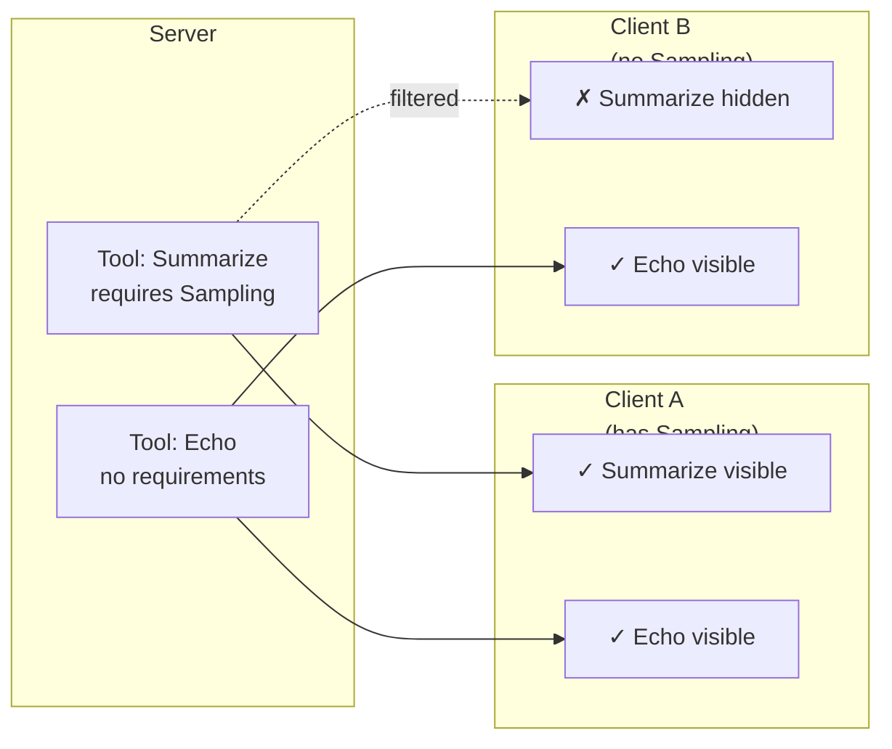
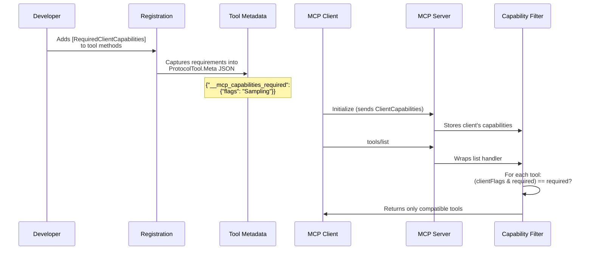
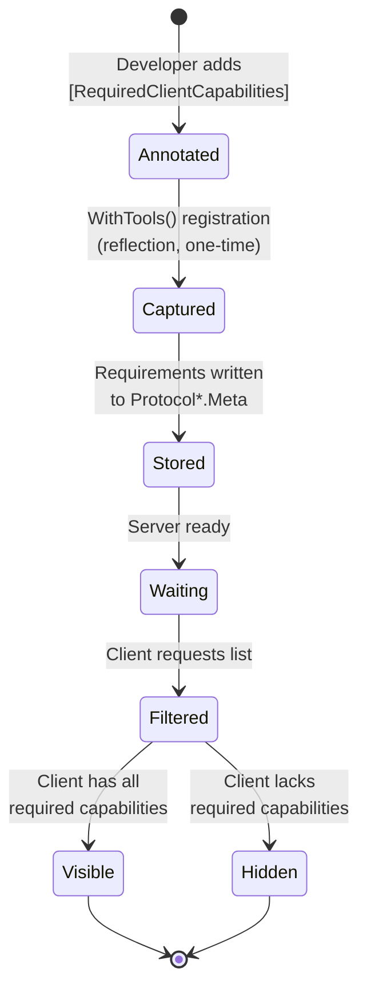
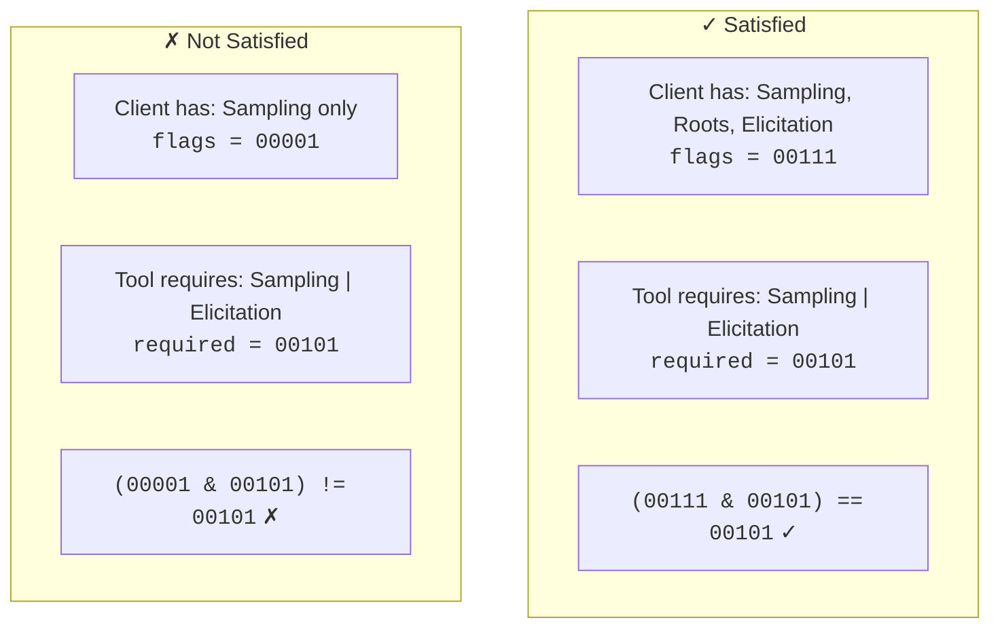

# McpCapabilities

**Capability-gating library for MCP servers.** Annotate your tools, prompts, and resources with `[RequiredClientCapabilities]` — the library automatically hides them from clients that don't advertise the required capabilities.



## Before you go any further

- I have created this repo on my journey to learn more about MCP in .net.
- While working with the [csharp-sdk](https://github.com/modelcontextprotocol/csharp-sdk), I didn't find anything that works with the client capabilities, on the side of the server.
- Since I am a strong believer that we should keep the context for your model as concise as possible, it bugged me that tools would be propagated to the client, even if the client couldn't make use of them, cluttering the context with descriptions that it doesn't need.
- This is the result of me tinkering in sarch for a way to "filter" the output to the clients, depending on the capabilities that they advertise.

## Why?

MCP servers often expose features that depend on client-side capabilities — LLM sampling, user elicitation, filesystem roots, etc. Without capability gating, every client sees every tool, even ones it can't use. That leads to broken UX and confusing error messages.

`McpCapabilities.Server` lets you declare what each tool/prompt/resource needs, and the library handles the filtering at runtime — silently hiding unavailable primitives from under-capable clients.

## Installation

```bash
dotnet add package McpCapabilities.Server
```

Dependencies: `ModelContextProtocol` (≥1.4.0), `FluentResults` (≥4.0.0).

## Quick Start

### 1. Annotate your server primitives

```csharp
using McpCapabilities.Server;
using ModelContextProtocol.Server;

[McpServerToolType]
public class MyTools
{
    [McpServerTool]
    [RequiredClientCapabilities(
        Required = CapabilityFlag.Sampling,
        Message = "This tool requires LLM sampling support")]
    public async Task<string> Summarize(
        McpServer server,
        string text,
        CancellationToken ct)
    {
        var result = await server.SampleAsync(/* ... */, cancellationToken: ct);
        return result.Content.OfType<TextContentBlock>().First().Text;
    }

    [McpServerTool]
    public string Echo(string text) => text; // always visible
}
```

### 2. Register with capability gating

```csharp
builder.Services.AddMcpServer()
    .WithTools<MyTools>()       // register annotated tools
    .AddCapabilityGating();     // enable runtime filtering
```

That's it. Clients without sampling capability won't see the `Summarize` tool.

## How It Works



The two-phase architecture:



## Capability Flags

`CapabilityFlag` is a `[Flags]` enum. Combine multiple flags with bitwise OR.

| Flag                       | Built-in Capability              | Description                 |
| -------------------------- | -------------------------------- | --------------------------- |
| `None`                     | —                                | No capabilities required    |
| `Sampling`                 | `ClientCapabilities.Sampling`    | LLM sampling requests       |
| `Roots`                    | `ClientCapabilities.Roots`       | Filesystem root listing     |
| `Elicitation`              | `ClientCapabilities.Elicitation` | Elicitation (any mode)      |
| `ElicitationForm`          | `Elicitation.Form`               | Form-mode elicitation       |
| `ElicitationUrl`           | `Elicitation.Url`                | URL-mode elicitation        |
| `Tasks`                    | `ClientCapabilities.Tasks`       | Task-augmented requests     |
| `TaskList`                 | `Tasks.List`                     | Task listing                |
| `TaskCancel`               | `Tasks.Cancel`                   | Task cancellation           |
| `TaskAugmentedSampling`    | `Tasks.Requests.Sampling`        | Task-augmented LLM sampling |
| `TaskAugmentedElicitation` | `Tasks.Requests.Elicitation`     | Task-augmented elicitation  |

### Bitmask Satisfaction



## Usage Patterns

### Gating tools

```csharp
[McpServerToolType]
public class AiTools
{
    [McpServerTool]
    [RequiredClientCapabilities(Required = CapabilityFlag.Sampling)]
    public async Task<string> AiSummarize(McpServer server, string text, CancellationToken ct)
    {
        var result = await server.SampleAsync(
            new CreateMessageRequestParams { /* ... */ },
            cancellationToken: ct);
        return result.Content.OfType<TextContentBlock>().First().Text;
    }

    [McpServerTool]
    [RequiredClientCapabilities(Required = CapabilityFlag.Elicitation)]
    public async Task<string> AiChoose(McpServer server, string options, CancellationToken ct)
    {
        var result = await server.ElicitAsync(/* ... */, cancellationToken: ct);
        return $"Chose: {result.Content}";
    }

    [McpServerTool]
    [RequiredClientCapabilities(
        Required = CapabilityFlag.Sampling | CapabilityFlag.Elicitation,
        Message = "This tool requires both LLM sampling and user elicitation")]
    public async Task<string> AdvancedAnalysis(McpServer server, CancellationToken ct)
    {
        var sample = await server.SampleAsync(/* ... */, ct);
        var elicit = await server.ElicitAsync(/* ... */, ct);
        return Process(sample, elicit);
    }

    [McpServerTool]
    public string Echo(string text) => text;
}
```

### Gating prompts

```csharp
[McpServerPromptType]
public class HelpfulPrompts
{
    [McpServerPrompt]
    [RequiredClientCapabilities(Required = CapabilityFlag.Elicitation)]
    public string ConfirmAction() =>
        "Ask the user to confirm before proceeding. Use elicitation to collect their choice.";

    [McpServerPrompt]
    public string Greeting() =>
        "Greet the user warmly and ask how you can help them today.";
}
```

### Gating resources

```csharp
[McpServerResourceType]
public class WorkspaceResources
{
    [McpServerResource]
    [RequiredClientCapabilities(Required = CapabilityFlag.Roots)]
    public string WorkspaceFiles() => "file:///workspace/**";

    [McpServerResource]
    public string AppInfo() => "SampleMcpServer v1.0";
}
```

### Registration

```csharp
builder.Services.AddMcpServer(options =>
{
    options.ServerInfo = new Implementation
    {
        Name = "MyServer",
        Version = "1.0",
    };
})
    .WithTools<AiTools>()
    .WithPrompts<HelpfulPrompts>()
    .WithResources<WorkspaceResources>()
    .AddCapabilityGating();
```

### Gating options

By default, clients that connect without sending any `ClientCapabilities` object are subject to capability gating. Set `AllowWhenClientCapabilitiesNotProvided = true` to allow those clients to bypass gating and see all primitives:

```csharp
builder.Services.AddMcpServer()
    .WithTools<MyTools>()
    .AddCapabilityGating(opts =>
        opts.AllowWhenClientCapabilitiesNotProvided = true);
```

`CapabilityGatingOptions` participates in the standard .NET options system, so you can bind it from `appsettings.json` as well. Apply the configuration before calling `AddCapabilityGating`:

```json
{
  "CapabilityGating": {
    "AllowWhenClientCapabilitiesNotProvided": true
  }
}
```

```csharp
builder.Services.Configure<CapabilityGatingOptions>(
    builder.Configuration.GetSection("CapabilityGating"));

builder.Services.AddMcpServer()
    .WithTools<MyTools>()
    .AddCapabilityGating();
```

### Dispatch enforcement

Gating applies at **both** listing and invocation time. If a client calls a tool (or gets a prompt / reads a resource) they lack the capability for, the server throws `McpProtocolException` with `McpErrorCode.InvalidRequest`:

```text
Client missing capabilities to call 'summarize': Sampling
```

The optional `Message` property on `[RequiredClientCapabilities]` replaces the default error text:

```csharp
[RequiredClientCapabilities(
    Required = CapabilityFlag.Sampling,
    Message = "This tool requires LLM sampling support")]
public string Summarize(string text) => ...;
```

### Programmatic filtering (FluentResults)

```csharp
using McpCapabilities.Server;
using FluentResults;

var tools = GetFullToolList();
var clientCaps = GetConnectedClientCapabilities();

var result = tools.FilterByClientCapabilities(clientCaps);

result.Switch(
    success: visible =>
    {
        foreach (var tool in visible)
            Console.WriteLine($"  - {tool.Name}");
    },
    failure: errors =>
    {
        var error = errors.OfType<CapabilityNotMetError>().First();
        Console.WriteLine($"Client lacks: {error.Missing}");
    });
```

## Samples

- there are several sample project in the ./samples/ directory. They are used to test the library.
- There is one server, that can be started as both stdio or http (or both)
- There is a blazor wasm client that connects to the server.
  - I have NEVER developed blazor before.
  - I am impressed by how I could generate this using AI assisted coding.
  - I give ZERO guarantee for correctness, I do, however, test the library with it all the time.
  - If you have any input on that, don't hesitate to write up an issue.

## Versioning

This project uses [MinVer](https://github.com/adamralph/minver) for automatic versioning from git tags:

```bash
# Cut a release
git tag v1.2.3

# Package picks up the version automatically
make pack      # → McpCapabilities.Server.1.2.3.nupkg
```

Commits after a tag get a pre-release suffix (e.g., `1.2.4-alpha.0.5`).

## Documentation

- [Library docs](src/McpCapabilities.Server/README.md) — detailed API reference
- [Sample server](samples/SampleMcpServer/README.md) — walkthrough of the included sample
- [Development guide](DEVELOPMENT.md) — build, test, package, and publish instructions

## License

Mozille Public License 2.0

## DISCLAIMER

- This is a project for me to learn more about MCP, how it works, and how I can use it in own products.
- I have used AI assisted coding to generate most of this code.
- My focus has been learning and understanding how the csharp sdk for MCP works and how to use it. I am unsure if I am doing it the correct way, but I would be happy (excited, even) to get some feedback.
- If you have any suggestion, please don't hesitate to create an issue.
- My choice of license is supported by the following points:
  - I would like people to be able to learn from what I have learned, that's why it is open to be used as is.
  - If someone changes something that might be helpful to the learning process (of making this a full fledged, production ready library), I would appreciate that information to flow back into this repository, so that we all can benefit.
