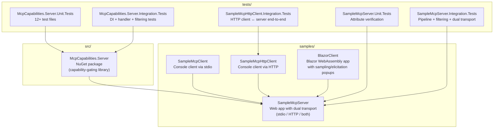
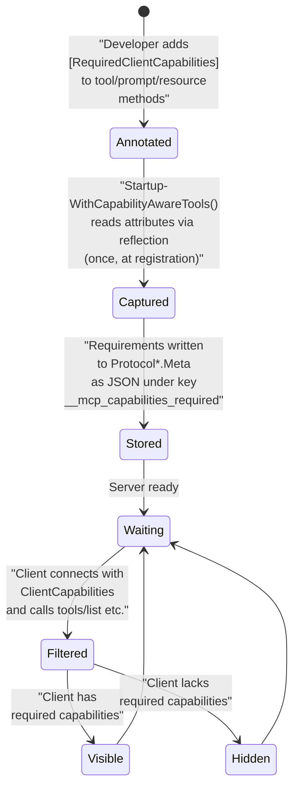
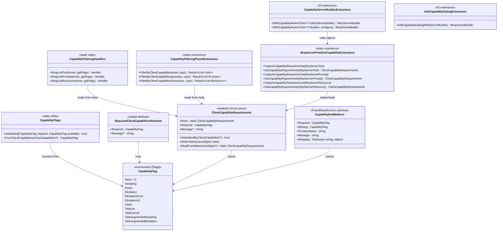
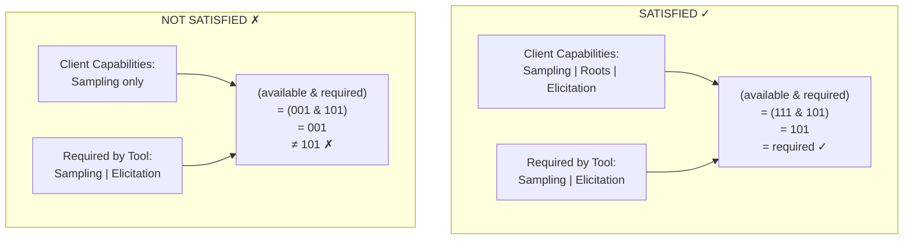
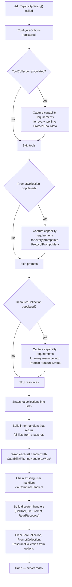
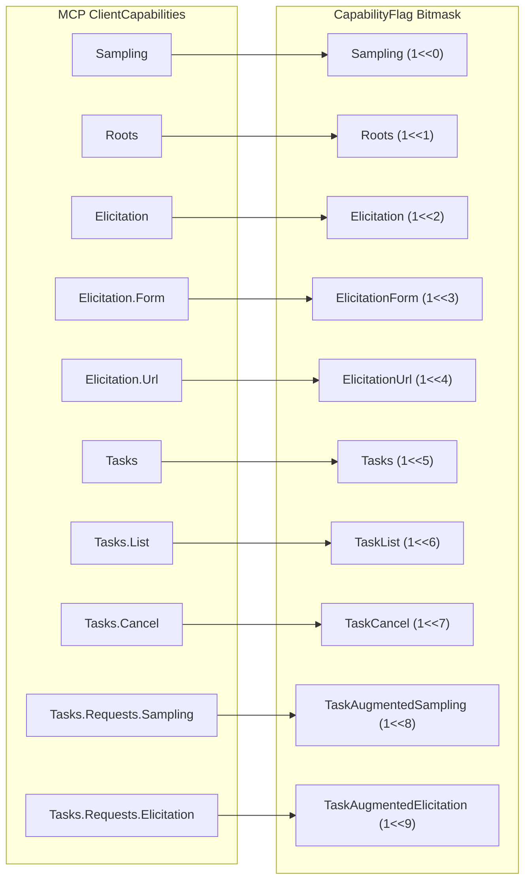
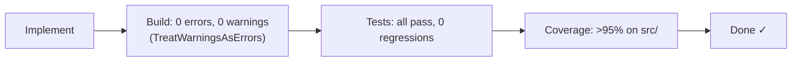

# McpCapabilities — Repository Learnings

> Compiled from all source code, tests, OpenSpec specs, design documents, and proposals.

---

## 1. Overview

**McpCapabilities** is a .NET solution that provides **capability-gating** for MCP (Model Context Protocol) servers. When an MCP client connects to a server, it advertises its `ClientCapabilities` (e.g., "I support LLM sampling", "I support user elicitation", "I support filesystem roots"). The `McpCapabilities.Server` library lets developers **annotate** their tools, prompts, and resources at compile time with `[RequiredClientCapabilities]` attributes — and at runtime, the library **automatically hides** primitives from clients that don't have the required capabilities. No boilerplate filtering code needed.

The repository also contains **runnable samples** (stdio, HTTP, and Blazor clients) and a comprehensive **test suite** (unit + integration) with >95% code coverage.

---

## 2. Repository Structure



### File Tree

```
McpCapabilities/
├── Directory.Build.props            # TreatWarningsAsErrors, ArtifactsPath
├── Directory.Packages.props         # Central Package Management
├── global.json                      # .NET 11.0 SDK pinning
├── McpCapabilities.slnx             # Solution file
├── .editorconfig                    # Coding conventions
├── AGENTS.md                        # AI coding agent guidelines
├── DEVELOPMENT.md                   # Dev workflow docs
├── Makefile                         # Quality gate targets
│
├── src/McpCapabilities.Server/
│   ├── McpCapabilities.Server.csproj
│   ├── README.md                    # Library documentation
│   ├── CapabilityFlag.cs            # [Flags] enum
│   ├── CapabilityFlags.cs           # Bitmask utilities
│   ├── RequiredClientCapabilitiesAttribute.cs
│   ├── ClientCapabilityRequirements.cs
│   ├── CapabilityNotMetError.cs     # FluentResults Error
│   ├── McpServerPrimitiveCapabilityExtensions.cs
│   ├── CapabilityFilteringHandlers.cs
│   ├── CapabilityFilteringFluentExtensions.cs
│   ├── CapabilityServerBuilderExtensions.cs
│   └── AddCapabilityGatingExtensions.cs
│
├── samples/
│   ├── SampleMcpServer/             # Annotated tools, prompts, resources
│   ├── SampleMcpClient/             # Stdio client with capability profiles
│   ├── SampleMcpHttpClient/         # HTTP client with capability profiles
│   └── BlazorClient/                # WebAssembly Blazor client with popups
│
├── tests/
│   ├── McpCapabilities.Server.Unit.Tests/
│   ├── McpCapabilities.Server.Integration.Tests/
│   ├── SampleMcpServer.Unit.Tests/
│   ├── SampleMcpServer.Integration.Tests/
│   └── SampleMcpHttpClient.Integration.Tests/
│
└── openspec/
    ├── specs/                       # Current specification documents
    └── changes/                     # Archived and active change proposals
```

---

## 3. The Core Library: `McpCapabilities.Server`

### 3.1 Architecture Overview

The library operates in **two phases**:



### 3.2 Public API Surface



### 3.3 `CapabilityFlag` — The Bitmask Enum

Maps every MCP `ClientCapabilities` feature to a bitmask value:

```csharp
[Flags]
public enum CapabilityFlag
{
    None = 0,
    Sampling = 1 << 0,
    Roots = 1 << 1,
    Elicitation = 1 << 2,
    ElicitationForm = 1 << 3,
    ElicitationUrl = 1 << 4,
    Tasks = 1 << 5,
    TaskList = 1 << 6,
    TaskCancel = 1 << 7,
    TaskAugmentedSampling = 1 << 8,
    TaskAugmentedElicitation = 1 << 9,
}
```

Flags combine via bitwise OR: `CapabilityFlag.Sampling | CapabilityFlag.Elicitation`.

### 3.4 `CapabilityFlags` — Static Utilities

- **`FromClientCapabilities(ClientCapabilities?)`**: Converts a client's capability object into a bitmask. Handles nested properties (`Elicitation.Form`, `Elicitation.Url`, `Tasks.List`, `Tasks.Cancel`, `Tasks.Requests.Sampling`, `Tasks.Requests.Elicitation`). Returns `None` for `null`.
- **`IsSatisfied(required, available)`**: Uses the bitmask idiom `(available & required) == required`. Returns `true` only if every required flag is present.

### 3.5 `RequiredClientCapabilitiesAttribute`

A sealed, method-only attribute:

```csharp
[AttributeUsage(AttributeTargets.Method, AllowMultiple = false, Inherited = false)]
public sealed class RequiredClientCapabilitiesAttribute : Attribute
{
    public CapabilityFlag Required { get; init; }
    public string? Message { get; init; }
}
```

- **`Required`**: The bitmask of client capabilities the primitive needs.
- **`Message`** (optional): Human-readable description shown when requirements aren't met.
- Can only be applied to methods, is not inherited, cannot be applied multiple times.

### 3.6 `ClientCapabilityRequirements` — Serialization Container

A `readonly record struct` that stores capability requirements and serializes them to/from `JsonObject` under the well-known key `__mcp_capabilities_required`.

```csharp
public readonly record struct ClientCapabilityRequirements
{
    public static readonly ClientCapabilityRequirements None = new();
    public CapabilityFlag Required { get; init; }
    public string? Message { get; init; }

    public bool IsSatisfiedBy(ClientCapabilities? clientCaps);
    public void WriteToMeta(JsonObject meta);
    public static ClientCapabilityRequirements ReadFromMeta(JsonObject? meta);
}
```

The JSON storage format:
```json
{
    "__mcp_capabilities_required": {
        "flags": "Sampling, Elicitation",
        "message": "Requires LLM sampling and user elicitation"
    }
}
```

### 3.7 `CapabilityNotMetError` — FluentResults Integration

A structured error type that extends `FluentResults.Error`:

```csharp
public class CapabilityNotMetError : Error
{
    public CapabilityFlag Required { get; }    // what was needed
    public CapabilityFlag Missing { get; }     // which flags were absent
    public string PrimitiveName { get; }       // e.g., "tools/list", "ai_summarize"
    public string Message { get; }             // human-readable
}
```

Carries metadata via `WithMetadata()`: `"RequiredFlags"`, `"MissingFlags"`, `"PrimitiveName"`.

### 3.8 `McpServerPrimitiveCapabilityExtensions` — Registration Capture

Extension methods that bridge the attribute to the protocol meta:

- **`CaptureCapabilityRequirements()`**: Reads `[RequiredClientCapabilities]` from the method's `MethodInfo` (via one-time reflection at startup) and writes to `ProtocolTool.Meta` / `ProtocolPrompt.Meta` / `ProtocolResource.Meta`.
- **`GetCapabilityRequirements()`**: Reads the stored requirements back from the protocol meta (zero-reflection).

### 3.9 `CapabilityFilteringHandlers` — Request-Time Filtering

Three static methods that wrap the `tools/list`, `prompts/list`, and `resources/list` handlers:

```
WrapListTools(inner, getClientFlags)
WrapListPrompts(inner, getClientFlags)
WrapListResources(inner, getClientFlags)
```

Each wrapper:
1. Calls the inner handler to get the full list of primitives
2. Reads `ClientCapabilityRequirements` from each primitive's `Protocol*.Meta`
3. Compares against the client's capability bitmask (obtained via `getClientFlags`)
4. Returns a filtered list excluding unsatisfied primitives

**Zero reflection at request time** — all data comes from pre-populated `JsonObject` metadata.

### 3.10 `CapabilityFilteringFluentExtensions` — Programmatic Filtering

Extension methods that return `FluentResults.Result<T>`:

```csharp
// Returns Result<IList<Tool>> — success with filtered list, or failure with CapabilityNotMetError
tools.FilterByClientCapabilities(clientCaps);
prompts.FilterByClientCapabilities(clientCaps);
resources.FilterByClientCapabilities(clientCaps);
```

- When some primitives are hidden: `Result.IsSuccess` with filtered list, hidden primitives logged as reasons
- When ALL primitives are hidden: `Result.IsFailed` with a `CapabilityNotMetError` carrying aggregated missing flags

### 3.11 `CapabilityServerBuilderExtensions.WithCapabilityAwareTools<T>()`

DI registration extension that:

1. Registers tools from type `T` via the standard `.WithTools<T>()` pipeline
2. Adds a `IConfigureOptions<McpServerOptions>` that iterates each tool at configure time
3. Calls `CaptureCapabilityRequirements()` on each tool to read `[RequiredClientCapabilities]` and write to `ProtocolTool.Meta`
4. Optionally invokes a `configure` callback for each annotated tool

```csharp
services.AddMcpServer()
    .WithCapabilityAwareTools<MyTools>()
    // optional callback:
    .WithCapabilityAwareTools<MyTools>(configure: (tool, reqs) => { ... });
```

### 3.12 `AddCapabilityGating()` — One-Line Wiring

The culmination of the library — wires everything together:

```csharp
services.AddMcpServer()
    .WithCapabilityAwareTools<MyTools>()
    .AddCapabilityGating();  // ← this is the magic
```

Internally, `AddCapabilityGating()`:

1. **Captures** capability requirements from all registered `ToolCollection`, `PromptCollection`, `ResourceCollection` into their `Meta`
2. **Builds inner handlers** that assemble the full list from captured collections
3. **Wraps** them with `CapabilityFilteringHandlers.Wrap*()` using `CapabilityFlags.FromClientCapabilities(request.Server?.ClientCapabilities)`
4. **Chains** any existing user-provided handlers (combining their lists)
5. **Builds dispatch handlers** (`CallToolHandler`, `GetPromptHandler`, `ReadResourceHandler`) from captured collections
6. **Clears** `ToolCollection`, `PromptCollection`, `ResourceCollection` from options so the SDK serves only through the filtered handlers

---

## 4. How It All Fits Together

### 4.1 Full Registration + Request Flow

```mermaid
sequenceDiagram
    participant Dev as Developer
    participant Attr as [RequiredClientCapabilities]
    participant DI as DI Container
    participant Capture as CapabilityCapture
    participant Meta as Protocol*.Meta
    participant Server as McpServer
    participant Client as MCP Client

    Note over Dev,Attr: === REGISTRATION PHASE (startup, one-time) ===

    Dev->>Attr: Annotates methods with<br/>[RequiredClientCapabilities(Required = Sampling)]
    Dev->>DI: Calls .WithCapabilityAwareTools&lt;MyTools&gt;()

    DI->>Capture: On configure, iterates tools
    Capture->>Attr: Reads attribute via reflection<br/>MethodInfo.GetCustomAttribute()
    Capture->>Meta: Writes requirements as JSON<br/>{"__mcp_capabilities_required": {"flags": "Sampling"}}

    Dev->>DI: Calls .AddCapabilityGating()
    DI->>Server: Wraps ListToolsHandler, ListPromptsHandler,<br/>ListResourcesHandler with filtering wrappers

    Note over Dev,Client: === REQUEST PHASE (per-client connection) ===

    Client->>Server: Connect + Initialize<br/>(sends ClientCapabilities)
    Server->>Server: Stores client caps on McpServer instance

    Client->>Server: tools/list
    Server->>Server: Extracts CapabilityFlag from<br/>request.Server.ClientCapabilities
    Server->>Server: Calls wrapped handler
    Server->>Meta: For each tool: ReadFromMeta(tool.Meta)
    Server->>Server: Bitmask check:<br/>(clientFlags & required) == required

    alt Client has Sampling
        Server->>Client: Tool is visible ✓
    else Client lacks Sampling
        Server->>Client: Tool is hidden ✗ (excluded from list)
    end
```

### 4.2 Capability Satisfaction Logic



### 4.3 `AddCapabilityGating` Internals



### 4.4 CapabilityFlag → ClientCapabilities Mapping



---

## 5. How to Use `McpCapabilities.Server` in Your Own MCP Server

### 5.1 Installation

```bash
dotnet add package McpCapabilities.Server
```

Dependencies: `ModelContextProtocol` (≥1.4.0), `FluentResults` (≥4.0.0), `Microsoft.AspNetCore.App`.

### 5.2 Step-by-Step Integration

#### Step 1: Annotate Your Tool Methods

```csharp
using McpCapabilities.Server;

[McpServerToolType]
public class MyAITools
{
    // This tool requires LLM sampling — hidden from non-LLM clients
    [McpServerTool]
    [RequiredClientCapabilities(
        Required = CapabilityFlag.Sampling,
        Message = "Requires LLM sampling support")]
    public async Task<string> Summarize(
        string text,
        IMcpServer server,
        CancellationToken ct)
    {
        var result = await server.SampleAsync(/* ... */, ct);
        return result.Content.ToString();
    }

    // This tool requires both sampling AND elicitation
    [McpServerTool]
    [RequiredClientCapabilities(
        Required = CapabilityFlag.Sampling | CapabilityFlag.Elicitation)]
    public async Task<string> InteractiveAnalysis(
        string input,
        IMcpServer server,
        CancellationToken ct)
    {
        // Uses both server.RequestSamplingAsync() and server.RequestElicitationAsync()
        return "...";
    }

    // This tool is always visible — no requirements
    [McpServerTool]
    public string Echo(string text) => text;
}
```

#### Step 2: Annotate Prompts and Resources (Optional)

```csharp
[McpServerPromptType]
public class MyPrompts
{
    [McpServerPrompt]
    [RequiredClientCapabilities(Required = CapabilityFlag.Elicitation)]
    public string ConfirmAction() => "Ask the user to confirm...";

    [McpServerPrompt]
    public string Greeting() => "Greet the user...";
}

[McpServerResourceType]
public class MyResources
{
    [McpServerResource]
    [RequiredClientCapabilities(Required = CapabilityFlag.Roots)]
    public string WorkspaceContents() => "List workspace files...";

    [McpServerResource]
    public string About() => "v1.0.0";
}
```

#### Step 3: Wire Up in `Program.cs`

```csharp
var builder = WebApplication.CreateBuilder(args);

builder.Services.AddMcpServer(options =>
{
    options.ServerInfo = new Implementation { Name = "MyServer", Version = "1.0" };
})
    .WithCapabilityAwareTools<MyAITools>()        // capture attributes for tools
    .WithPrompts<MyPrompts>()                      // register prompts
    .WithResources<MyResources>()                  // register resources
    .AddCapabilityGating();                        // wire filtering handlers

var app = builder.Build();
app.MapMcp();                                      // HTTP transport
await app.RunAsync();
```

That's it! The three lines after `AddMcpServer()` — `WithCapabilityAwareTools<T>()`, `WithPrompts<T>()`, `WithResources<T>()`, and `AddCapabilityGating()` — handle everything.

#### Step 4: Run Your Server

- **HTTP mode** (default with `WebApplication`): `dotnet run` — serves at `https://localhost:5000/mcp`
- **Stdio mode**: `dotnet run` with no `MapMcp()` call — serves over stdin/stdout
- **Both modes**: Use `WithStdioServerTransport()` + `WithHttpTransport()` + `MapMcp()`

### 5.3 Dual Transport Configuration

```csharp
var builder = WebApplication.CreateBuilder(args);
var transport = builder.Configuration.GetValue<string>("MCP:Transport") ?? "stdio";
var isHttp = transport is "http" or "both";
var isStdio = transport is "stdio" or "both";

var mcpBuilder = builder.Services.AddMcpServer()
    .WithCapabilityAwareTools<MyAITools>()
    .AddCapabilityGating();

if (isStdio)
    mcpBuilder.WithStdioServerTransport();
if (isHttp)
    mcpBuilder.WithHttpTransport();

var app = builder.Build();
if (isHttp)
{
    app.UseCors();
    app.MapMcp();
}
await app.RunAsync();
```

Configure via `appsettings.json`:
```json
{
  "MCP": { "Transport": "both" }
}
```

### 5.4 Advanced: Programmatic Filtering

If you need to filter lists manually (e.g., in a custom handler), use the FluentResults extensions:

```csharp
using McpCapabilities.Server;
using FluentResults;

var allTools = GetSomeToolList();
var clientCaps = someConnectedClient.ClientCapabilities;

var result = allTools.FilterByClientCapabilities(clientCaps);

result.Switch(
    success: tools =>
    {
        // tools is the filtered list
        foreach (var t in tools)
            Console.WriteLine($"Visible: {t.Name}");
    },
    failure: errors =>
    {
        foreach (CapabilityNotMetError e in errors)
        {
            Console.WriteLine($"Client missing: {e.Missing}");
            Console.WriteLine($"Required:       {e.Required}");
            Console.WriteLine($"Primitive:      {e.PrimitiveName}");
        }
    });
```

### 5.5 Manual Capability Checking

```csharp
var clientFlags = CapabilityFlags.FromClientCapabilities(someClient.ClientCapabilities);
var reqs = ClientCapabilityRequirements.ReadFromMeta(tool.ProtocolTool.Meta);

if (CapabilityFlags.IsSatisfied(reqs.Required, clientFlags))
{
    // Allow access
}
```

---

## 6. Samples

### 6.1 SampleMcpServer

The reference server demonstrating all three primitive types:

| Primitive | Gated Tool | Requires | Ungated Tool |
|-----------|-----------|----------|--------------|
| Tools | `ai_summarize` | `Sampling` | `echo` |
| Tools | `ai_elicit` | `Elicitation` | — |
| Tools | `ai_choose` | `Elicitation` | — |
| Prompts | `confirm_action` | `Elicitation` | `greeting` |
| Resources | `workspace_files` | `Roots` | `app_info` |

Supports three transport modes (configured via `MCP:Transport` in `appsettings.json`):
- `"stdio"` — stdin/stdout transport
- `"http"` — HTTP transport at `https://localhost:5000`
- `"both"` — both transports simultaneously

Launch profiles (`launchSettings.json`) allow switching modes at runtime:
```bash
dotnet run --launch-profile http
dotnet run --launch-profile stdio
dotnet run --launch-profile both
```

### 6.2 SampleMcpClient (Stdio)

Connects to `SampleMcpServer` via stdio and runs two capability profiles:

| Profile | Capabilities | Expected Visible Tools | Expected Visible Prompts | Expected Visible Resources |
|---------|-------------|----------------------|-------------------------|---------------------------|
| **FULL** | Sampling + Roots + Elicitation | 4 (all) | 2 (all) | 2 (all) |
| **MINIMAL** | None | 1 (`echo`) | 1 (`greeting`) | 1 (`app_info`) |

### 6.3 SampleMcpHttpClient (HTTP)

Same profiles, but connects via HTTP `HttpClientTransport` to `https://localhost:5000`.

### 6.4 BlazorClient

A WebAssembly Blazor app that connects to `SampleMcpServer` via HTTP. Shows:
- **Dashboard**: Connection status
- **Full/Minimal Profile pages**: Tool/prompt/resource tables
- **Sampling popup**: When the server requests LLM sampling, a modal popup in the browser collects user input
- **Elicitation popup**: When the server requests user elicitation, a form popup collects user responses

Uses `HttpClientTransport`, `SamplingPopupService`, and `ElicitationPopupService`.

---

## 7. Design Decisions

### 7.1 FluentResults over Custom Result\<T\>

**Chosen**: `FluentResults` (NuGet, 100M+ downloads). Provides first-class multi-error support (`result.Errors` is `List<IError>`), structured metadata (`WithMetadata()`), and built-in logging hooks.

**Rejected**: Custom `Result<T, CapabilityError>` value struct (lacks multi-error support), `OneOf` (different programming model).

### 7.2 Meta Storage over Custom DI State

**Chosen**: Store requirements in `Protocol*.Meta` as JSON (`__mcp_capabilities_required` key). This is the SDK's built-in extension point, survives JSON serialization, requires zero allocation for reads at request time, and avoids polluting DI.

**Rejected**: Custom `ConcurrentDictionary` in DI (coupling to DI resolution, doesn't survive serialization), custom subclass (requires user code changes).

### 7.3 Handler Wrapping over Middleware

**Chosen**: Wrap `ListToolsHandler` / `ListPromptsHandler` / `ListResourcesHandler` delegates in `McpServerOptions.Handlers`. Preserves any existing handler chain, follows SDK pattern (`AddAuthorizationFilters()` uses the same approach).

**Rejected**: `McpServerFilters` (can't access full tool list post-resolution, intercepts at message boundary not handler boundary).

### 7.4 One-Time Reflection at Registration

**Chosen**: Reflect on `[RequiredClientCapabilities]` at startup, write to `_meta`, never reflect again.

**Rejected**: Per-request reflection (performance overhead), source generators (over-engineered for small number of tools; reflection at startup is microseconds).

### 7.5 Separate `WithCapabilityAwareTools` from `AddCapabilityGating`

**Chosen**: Keep them separate — users can use filtering without attribute capture if they populate `_meta` manually, or can capture without filtering if they handle filtering themselves.

### 7.6 Razor Pages over MVC for BlazorClient Sample (in transform-http-client change)

**Chosen**: Razor Pages — page-centric navigation with no complex form workflows, fewer files than MVC.

**Rejected**: MVC (overkill), Blazor Server (SignalR dependency, persistent circuit overhead), Minimal API + static HTML (needs JavaScript).

---

## 8. Testing Strategy

### 8.1 Test Framework

All tests use **TUnit** (v1.56.0) with `Microsoft.Testing.Platform`. No xUnit, no NUnit.

```csharp
public class MyTests
{
    [Test]
    public async Task MethodName_Scenario_ExpectedBehavior()
    {
        var result = Something();
        await Assert.That(result).IsEqualTo(expected);
    }
}
```

### 8.2 Test Categories

| Layer | Project | Tests | Focus |
|-------|---------|-------|-------|
| **Unit** | `McpCapabilities.Server.Unit.Tests` | 12+ files | Isolated tests: enums, attributes, bitmask logic, meta serialization, FluentResults error, handler filtering, DI registration |
| **Integration** | `McpCapabilities.Server.Integration.Tests` | 4 tests | DI wiring: `WithCapabilityAwareTools` captures attributes, `AddCapabilityGating` wires handlers, `FilterByClientCapabilities` returns errors |
| **Sample Unit** | `SampleMcpServer.Unit.Tests` | 3 files | Verify sample tools/prompts/resources have correct attributes and names |
| **Sample Integration** | `SampleMcpServer.Integration.Tests` | 12+ tests | Full pipeline: collections populated, capabilities captured, filtering produces correct visible/hidden counts for both full and minimal clients |
| **Dual Transport** | `SampleMcpServer.Integration.Tests` | — | `DualTransportTests.cs`: stdio, HTTP, and both modes covered |
| **HTTP Client Integration** | `SampleMcpHttpClient.Integration.Tests` | — | End-to-end: HTTP client ↔ HTTP server, verifies capability-gated filtering over the wire |

### 8.3 Quality Gates



Enforced by:
- `Directory.Build.props`: `<TreatWarningsAsErrors>true</TreatWarningsAsErrors>`, `<ArtifactsPath>$(MSBuildThisFileDirectory)/artifacts</ArtifactsPath>`
- `coverage.config`: 95% threshold
- `Makefile`: `make all` runs build → test → coverage in one command

### 8.4 Testing-First Mandate (from AGENTS.md)

> **Tests must be written before any implementation or production code.**

- Red → Green → Refactor cycle
- Tests must be deterministic, fast, independent
- Test names: `MethodName_Scenario_ExpectedBehavior`

---

## 9. Project Conventions

### 9.1 Central Package Management

All NuGet versions in `Directory.Packages.props`:
```xml
<PackageVersion Include="ModelContextProtocol" Version="1.4.0" />
<PackageVersion Include="FluentResults" Version="4.0.0" />
<PackageVersion Include="TUnit" Version="1.56.0" />
<!-- etc. -->
```

Project files reference packages without versions:
```xml
<PackageReference Include="ModelContextProtocol" />
```

### 9.2 Namespace Strategy

| Namespace | Purpose |
|-----------|---------|
| `McpCapabilities.Server` | Core library types (enums, attributes, records, extensions) |
| `Microsoft.Extensions.DependencyInjection` | DI registration extensions (feel natural when adding services) |

### 9.3 Solution Format

Uses `.slnx` format (the new XML-based solution format in .NET). Contains folders `/src/`, `/samples/`, `/tests/`.

### 9.4 Target Framework

`net11.0` (as of current `global.json`).

---

## 10. OpenSpec Change History

The repository uses **OpenSpec** for spec-driven development. Each change has a `proposal.md`, `design.md`, `tasks.md`, and capability specs.

| # | Change | Status | Key Contribution |
|---|--------|--------|-----------------|
| 1 | **implement-mcp-capabilities-server** | Archived | The core library: `CapabilityFlag`, `[RequiredClientCapabilities]`, `CapabilityFilteringHandlers`, `AddCapabilityGating`, `WithCapabilityAwareTools`, `CapabilityNotMetError` |
| 2 | **add-sample-mcp-server** | Archived | `SampleMcpServer` with `AiTools`, `HelpfulPrompts`, `WorkspaceResources` |
| 3 | **add-sample-clients** | Archived | `SampleMcpClient` — stdio client with capability profiles |
| 4 | **add-dual-transport-server** | Archived | HTTP + stdio + "both" transport modes, switched from `Microsoft.NET.Sdk` to `Microsoft.NET.Sdk.Web` |
| 5 | **add-server-launch-settings** | Archived | `launchSettings.json` profiles + environment-specific `appsettings.{Environment}.json` |
| 6 | **add-sample-http-client** | In progress | `SampleMcpHttpClient` (console) + HTTP integration tests |
| 7 | **transform-http-client-to-webapp** | In progress | Replace console `SampleMcpHttpClient` with Razor Pages web app |

---

## 11. Capability Matrix

| MCP Primitive Feature | Client Capability | CapabilityFlag | Sample Tool Using It |
|-----------------------|------------------|----------------|---------------------|
| LLM Sampling | `ClientCapabilities.Sampling` | `Sampling` | `ai_summarize` |
| Filesystem Roots | `ClientCapabilities.Roots` | `Roots` | `workspace_files` (resource) |
| User Elicitation | `ClientCapabilities.Elicitation` | `Elicitation` | `ai_elicit`, `ai_choose`, `confirm_action` (prompt) |
| Elicitation Form | `Elicitation.Form` | `ElicitationForm` | — |
| Elicitation URL | `Elicitation.Url` | `ElicitationUrl` | — |
| Tasks (experimental) | `ClientCapabilities.Tasks` | `Tasks` | — |
| Task List | `Tasks.List` | `TaskList` | — |
| Task Cancel | `Tasks.Cancel` | `TaskCancel` | — |
| Task-Augmented Sampling | `Tasks.Requests.Sampling` | `TaskAugmentedSampling` | — |
| Task-Augmented Elicitation | `Tasks.Requests.Elicitation` | `TaskAugmentedElicitation` | — |

---

## 12. Quick Reference: Key Snippets

### Minimal Server Setup

```csharp
var builder = WebApplication.CreateBuilder(args);

builder.Services.AddMcpServer()
    .WithCapabilityAwareTools<MyTools>()
    .AddCapabilityGating();

var app = builder.Build();
app.MapMcp();
await app.RunAsync();
```

### Attribute Usage

```csharp
[McpServerTool]
[RequiredClientCapabilities(Required = CapabilityFlag.Sampling)]
public string MyTool(string input) => input;

[McpServerTool]
[RequiredClientCapabilities(
    Required = CapabilityFlag.Sampling | CapabilityFlag.Elicitation,
    Message = "Requires LLM and user interaction")]
public string ComplexTool(string input) => input;
```

### Build and Test Commands

```bash
dotnet restore && dotnet tool restore   # Setup
dotnet build                             # Build
dotnet test                              # Run all tests
dotnet test --coverage                   # With coverage
dotnet run --project samples/SampleMcpServer/ --launch-profile http
```

### Quality Gate

```bash
make all   # build → test → coverage (must be ≥95%)
```

---

## 13. Summary

The `McpCapabilities.Server` library solves a common MCP server problem: **selectively exposing tools, prompts, and resources based on what the connected client can handle**. It does this with:

1. **Compile-time annotation** via `[RequiredClientCapabilities]` attributes
2. **One-time reflection** at startup to capture requirements into protocol metadata
3. **Zero-reflection request-time filtering** via handler wrapping and bitmask comparison
4. **FluentResults integration** for composable, structured error handling when no primitives are available
5. **Minimal API surface** — three lines of code to enable: `WithCapabilityAwareTools<T>()`, `WithPrompts<T>()`, `WithResources<T>()`, and `AddCapabilityGating()`
