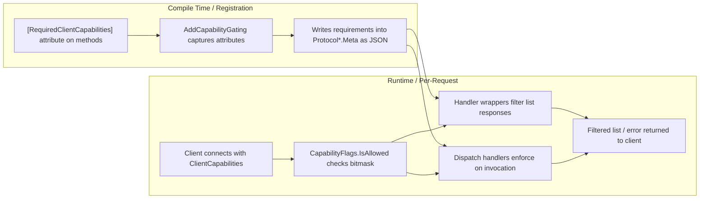
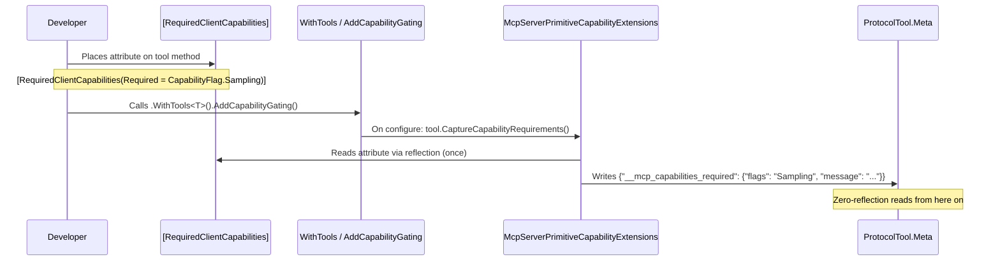
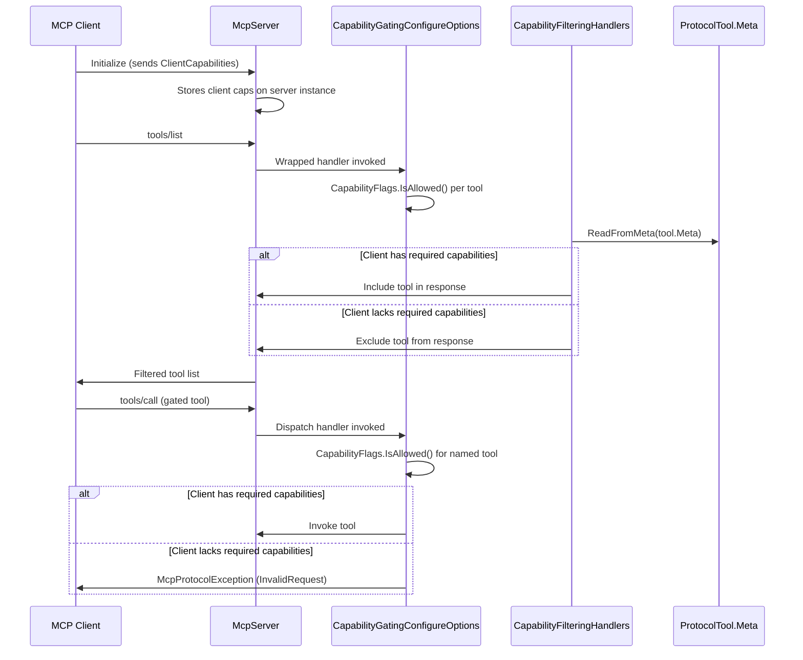
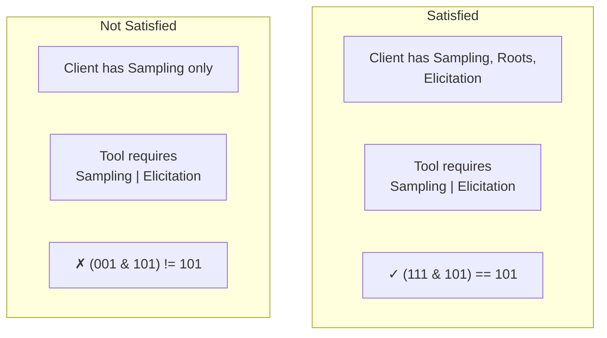
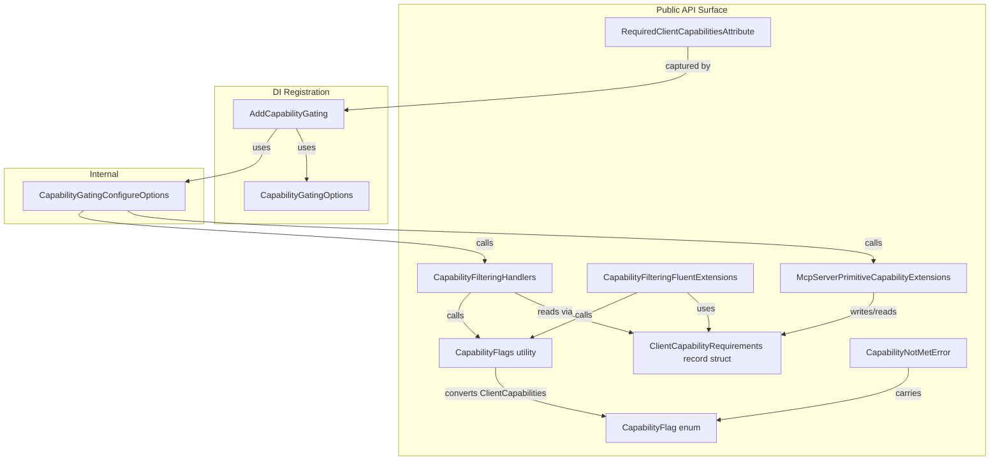

# McpCapabilities.Server

Capability-gating library for MCP servers. Annotate your tools, prompts, and resources with `[RequiredClientCapabilities]` at compile time — the library automatically hides them from clients that don't advertise the required capabilities at runtime, and blocks invocations from clients that lack them.

## Installation

```bash
dotnet add package McpCapabilities.Server
```

Dependencies: `ModelContextProtocol`, `FluentResults`.

## Quick Start

```csharp
using McpCapabilities.Server;

[McpServerToolType]
public class MyTools
{
    [McpServerTool]
    [RequiredClientCapabilities(Required = CapabilityFlag.Sampling)]
    public string Summarize(string text, IMcpServer server)
        => server.RequestSamplingAsync(/* ... */);

    [McpServerTool]
    public string Echo(string text) => text; // always visible
}

services.AddMcpServer()
    .WithTools<MyTools>()
    .AddCapabilityGating();
```

Clients without LLM sampling capability won't see — or be able to invoke — the `Summarize` tool.

## High-Level Architecture



The library operates in two phases:

1. **Registration phase** — `AddCapabilityGating()` uses reflection *once* to read `[RequiredClientCapabilities]` from each method and serializes the requirements into the protocol primitives' `Meta` JSON objects. No reflection is needed at request time.

2. **Request phase** — list handlers (`tools/list`, `prompts/list`, `resources/list`) filter out primitives whose requirements the connected client does not satisfy. Dispatch handlers (`tools/call`, `prompts/get`, `resources/read`) enforce the same check and throw `McpProtocolException` if a client attempts to invoke a gated primitive they lack capability for.

## Data Flow

### Registration Flow



### Request Flow



## Core Concepts

### `CapabilityFlag` — Bitmask Enum

A `[Flags]` enum representing all MCP client capabilities a server can gate on:

| Flag | Built-in Capability | Description |
|------|-------------------|-------------|
| `None` | — | No capabilities required |
| `Sampling` | `ClientCapabilities.Sampling` | LLM sampling requests |
| `Roots` | `ClientCapabilities.Roots` | Filesystem root listing |
| `Elicitation` | `ClientCapabilities.Elicitation` | Elicitation (any mode) |
| `ElicitationForm` | `Elicitation.Form` | Form-mode elicitation |
| `ElicitationUrl` | `Elicitation.Url` | URL-mode elicitation |
| `Tasks` | `ClientCapabilities.Tasks` | Task-augmented requests |
| `TaskList` | `Tasks.List` | Task listing |
| `TaskCancel` | `Tasks.Cancel` | Task cancellation |
| `TaskAugmentedSampling` | `Tasks.Requests.Sampling` | Task-augmented LLM sampling |
| `TaskAugmentedElicitation` | `Tasks.Requests.Elicitation` | Task-augmented elicitation |

Combine flags with bitwise OR: `CapabilityFlag.Sampling | CapabilityFlag.Elicitation`.

### `CapabilityFlags.IsAllowed`

The central allow/deny predicate used by all filtering and dispatch logic:

```csharp
bool IsAllowed(
    CapabilityFlag required,
    ClientCapabilities? clientCaps,
    bool allowWhenNotProvided = true)
```

- Returns `true` when `required == None`.
- When `clientCaps` is `null`, returns `allowWhenNotProvided`.
- Otherwise performs `(clientFlags & required) == required`.

### Bitmask Satisfaction



## Usage Guide

### Gating tools

```csharp
[McpServerToolType]
public class AITools
{
    [McpServerTool]
    [RequiredClientCapabilities(
        Required = CapabilityFlag.Sampling | CapabilityFlag.Elicitation,
        Message = "This tool requires LLM sampling and user elicitation")]
    public string AdvancedAnalysis(string input, IMcpServer server) => ...;

    [McpServerTool]
    [RequiredClientCapabilities(Required = CapabilityFlag.Sampling)]
    public string Summarize(string text) => ...;

    [McpServerTool]
    public string Echo(string text) => text; // always visible
}
```

### Gating prompts and resources

```csharp
[McpServerPromptType]
public class MyPrompts
{
    [McpServerPrompt]
    [RequiredClientCapabilities(Required = CapabilityFlag.Sampling)]
    public string AiPrompt() => "Ask the AI to summarize...";

    [McpServerPrompt]
    public string HelpPrompt() => "How can I help you?";
}

[McpServerResourceType]
public class MyResources
{
    [McpServerResource]
    [RequiredClientCapabilities(Required = CapabilityFlag.Roots)]
    public string FilesResource() => "file:///workspace";
}
```

### Registration

```csharp
services.AddMcpServer()
    .WithTools<AITools>()
    .WithPrompts<MyPrompts>()
    .WithResources<MyResources>()
    .AddCapabilityGating();
```

### Gating options

`AddCapabilityGating` accepts an optional `CapabilityGatingOptions` callback:

```csharp
services.AddMcpServer()
    .WithTools<AITools>()
    .AddCapabilityGating(opts =>
    {
        // Allow clients that send no ClientCapabilities object at all to bypass gating.
        // Default is false (those clients are gated).
        opts.AllowWhenClientCapabilitiesNotProvided = true;

        // Observe which tools have requirements (e.g. for startup logging)
        opts.OnToolRequirements = (tool, reqs) =>
            logger.LogInformation("Tool '{Name}' requires {Flags}", tool.ProtocolTool.Name, reqs.Required);
    });
```

`CapabilityGatingOptions` participates in the standard .NET options system. You can pre-configure it (e.g., from `appsettings.json`) before calling `AddCapabilityGating`:

```json
{
  "CapabilityGating": {
    "AllowWhenClientCapabilitiesNotProvided": true
  }
}
```

```csharp
services.Configure<CapabilityGatingOptions>(
    configuration.GetSection("CapabilityGating"));

services.AddMcpServer()
    .WithTools<AITools>()
    .AddCapabilityGating();
```

### Dispatch enforcement

Gating blocks invocations, not just listings. When a client calls a gated tool they lack capability for, the dispatch handler throws `McpProtocolException` with `McpErrorCode.InvalidRequest`:

```text
Client missing capabilities to call 'summarize': Sampling
```

Set a custom `Message` on the attribute to replace the default error text:

```csharp
[RequiredClientCapabilities(
    Required = CapabilityFlag.Sampling,
    Message = "Connect an LLM to use this tool")]
public string Summarize(string text) => ...;
```

The same enforcement applies to `GetPrompt` and `ReadResource`.

### Programmatic filtering with FluentResults

```csharp
using McpCapabilities.Server;
using FluentResults;

var result = tools.FilterByClientCapabilities(clientCaps);

result.Switch(
    success: visible =>
    {
        foreach (var tool in visible)
            Console.WriteLine($"  - {tool.Name}");
    },
    failure: errors =>
    {
        var error = errors.OfType<CapabilityNotMetError>().First();
        Console.WriteLine($"Client lacks: {error.Missing}");
        Console.WriteLine($"Required:     {error.Required}");
        Console.WriteLine($"Primitive:    {error.PrimitiveName}"); // "tools/list"
    });
```

Pass `allowWhenNotProvided: true` to match the opt-in permissive server behavior:

```csharp
var result = tools.FilterByClientCapabilities(clientCaps, allowWhenNotProvided: true);
```

### Manual checking

```csharp
var clientFlags = CapabilityFlags.FromClientCapabilities(clientCapabilities);
var reqs = ClientCapabilityRequirements.ReadFromMeta(tool.ProtocolTool.Meta);

if (CapabilityFlags.IsSatisfied(reqs.Required, clientFlags))
{
    // Client can use this tool
}
```

## Component Map



## Error Handling

When all primitives in a list are hidden, `FilterByClientCapabilities` returns a `Result.Fail` with a `CapabilityNotMetError`:

```csharp
public class CapabilityNotMetError : Error
{
    public CapabilityFlag Required { get; }    // what was needed
    public CapabilityFlag Missing { get; }     // what was missing
    public string PrimitiveName { get; }       // "tools/list", "prompts/list", "resources/list"
    public string Message { get; }             // human-readable description
}
```

## Framework Compatibility

- .NET 10+ (targets `net10.0`)
- Works with the `ModelContextProtocol` MCP server SDK
- Requires `Microsoft.AspNetCore.App` framework reference
