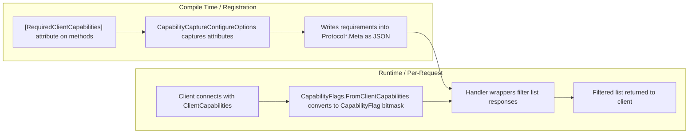
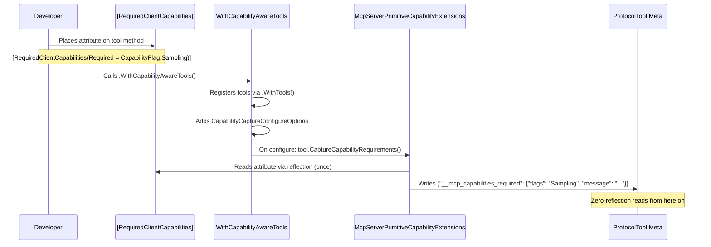
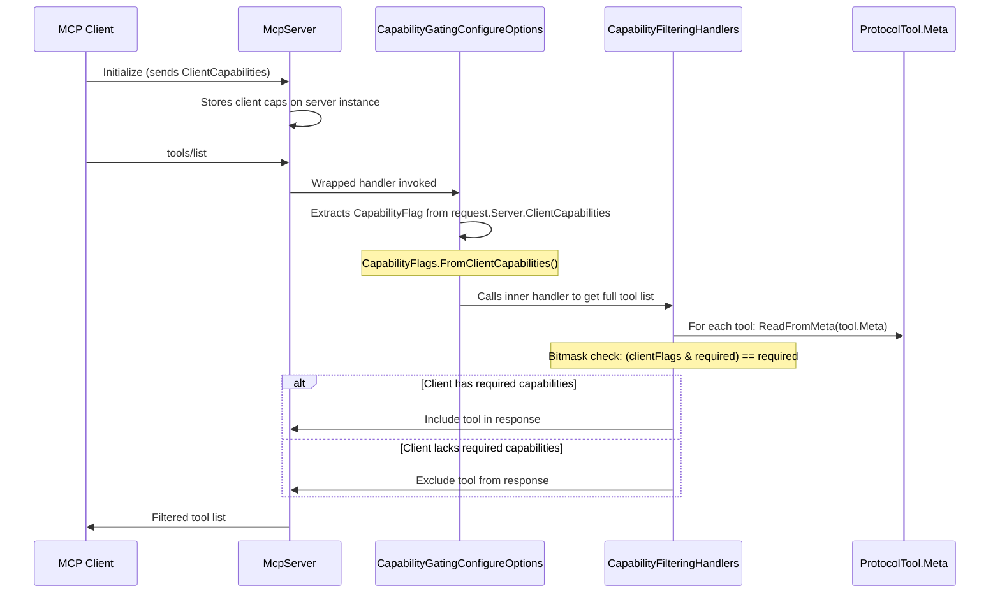
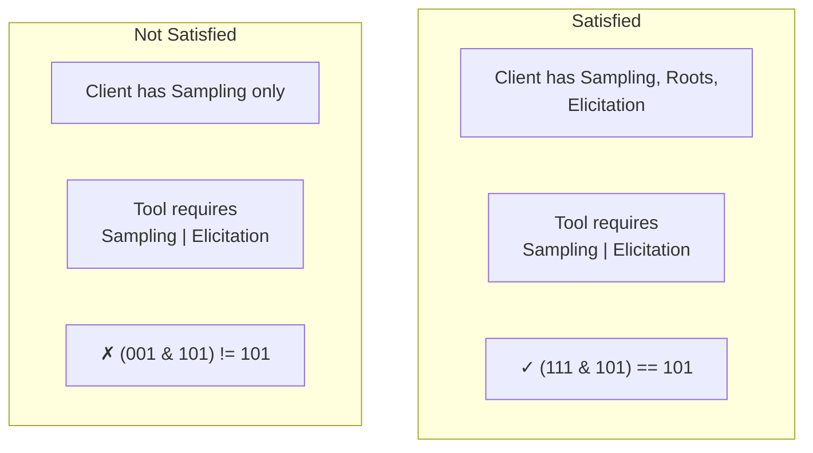
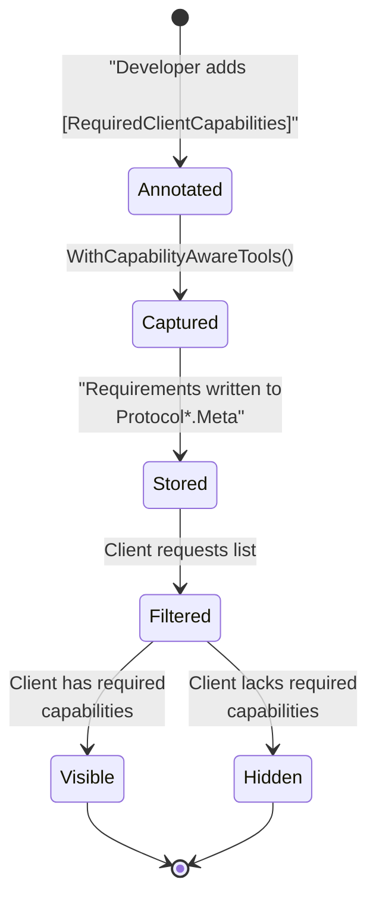
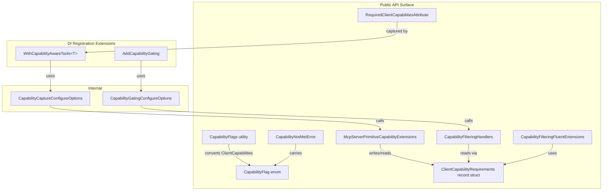

# McpCapabilities.Server

Capability-gating library for MCP servers. Annotate your tools, prompts, and resources with `[RequiredClientCapabilities]` at compile time — the library automatically hides them from clients that don't advertise the required capabilities at runtime.

## Installation

```bash
dotnet add package McpCapabilities.Server
```

Dependencies: `ModelContextProtocol`, `FluentResults`.

## Quick Start

```csharp
using McpCapabilities.Server;

// 1. Annotate your tools
public class MyTools
{
    [McpServerTool]
    [RequiredClientCapabilities(Required = CapabilityFlag.Sampling)]
    public string Summarize(string text, IMcpServer server)
        => server.RequestSamplingAsync(/* ... */);

    [McpServerTool]
    public string Echo(string text) => text; // always visible
}

// 2. Register with capability capture
services.AddMcpServer()
    .WithCapabilityAwareTools<MyTools>()
    .AddCapabilityGating();
```

That's it. Clients without LLM sampling capability won't see the `Summarize` tool.

## High-Level Architecture



The library operates in two phases:

1. **Registration phase** — attributes are captured from annotated methods and serialized into the protocol primitives' `Meta` JSON objects. No reflection is needed at request time.

2. **Request phase** — list handlers (`tools/list`, `prompts/list`, `resources/list`) are wrapped to filter out primitives whose capability requirements are not satisfied by the connected client.

## Data Flow

### Registration Flow



### Request Flow (with filtering)



## Core Concepts

### `CapabilityFlag` — Bitmask Enum

A `[Flags]` enum representing all MCP client capabilities a server can gate on:

| Flag | Built-in Capability | Description |
|------|-------------------|-------------|
| `None` | — | No capabilities required |
| `Sampling` | `ClientCapabilities.Sampling` | LLM sampling requests |
| `Roots` | `ClientCapabilities.Roots` | Filesystem root listing |
| `Elicitation` | `ClientCapabilities.Elicitation` | Elicitation (any mode) |
| `ElicitationForm` | `Elicitation.Form` | Form-mode elicitation |
| `ElicitationUrl` | `Elicitation.Url` | URL-mode elicitation |
| `Tasks` | `ClientCapabilities.Tasks` | Task-augmented requests |
| `TaskList` | `Tasks.List` | Task listing |
| `TaskCancel` | `Tasks.Cancel` | Task cancellation |
| `TaskAugmentedSampling` | `Tasks.Requests.Sampling` | Task-augmented LLM sampling |
| `TaskAugmentedElicitation` | `Tasks.Requests.Elicitation` | Task-augmented elicitation |

Combine flags with bitwise OR: `CapabilityFlag.Sampling | CapabilityFlag.Elicitation`.

### Bitmask Satisfaction



The check `(available & required) == required` ensures the client has *every* flag the tool needs. If any required flag is missing, the tool is hidden.

### Two-Phase Lifecycle



## Usage Guide

### Basic: Capability-Aware Tools

```csharp
// Define your tool class
[McpServerToolType]
public class AITools
{
    [McpServerTool]
    [RequiredClientCapabilities(
        Required = CapabilityFlag.Sampling | CapabilityFlag.Elicitation,
        Message = "This tool requires LLM sampling and user elicitation")]
    public string AdvancedAnalysis(string input, IMcpServer server)
    {
        var sample = await server.RequestSamplingAsync(/* ... */);
        var elicit = await server.RequestElicitationAsync(/* ... */);
        return Process(sample, elicit);
    }

    [McpServerTool]
    [RequiredClientCapabilities(Required = CapabilityFlag.Sampling)]
    public string Summarize(string text) => /* ... */;

    [McpServerTool]
    public string Echo(string text) => text; // always visible
}

// In Program.cs / Startup
services.AddMcpServer()
    .WithCapabilityAwareTools<AITools>()
    .AddCapabilityGating();
```

### With Post-Registration Callback

```csharp
services.AddMcpServer()
    .WithCapabilityAwareTools<MyTools>(configure: (tool, reqs) =>
    {
        // e.g., log or augment the tool
        logger.LogInformation("Tool '{Name}' requires {Flags}",
            tool.ProtocolTool.Name, reqs.Required);
    })
    .AddCapabilityGating();
```

### Prompts and Resources

The same attribute works on prompts and resources:

```csharp
[McpServerPromptType]
public class MyPrompts
{
    [McpServerPrompt]
    [RequiredClientCapabilities(Required = CapabilityFlag.Sampling)]
    public string AiPrompt() => "Ask the AI to summarize...";

    [McpServerPrompt]
    public string HelpPrompt() => "How can I help you?";
}

[McpServerResourceType]
public class MyResources
{
    [McpServerResource]
    [RequiredClientCapabilities(Required = CapabilityFlag.Roots)]
    public string FilesResource() => "file:///workspace";
}
```

### Advanced: Programmatic Filtering with FluentResults

Use the FluentResults-based extension methods for custom filtering logic:

```csharp
using McpCapabilities.Server;
using FluentResults;

var tools = GetFullToolList();
var clientCaps = GetConnectedClientCapabilities();

var result = tools.FilterByClientCapabilities(clientCaps);

result.Switch(
    success: visible =>
    {
        Console.WriteLine($"Showing {visible.Count} tools");
        foreach (var tool in visible)
            Console.WriteLine($"  - {tool.Name}");
    },
    failure: errors =>
    {
        var error = errors.OfType<CapabilityNotMetError>().First();
        Console.WriteLine($"Client lacks: {error.Missing}");
        Console.WriteLine($"Required:     {error.Required}");
        Console.WriteLine($"Primitive:    {error.PrimitiveName}"); // "tools/list"
    });
```

### Manual Checking

```csharp
var clientFlags = CapabilityFlags.FromClientCapabilities(clientCapabilities);
var reqs = ClientCapabilityRequirements.ReadFromMeta(tool.ProtocolTool.Meta);

if (reqs.Required == CapabilityFlag.None || CapabilityFlags.IsSatisfied(reqs.Required, clientFlags))
{
    // Client can use this tool
}
```

## Component Map



## Error Handling

When all tools/prompts/resources in a list are hidden, `FilterByClientCapabilities` returns a `Result.Fail` with a `CapabilityNotMetError`:

```csharp
public class CapabilityNotMetError : Error
{
    public CapabilityFlag Required { get; }    // what was needed
    public CapabilityFlag Missing { get; }     // what was missing
    public string PrimitiveName { get; }       // "tools/list", "prompts/list", "resources/list"
    public string Message { get; }             // human-readable description
}
```

The error also carries structured metadata (`RequiredFlags`, `MissingFlags`, `PrimitiveName`) for logging and diagnostics.

## How It Works Under the Hood

1. **Registration time** — `WithCapabilityAwareTools<T>()` uses reflection *once* to read `[RequiredClientCapabilities]` from each method and writes the requirements as JSON into the tool's `ProtocolTool.Meta` dictionary under the key `"__mcp_capabilities_required"`.

2. **Request time** — `AddCapabilityGating()` wraps the `ListToolsHandler`, `ListPromptsHandler`, and `ListResourcesHandler` with filters. Each wrapper reads the connected client's `ClientCapabilities`, converts them to a `CapabilityFlag` bitmask, and filters the list by comparing each primitive's stored requirements against the client's flags.

3. **Zero reflection at request time** — all requirement data is read from pre-populated `JsonObject` metadata, making per-request filtering fast and allocation-light.

## Framework Compatibility

- .NET 10+ (targets `net10.0`)
- Works with the `ModelContextProtocol` MCP server SDK
- Requires `Microsoft.AspNetCore.App` framework reference
